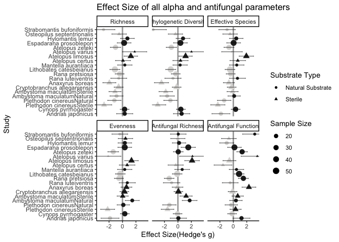
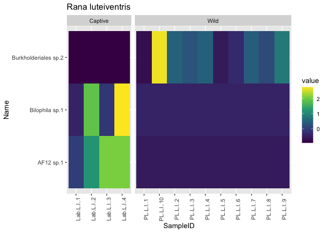
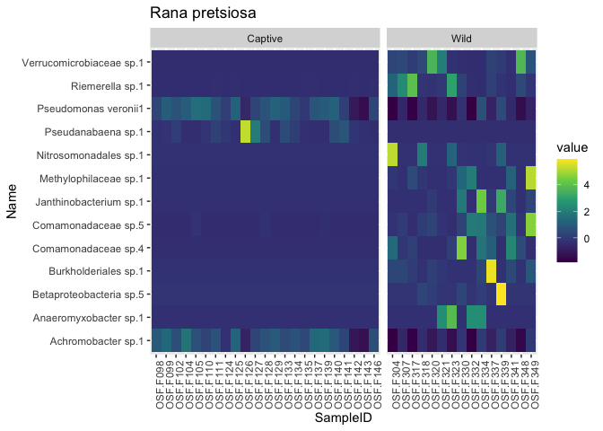
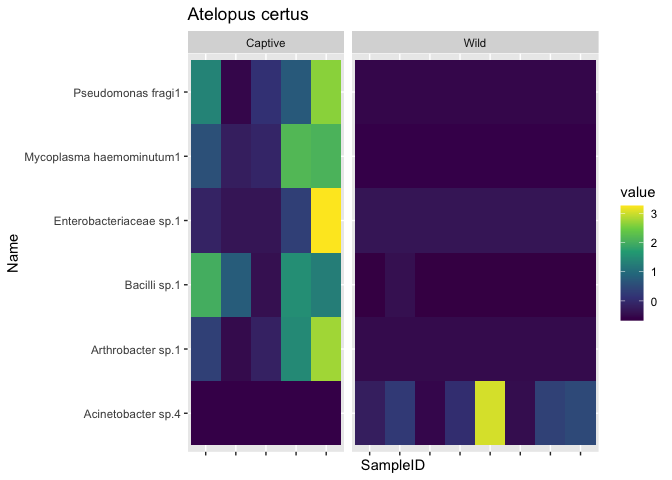
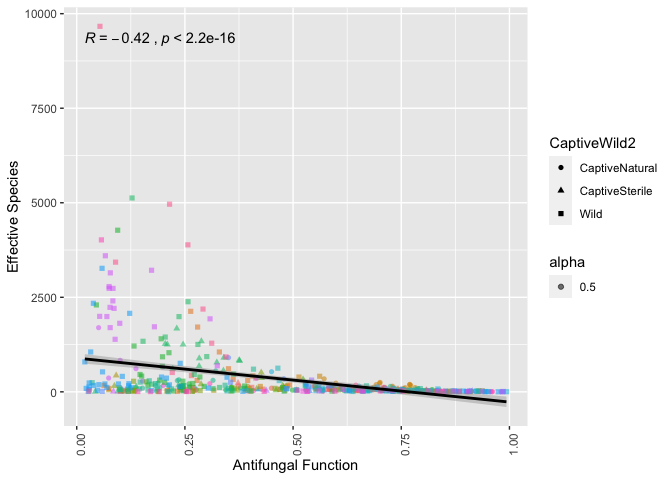

Captive-Wild Metaanalysis
================
Molly Bletz
2021

-   [Alpha & Antifungal](#alpha-antifungal)
    -   [Packages](#packages)
    -   [Reading in Data](#reading-in-data)
    -   [sOTU Richness](#sotu-richness)
    -   [Effective Species (expShannon)](#effective-species-expshannon)
    -   [Phylogenetic Diversity](#phylogenetic-diversity)
    -   [Evenness](#evenness)
    -   [Antifungal Richness](#antifungal-richness)
    -   [Proportional Antifungal
        function](#proportional-antifungal-function)
    -   [Overall Combo](#overall-combo)
-   [Beta Diversity](#beta-diversity)
    -   [Beta Dispersion](#beta-dispersion)
    -   [PCoA (unWUF)](#pcoa-unwuf)
    -   [PCoA (wUF)](#pcoa-wuf)
    -   [Adonis](#adonis)
-   [Differential Features](#differential-features)
    -   [Data](#data)
    -   [Plots](#plots)
-   [Atelopus Mesocosms - Microbiome
    trajectory](#atelopus-mesocosms---microbiome-trajectory)
-   [Supplementary Analyses](#supplementary-analyses)
-   [Venn Diagrams (Captive only)](#venn-diagrams-captive-only)
    -   [Venn Diagram Temperate
        Caudata](#venn-diagram-temperate-caudata)
    -   [Venn Diagram Anura Temperate](#venn-diagram-anura-temperate)
    -   [Venn Diagram Anura Tropical](#venn-diagram-anura-tropical)
-   [Venn Diagrams (Wild-Cap)](#venn-diagrams-wild-cap)
    -   [Data prep](#data-prep)
    -   [All Species](#all-species)
    -   [Individual species](#individual-species)
    -   [Correlations](#correlations)
    -   [Espadarana prosoblepon - location pairwise
        distances](#espadarana-prosoblepon---location-pairwise-distances)

# Alpha & Antifungal

## Packages

``` r
library(dmetar)
library(tidyverse)
library(dplyr)
library(qiime2R)
```

## Reading in Data

``` r
CW_Mapping = read_tsv("./Mapping/Mapping_Dec3_MCB.txt")

CW_Alpha = read_tsv("./AlphaDiversity/Merged_AlphaDiv_Metrics_wMetadata_ALL_2885_RALU_ANJA_CYPY_RAPE_Lower_Dec1.txt")%>%
  filter(!is.na(observed_otus)) %>%
  dplyr::select(!Description)

CW_Antifungal = read_tsv("./Antifungal/Metadata_Antifungal_Predictions2885_CYPY_ANJA_RAPE_RALU_lower_Dec.txt") %>%
  dplyr::select(!Description)
```

``` r
CWMetadata_Alpha = CW_Mapping %>%
  left_join(.,CW_Alpha, by = "SampleID") %>%
  left_join(.,CW_Antifungal, by = "SampleID") %>%
  filter(!LifeStage %in% "Larva") %>%
  filter(!is.na(observed_otus))

SubGrp_Data = read_tsv("./Mapping/StudyMetadata_Captive_Wild.txt") %>%
  select(Study.SpeciesID,GenerationCaptivity,CaptivitySubstrateBinary,Region,FrogOrder)
```

## sOTU Richness

### Calculating Means, Standard deviations, and Sample sizes

``` r
RichnessCap1 = CWMetadata_Alpha %>%
  select(FrogSpecies,CaptiveWild,observed_otus)%>%
  filter(!is.na(observed_otus))%>% 
  filter(CaptiveWild=="Captive")%>%
  group_by(FrogSpecies) %>%
  dplyr::summarise(Me = mean(observed_otus), Se = sd(observed_otus), Ne = n()) %>%
  add_column(CaptiveWild = "Captive")

RichnessCap2 = CWMetadata_Alpha %>%
  select(FrogSpecies,CaptiveWild,observed_otus)%>%
  filter(!is.na(observed_otus))%>% 
  filter(CaptiveWild=="CaptiveSterile")%>%
  group_by(FrogSpecies) %>%
  dplyr::summarise(Me = mean(observed_otus), Se = sd(observed_otus), Ne = n())%>%
  add_column(CaptiveWild = "CaptiveSterile")

RichnessCap3 = CWMetadata_Alpha %>%
  select(FrogSpecies,CaptiveWild,observed_otus)%>%
  filter(!is.na(observed_otus))%>% 
  filter(CaptiveWild=="CaptiveNatural")%>%
  group_by(FrogSpecies) %>%
  dplyr::summarise(Me = mean(observed_otus), Se = sd(observed_otus), Ne = n())%>%
  add_column(CaptiveWild = "CaptiveNatural")

RichnessCap = rbind(RichnessCap1,RichnessCap2,RichnessCap3)

RichnessWild = CWMetadata_Alpha %>%
  select(FrogSpecies,CaptiveWild,observed_otus)%>%
  filter(!is.na(observed_otus))%>% 
  filter(CaptiveWild=="Wild")%>%
  group_by(FrogSpecies) %>%
  dplyr::summarise(Mc = mean(observed_otus), Sc = sd(observed_otus), Nc = n()) 

RichnessComb = RichnessCap %>%
  left_join(RichnessWild, by = "FrogSpecies")%>%
  unite(Study.SpeciesID, FrogSpecies, CaptiveWild, sep = "_", remove = FALSE)

RichnessComb$Study.SpeciesID <- gsub("_Captive", "", RichnessComb$Study.SpeciesID)

RichnessComb = RichnessComb %>%
  left_join(.,SubGrp_Data, by = "Study.SpeciesID")
```

### Effect Model

``` r
EffectSize_Richness= meta::metacont(Ne,Me,Se,Nc,Mc,Sc,studlab = paste(Study.SpeciesID),
         data = RichnessComb,
         comb.fixed = FALSE, comb.random = TRUE,prediction=TRUE,
                  sm="SMD", hakn = TRUE, method.tau = "ML")

EffectSize_Richness_df = as.data.frame(EffectSize_Richness)

sink("Richness_results.txt")
print(EffectSize_Richness)
```

    ##                                  SMD             95%-CI %W(random)
    ## Anaxyrus boreas              -1.9534 [-2.9196; -0.9871]        5.2
    ## Andrias japonicus             0.3274 [-0.8865;  1.5414]        4.5
    ## Atelopus certus               0.0738 [-1.0441;  1.1916]        4.8
    ## Atelopus limosus              1.2419 [ 0.2382;  2.2456]        5.1
    ## Atelopus varius               1.8146 [ 0.0136;  3.6155]        3.3
    ## Atelopus zeteki              -1.0395 [-1.8025; -0.2764]        5.7
    ## Cryptobranchus alleganiensis -0.5752 [-1.2364;  0.0861]        5.9
    ## Cynops pyrrhogaster           0.3149 [-0.3344;  0.9642]        5.9
    ## Espadarana prosoblepon        0.2422 [-0.7798;  1.2642]        5.0
    ## Hylomantis lemur              0.7323 [-0.2930;  1.7577]        5.0
    ## Lithobates catesbeianus      -1.1319 [-1.8775; -0.3864]        5.7
    ## Mantella aurantiaca           0.3477 [-0.7217;  1.4170]        4.9
    ## Osteopilus septentrionalis   -0.4976 [-1.5782;  0.5830]        4.9
    ## Rana luteiventris            -0.5530 [-1.7375;  0.6314]        4.6
    ## Rana pretsiosa               -0.4280 [-1.0864;  0.2304]        5.9
    ## Strabomantis bufoniformis    -2.8202 [-4.5122; -1.1281]        3.5
    ## Ambystoma maculatumSterile   -1.1152 [-2.0124; -0.2180]        5.3
    ## Plethodon cinereusSterile    -2.7411 [-3.8849; -1.5974]        4.7
    ## Ambystoma maculatumNatural   -0.8880 [-1.8568;  0.0808]        5.1
    ## Plethodon cinereusNatural    -1.2102 [-2.1981; -0.2223]        5.1
    ## 
    ## Number of studies combined: k = 20
    ## 
    ##                          SMD            95%-CI     t p-value
    ## Random effects model -0.5018 [-1.0231; 0.0195] -2.01  0.0583
    ## Prediction interval          [-2.4383; 1.4347]              
    ## 
    ## Quantifying heterogeneity:
    ##  tau^2 = 0.7875 [0.4103; 2.5812]; tau = 0.8874 [0.6406; 1.6066];
    ##  I^2 = 75.2% [61.7%; 83.9%]; H = 2.01 [1.62; 2.49]
    ## 
    ## Test of heterogeneity:
    ##      Q d.f.  p-value
    ##  76.60   19 < 0.0001
    ## 
    ## Details on meta-analytical method:
    ## - Inverse variance method
    ## - Maximum-likelihood estimator for tau^2
    ## - Q-profile method for confidence interval of tau^2 and tau
    ## - Hartung-Knapp adjustment for random effects model
    ## - Hedges' g (bias corrected standardised mean difference)

``` r
sink()
```

### Effect Plot

``` r
meta::forest(EffectSize_Richness,
       layout = "JAMA",
       text.predict = "95% Prediction Interval",
       col.predict = "black",colgap.forest.left = unit(15,"mm"),spacing =0.5,fontsize = 8)
```

<!-- -->

<span style="color: purple;"> Notes on Heterogeneity: All three of our
indicators suggest that moderate to substantial heterogeneity is present
in our data. Given the broad prediction interval, which stretches well
below zero, we also cannot be overly confident that the marginally
negative effect we found for our interventions is robust in every
context. </span>

### GOSH analysis

<span style="color: purple;"> exploring the patterns of effect sizes and
heterogeneity in our data with Graphic Display of Heterogeneity (GOSH)
plots (Olkin, Dahabreh, and Trikalinos 2012) </span>

``` r
Rich_m.rma <- metafor::rma(yi = EffectSize_Richness$TE, 
             sei = EffectSize_Richness$seTE,
             method = EffectSize_Richness$method.tau,
             test = "knha")

Rich_dat.gosh <- metafor::gosh(Rich_m.rma,subsets = 10000)
```

    ##   |                                                                              |                                                                      |   0%  |                                                                              |                                                                      |   1%  |                                                                              |=                                                                     |   1%  |                                                                              |=                                                                     |   2%  |                                                                              |==                                                                    |   2%  |                                                                              |==                                                                    |   3%  |                                                                              |==                                                                    |   4%  |                                                                              |===                                                                   |   4%  |                                                                              |===                                                                   |   5%  |                                                                              |====                                                                  |   5%  |                                                                              |====                                                                  |   6%  |                                                                              |=====                                                                 |   6%  |                                                                              |=====                                                                 |   7%  |                                                                              |=====                                                                 |   8%  |                                                                              |======                                                                |   8%  |                                                                              |======                                                                |   9%  |                                                                              |=======                                                               |   9%  |                                                                              |=======                                                               |  10%  |                                                                              |=======                                                               |  11%  |                                                                              |========                                                              |  11%  |                                                                              |========                                                              |  12%  |                                                                              |=========                                                             |  12%  |                                                                              |=========                                                             |  13%  |                                                                              |=========                                                             |  14%  |                                                                              |==========                                                            |  14%  |                                                                              |==========                                                            |  15%  |                                                                              |===========                                                           |  15%  |                                                                              |===========                                                           |  16%  |                                                                              |============                                                          |  16%  |                                                                              |============                                                          |  17%  |                                                                              |============                                                          |  18%  |                                                                              |=============                                                         |  18%  |                                                                              |=============                                                         |  19%  |                                                                              |==============                                                        |  19%  |                                                                              |==============                                                        |  20%  |                                                                              |==============                                                        |  21%  |                                                                              |===============                                                       |  21%  |                                                                              |===============                                                       |  22%  |                                                                              |================                                                      |  22%  |                                                                              |================                                                      |  23%  |                                                                              |================                                                      |  24%  |                                                                              |=================                                                     |  24%  |                                                                              |=================                                                     |  25%  |                                                                              |==================                                                    |  25%  |                                                                              |==================                                                    |  26%  |                                                                              |===================                                                   |  26%  |                                                                              |===================                                                   |  27%  |                                                                              |===================                                                   |  28%  |                                                                              |====================                                                  |  28%  |                                                                              |====================                                                  |  29%  |                                                                              |=====================                                                 |  29%  |                                                                              |=====================                                                 |  30%  |                                                                              |=====================                                                 |  31%  |                                                                              |======================                                                |  31%  |                                                                              |======================                                                |  32%  |                                                                              |=======================                                               |  32%  |                                                                              |=======================                                               |  33%  |                                                                              |=======================                                               |  34%  |                                                                              |========================                                              |  34%  |                                                                              |========================                                              |  35%  |                                                                              |=========================                                             |  35%  |                                                                              |=========================                                             |  36%  |                                                                              |==========================                                            |  36%  |                                                                              |==========================                                            |  37%  |                                                                              |==========================                                            |  38%  |                                                                              |===========================                                           |  38%  |                                                                              |===========================                                           |  39%  |                                                                              |============================                                          |  39%  |                                                                              |============================                                          |  40%  |                                                                              |============================                                          |  41%  |                                                                              |=============================                                         |  41%  |                                                                              |=============================                                         |  42%  |                                                                              |==============================                                        |  42%  |                                                                              |==============================                                        |  43%  |                                                                              |==============================                                        |  44%  |                                                                              |===============================                                       |  44%  |                                                                              |===============================                                       |  45%  |                                                                              |================================                                      |  45%  |                                                                              |================================                                      |  46%  |                                                                              |=================================                                     |  46%  |                                                                              |=================================                                     |  47%  |                                                                              |=================================                                     |  48%  |                                                                              |==================================                                    |  48%  |                                                                              |==================================                                    |  49%  |                                                                              |===================================                                   |  49%  |                                                                              |===================================                                   |  50%  |                                                                              |===================================                                   |  51%  |                                                                              |====================================                                  |  51%  |                                                                              |====================================                                  |  52%  |                                                                              |=====================================                                 |  52%  |                                                                              |=====================================                                 |  53%  |                                                                              |=====================================                                 |  54%  |                                                                              |======================================                                |  54%  |                                                                              |======================================                                |  55%  |                                                                              |=======================================                               |  55%  |                                                                              |=======================================                               |  56%  |                                                                              |========================================                              |  56%  |                                                                              |========================================                              |  57%  |                                                                              |========================================                              |  58%  |                                                                              |=========================================                             |  58%  |                                                                              |=========================================                             |  59%  |                                                                              |==========================================                            |  59%  |                                                                              |==========================================                            |  60%  |                                                                              |==========================================                            |  61%  |                                                                              |===========================================                           |  61%  |                                                                              |===========================================                           |  62%  |                                                                              |============================================                          |  62%  |                                                                              |============================================                          |  63%  |                                                                              |============================================                          |  64%  |                                                                              |=============================================                         |  64%  |                                                                              |=============================================                         |  65%  |                                                                              |==============================================                        |  65%  |                                                                              |==============================================                        |  66%  |                                                                              |===============================================                       |  66%  |                                                                              |===============================================                       |  67%  |                                                                              |===============================================                       |  68%  |                                                                              |================================================                      |  68%  |                                                                              |================================================                      |  69%  |                                                                              |=================================================                     |  69%  |                                                                              |=================================================                     |  70%  |                                                                              |=================================================                     |  71%  |                                                                              |==================================================                    |  71%  |                                                                              |==================================================                    |  72%  |                                                                              |===================================================                   |  72%  |                                                                              |===================================================                   |  73%  |                                                                              |===================================================                   |  74%  |                                                                              |====================================================                  |  74%  |                                                                              |====================================================                  |  75%  |                                                                              |=====================================================                 |  75%  |                                                                              |=====================================================                 |  76%  |                                                                              |======================================================                |  76%  |                                                                              |======================================================                |  77%  |                                                                              |======================================================                |  78%  |                                                                              |=======================================================               |  78%  |                                                                              |=======================================================               |  79%  |                                                                              |========================================================              |  79%  |                                                                              |========================================================              |  80%  |                                                                              |========================================================              |  81%  |                                                                              |=========================================================             |  81%  |                                                                              |=========================================================             |  82%  |                                                                              |==========================================================            |  82%  |                                                                              |==========================================================            |  83%  |                                                                              |==========================================================            |  84%  |                                                                              |===========================================================           |  84%  |                                                                              |===========================================================           |  85%  |                                                                              |============================================================          |  85%  |                                                                              |============================================================          |  86%  |                                                                              |=============================================================         |  86%  |                                                                              |=============================================================         |  87%  |                                                                              |=============================================================         |  88%  |                                                                              |==============================================================        |  88%  |                                                                              |==============================================================        |  89%  |                                                                              |===============================================================       |  89%  |                                                                              |===============================================================       |  90%  |                                                                              |===============================================================       |  91%  |                                                                              |================================================================      |  91%  |                                                                              |================================================================      |  92%  |                                                                              |=================================================================     |  92%  |                                                                              |=================================================================     |  93%  |                                                                              |=================================================================     |  94%  |                                                                              |==================================================================    |  94%  |                                                                              |==================================================================    |  95%  |                                                                              |===================================================================   |  95%  |                                                                              |===================================================================   |  96%  |                                                                              |====================================================================  |  96%  |                                                                              |====================================================================  |  97%  |                                                                              |====================================================================  |  98%  |                                                                              |===================================================================== |  98%  |                                                                              |===================================================================== |  99%  |                                                                              |======================================================================|  99%  |                                                                              |======================================================================| 100%

``` r
plot(Rich_dat.gosh, alpha= 0.1, col = "blue")

Rich_gosh.diag <- gosh.diagnostics(Rich_dat.gosh,km = TRUE, db = FALSE, gmm = TRUE)
```

<!-- -->

    ##   
    ##  Perform Clustering... 
    ##  |==========================================================================================| DONE

``` r
summary(Rich_gosh.diag)
```

    ## GOSH Diagnostics 
    ## ================================ 
    ## 
    ##  - Number of K-means clusters detected: 3
    ##  - Number of GMM clusters detected: 7
    ## 
    ##  Identification of potential outliers 
    ##  --------------------------------- 
    ## 
    ##  - K-means: Study 4, Study 18
    ##  - Gaussian Mixture Model: Study

``` r
plot(Rich_gosh.diag, which = "cluster")
```

<!-- --><!-- -->

``` r
# plot(Rich_gosh.diag, which = "outlier")
```

### Sub-group analysis

<span style="color: purple;"> Another source of between-study
heterogeneity making our effect size estimate less precise could be that
there are slight differences in the study design or intervention
components between the studies.
(<https://bookdown.org/MathiasHarrer/Doing_Meta_Analysis_in_R/>) </span>

#### Sub-Group:Housing Substrate

``` r
substrate.subgroup<-meta::update.meta(EffectSize_Richness, 
                             byvar=CaptivitySubstrateBinary, 
                             comb.random = FALSE, 
                             comb.fixed = TRUE)

substrate.subgroup
```

    ##                                  SMD             95%-CI %W(fixed)
    ## Anaxyrus boreas              -1.9534 [-2.9196; -0.9871]       4.6
    ## Andrias japonicus             0.3274 [-0.8865;  1.5414]       2.9
    ## Atelopus certus               0.0738 [-1.0441;  1.1916]       3.5
    ## Atelopus limosus              1.2419 [ 0.2382;  2.2456]       4.3
    ## Atelopus varius               1.8146 [ 0.0136;  3.6155]       1.3
    ## Atelopus zeteki              -1.0395 [-1.8025; -0.2764]       7.4
    ## Cryptobranchus alleganiensis -0.5752 [-1.2364;  0.0861]       9.9
    ## Cynops pyrrhogaster           0.3149 [-0.3344;  0.9642]      10.3
    ## Espadarana prosoblepon        0.2422 [-0.7798;  1.2642]       4.1
    ## Hylomantis lemur              0.7323 [-0.2930;  1.7577]       4.1
    ## Lithobates catesbeianus      -1.1319 [-1.8775; -0.3864]       7.8
    ## Mantella aurantiaca           0.3477 [-0.7217;  1.4170]       3.8
    ## Osteopilus septentrionalis   -0.4976 [-1.5782;  0.5830]       3.7
    ## Rana luteiventris            -0.5530 [-1.7375;  0.6314]       3.1
    ## Rana pretsiosa               -0.4280 [-1.0864;  0.2304]      10.0
    ## Strabomantis bufoniformis    -2.8202 [-4.5122; -1.1281]       1.5
    ## Ambystoma maculatumSterile   -1.1152 [-2.0124; -0.2180]       5.4
    ## Plethodon cinereusSterile    -2.7411 [-3.8849; -1.5974]       3.3
    ## Ambystoma maculatumNatural   -0.8880 [-1.8568;  0.0808]       4.6
    ## Plethodon cinereusNatural    -1.2102 [-2.1981; -0.2223]       4.4
    ##                              CaptivitySubstrateBinary
    ## Anaxyrus boreas                               Sterile
    ## Andrias japonicus                   Natural Substrate
    ## Atelopus certus                               Sterile
    ## Atelopus limosus                              Sterile
    ## Atelopus varius                               Sterile
    ## Atelopus zeteki                     Natural Substrate
    ## Cryptobranchus alleganiensis                  Sterile
    ## Cynops pyrrhogaster                 Natural Substrate
    ## Espadarana prosoblepon              Natural Substrate
    ## Hylomantis lemur                    Natural Substrate
    ## Lithobates catesbeianus             Natural Substrate
    ## Mantella aurantiaca                 Natural Substrate
    ## Osteopilus septentrionalis                    Sterile
    ## Rana luteiventris                   Natural Substrate
    ## Rana pretsiosa                      Natural Substrate
    ## Strabomantis bufoniformis           Natural Substrate
    ## Ambystoma maculatumSterile                    Sterile
    ## Plethodon cinereusSterile                     Sterile
    ## Ambystoma maculatumNatural          Natural Substrate
    ## Plethodon cinereusNatural           Natural Substrate
    ## 
    ## Number of studies combined: k = 20
    ## 
    ##                         SMD             95%-CI     z  p-value
    ## Fixed effect model  -0.5030 [-0.7110; -0.2951] -4.74 < 0.0001
    ## Prediction interval         [-2.4383;  1.4347]               
    ## 
    ## Quantifying heterogeneity:
    ##  tau^2 = 0.7875 [0.4103; 2.5812]; tau = 0.8874 [0.6406; 1.6066];
    ##  I^2 = 75.2% [61.7%; 83.9%]; H = 2.01 [1.62; 2.49]
    ## 
    ## Quantifying residual heterogeneity:
    ##  I^2 = 76.1% [62.9%; 84.6%]; H = 2.05 [1.64; 2.55]
    ## 
    ## Test of heterogeneity:
    ##      Q d.f.  p-value
    ##  76.60   19 < 0.0001
    ## 
    ## Results for subgroups (fixed effect model):
    ##                                                k     SMD             95%-CI
    ## CaptivitySubstrateBinary = Sterile             8 -0.6565 [-1.0031; -0.3098]
    ## CaptivitySubstrateBinary = Natural Substrate  12 -0.4168 [-0.6767; -0.1570]
    ##                                                  Q   I^2  tau^2    tau
    ## CaptivitySubstrateBinary = Sterile           43.44 83.9% 1.4676 1.2115
    ## CaptivitySubstrateBinary = Natural Substrate 31.99 65.6% 0.3578 0.5982
    ## 
    ## Test for subgroup differences (fixed effect model):
    ##                    Q d.f.  p-value
    ## Between groups  1.18    1   0.2783
    ## Within groups  75.43   18 < 0.0001
    ## 
    ## Details on meta-analytical method:
    ## - Inverse variance method
    ## - Maximum-likelihood estimator for tau^2
    ## - Q-profile method for confidence interval of tau^2 and tau
    ## - Hedges' g (bias corrected standardised mean difference)

``` r
substrate.subgroupmix <- dmetar::subgroup.analysis.mixed.effects(x = EffectSize_Richness, subgroups = SubGrp_Data$CaptivitySubstrateBinary)

meta::forest(substrate.subgroupmix,layout = "JAMA",spacing =0.5,fontsize = 8)
```

<!-- -->

#### Sub-Group:Generation (Born vs Brought into captivity)

``` r
generation.subgroup<-meta::update.meta(EffectSize_Richness, 
                             byvar=GenerationCaptivity, 
                             comb.random = TRUE, 
                             comb.fixed = FALSE)

generation.subgroup
```

    ##                                  SMD             95%-CI %W(random)
    ## Anaxyrus boreas              -1.9534 [-2.9196; -0.9871]        5.2
    ## Andrias japonicus             0.3274 [-0.8865;  1.5414]        4.5
    ## Atelopus certus               0.0738 [-1.0441;  1.1916]        4.8
    ## Atelopus limosus              1.2419 [ 0.2382;  2.2456]        5.1
    ## Atelopus varius               1.8146 [ 0.0136;  3.6155]        3.3
    ## Atelopus zeteki              -1.0395 [-1.8025; -0.2764]        5.7
    ## Cryptobranchus alleganiensis -0.5752 [-1.2364;  0.0861]        5.9
    ## Cynops pyrrhogaster           0.3149 [-0.3344;  0.9642]        5.9
    ## Espadarana prosoblepon        0.2422 [-0.7798;  1.2642]        5.0
    ## Hylomantis lemur              0.7323 [-0.2930;  1.7577]        5.0
    ## Lithobates catesbeianus      -1.1319 [-1.8775; -0.3864]        5.7
    ## Mantella aurantiaca           0.3477 [-0.7217;  1.4170]        4.9
    ## Osteopilus septentrionalis   -0.4976 [-1.5782;  0.5830]        4.9
    ## Rana luteiventris            -0.5530 [-1.7375;  0.6314]        4.6
    ## Rana pretsiosa               -0.4280 [-1.0864;  0.2304]        5.9
    ## Strabomantis bufoniformis    -2.8202 [-4.5122; -1.1281]        3.5
    ## Ambystoma maculatumSterile   -1.1152 [-2.0124; -0.2180]        5.3
    ## Plethodon cinereusSterile    -2.7411 [-3.8849; -1.5974]        4.7
    ## Ambystoma maculatumNatural   -0.8880 [-1.8568;  0.0808]        5.1
    ## Plethodon cinereusNatural    -1.2102 [-2.1981; -0.2223]        5.1
    ##                              GenerationCaptivity
    ## Anaxyrus boreas                    BornCaptivity
    ## Andrias japonicus                  BornCaptivity
    ## Atelopus certus                    BornCaptivity
    ## Atelopus limosus                   BornCaptivity
    ## Atelopus varius                 BroughtCaptivity
    ## Atelopus zeteki                    BornCaptivity
    ## Cryptobranchus alleganiensis       BornCaptivity
    ## Cynops pyrrhogaster                BornCaptivity
    ## Espadarana prosoblepon          BroughtCaptivity
    ## Hylomantis lemur                BroughtCaptivity
    ## Lithobates catesbeianus            BornCaptivity
    ## Mantella aurantiaca                BornCaptivity
    ## Osteopilus septentrionalis      BroughtCaptivity
    ## Rana luteiventris               BroughtCaptivity
    ## Rana pretsiosa                     BornCaptivity
    ## Strabomantis bufoniformis       BroughtCaptivity
    ## Ambystoma maculatumSterile         BornCaptivity
    ## Plethodon cinereusSterile       BroughtCaptivity
    ## Ambystoma maculatumNatural         BornCaptivity
    ## Plethodon cinereusNatural       BroughtCaptivity
    ## 
    ## Number of studies combined: k = 20
    ## 
    ##                          SMD            95%-CI     t p-value
    ## Random effects model -0.5018 [-1.0231; 0.0195] -2.01  0.0583
    ## Prediction interval          [-2.4383; 1.4347]              
    ## 
    ## Quantifying heterogeneity:
    ##  tau^2 = 0.7875 [0.4103; 2.5812]; tau = 0.8874 [0.6406; 1.6066];
    ##  I^2 = 75.2% [61.7%; 83.9%]; H = 2.01 [1.62; 2.49]
    ## 
    ## Quantifying residual heterogeneity:
    ##  I^2 = 76.4% [63.3%; 84.8%]; H = 2.06 [1.65; 2.56]
    ## 
    ## Test of heterogeneity:
    ##      Q d.f.  p-value
    ##  76.60   19 < 0.0001
    ## 
    ## Results for subgroups (random effects model):
    ##                                          k     SMD            95%-CI  tau^2
    ## GenerationCaptivity = BornCaptivity     12 -0.4335 [-0.9838; 0.1168] 0.4549
    ## GenerationCaptivity = BroughtCaptivity   8 -0.6383 [-1.9318; 0.6551] 1.5509
    ##                                           tau     Q   I^2
    ## GenerationCaptivity = BornCaptivity    0.6745 38.63 71.5%
    ## GenerationCaptivity = BroughtCaptivity 1.2453 37.58 81.4%
    ## 
    ## Test for subgroup differences (random effects model):
    ##                     Q d.f. p-value
    ## Between groups   0.12    1  0.7334
    ## 
    ## Details on meta-analytical method:
    ## - Inverse variance method
    ## - Maximum-likelihood estimator for tau^2
    ## - Q-profile method for confidence interval of tau^2 and tau
    ## - Hartung-Knapp adjustment for random effects model
    ## - Hedges' g (bias corrected standardised mean difference)

``` r
meta::forest(generation.subgroup,layout = "JAMA",spacing =0.5,fontsize = 8)
```

<!-- -->

#### Sub-Group: Amphibian Order (Frog vs. Salamnder)

``` r
Order.subgroup<-meta::update.meta(EffectSize_Richness, 
                             byvar=FrogOrder, 
                             comb.random = TRUE, 
                             comb.fixed = FALSE)

Order.subgroup
```

    ##                                  SMD             95%-CI %W(random) FrogOrder
    ## Anaxyrus boreas              -1.9534 [-2.9196; -0.9871]        5.2     Anura
    ## Andrias japonicus             0.3274 [-0.8865;  1.5414]        4.5   Caudata
    ## Atelopus certus               0.0738 [-1.0441;  1.1916]        4.8     Anura
    ## Atelopus limosus              1.2419 [ 0.2382;  2.2456]        5.1     Anura
    ## Atelopus varius               1.8146 [ 0.0136;  3.6155]        3.3     Anura
    ## Atelopus zeteki              -1.0395 [-1.8025; -0.2764]        5.7     Anura
    ## Cryptobranchus alleganiensis -0.5752 [-1.2364;  0.0861]        5.9   Caudata
    ## Cynops pyrrhogaster           0.3149 [-0.3344;  0.9642]        5.9   Caudata
    ## Espadarana prosoblepon        0.2422 [-0.7798;  1.2642]        5.0     Anura
    ## Hylomantis lemur              0.7323 [-0.2930;  1.7577]        5.0     Anura
    ## Lithobates catesbeianus      -1.1319 [-1.8775; -0.3864]        5.7     Anura
    ## Mantella aurantiaca           0.3477 [-0.7217;  1.4170]        4.9     Anura
    ## Osteopilus septentrionalis   -0.4976 [-1.5782;  0.5830]        4.9     Anura
    ## Rana luteiventris            -0.5530 [-1.7375;  0.6314]        4.6     Anura
    ## Rana pretsiosa               -0.4280 [-1.0864;  0.2304]        5.9     Anura
    ## Strabomantis bufoniformis    -2.8202 [-4.5122; -1.1281]        3.5     Anura
    ## Ambystoma maculatumSterile   -1.1152 [-2.0124; -0.2180]        5.3   Caudata
    ## Plethodon cinereusSterile    -2.7411 [-3.8849; -1.5974]        4.7   Caudata
    ## Ambystoma maculatumNatural   -0.8880 [-1.8568;  0.0808]        5.1   Caudata
    ## Plethodon cinereusNatural    -1.2102 [-2.1981; -0.2223]        5.1   Caudata
    ## 
    ## Number of studies combined: k = 20
    ## 
    ##                          SMD            95%-CI     t p-value
    ## Random effects model -0.5018 [-1.0231; 0.0195] -2.01  0.0583
    ## Prediction interval          [-2.4383; 1.4347]              
    ## 
    ## Quantifying heterogeneity:
    ##  tau^2 = 0.7875 [0.4103; 2.5812]; tau = 0.8874 [0.6406; 1.6066];
    ##  I^2 = 75.2% [61.7%; 83.9%]; H = 2.01 [1.62; 2.49]
    ## 
    ## Quantifying residual heterogeneity:
    ##  I^2 = 76.2% [62.9%; 84.7%]; H = 2.05 [1.64; 2.55]
    ## 
    ## Test of heterogeneity:
    ##      Q d.f.  p-value
    ##  76.60   19 < 0.0001
    ## 
    ## Results for subgroups (random effects model):
    ##                       k     SMD            95%-CI  tau^2    tau     Q   I^2
    ## FrogOrder = Anura    13 -0.3235 [-1.0311; 0.3840] 0.8275 0.9096 49.14 75.6%
    ## FrogOrder = Caudata   7 -0.8010 [-1.7375; 0.1355] 0.6057 0.7783 26.36 77.2%
    ## 
    ## Test for subgroup differences (random effects model):
    ##                     Q d.f. p-value
    ## Between groups   0.90    1  0.3415
    ## 
    ## Details on meta-analytical method:
    ## - Inverse variance method
    ## - Maximum-likelihood estimator for tau^2
    ## - Q-profile method for confidence interval of tau^2 and tau
    ## - Hartung-Knapp adjustment for random effects model
    ## - Hedges' g (bias corrected standardised mean difference)

``` r
meta::forest(layout = "JAMA",Order.subgroup,colgap.forest.left = unit(15,"mm"),spacing =0.5,fontsize = 8)
```

<!-- -->

#### Sub-Group: Geographic Region

``` r
Region.subgroup<-meta::update.meta(EffectSize_Richness, 
                             byvar=Region, 
                             comb.random = TRUE, 
                             comb.fixed = FALSE)

Region.subgroup
```

    ##                                  SMD             95%-CI %W(random)    Region
    ## Anaxyrus boreas              -1.9534 [-2.9196; -0.9871]        5.2 Temperate
    ## Andrias japonicus             0.3274 [-0.8865;  1.5414]        4.5 Temperate
    ## Atelopus certus               0.0738 [-1.0441;  1.1916]        4.8  Tropical
    ## Atelopus limosus              1.2419 [ 0.2382;  2.2456]        5.1  Tropical
    ## Atelopus varius               1.8146 [ 0.0136;  3.6155]        3.3  Tropical
    ## Atelopus zeteki              -1.0395 [-1.8025; -0.2764]        5.7  Tropical
    ## Cryptobranchus alleganiensis -0.5752 [-1.2364;  0.0861]        5.9 Temperate
    ## Cynops pyrrhogaster           0.3149 [-0.3344;  0.9642]        5.9 Temperate
    ## Espadarana prosoblepon        0.2422 [-0.7798;  1.2642]        5.0  Tropical
    ## Hylomantis lemur              0.7323 [-0.2930;  1.7577]        5.0  Tropical
    ## Lithobates catesbeianus      -1.1319 [-1.8775; -0.3864]        5.7  Tropical
    ## Mantella aurantiaca           0.3477 [-0.7217;  1.4170]        4.9  Tropical
    ## Osteopilus septentrionalis   -0.4976 [-1.5782;  0.5830]        4.9  Tropical
    ## Rana luteiventris            -0.5530 [-1.7375;  0.6314]        4.6 Temperate
    ## Rana pretsiosa               -0.4280 [-1.0864;  0.2304]        5.9 Temperate
    ## Strabomantis bufoniformis    -2.8202 [-4.5122; -1.1281]        3.5  Tropical
    ## Ambystoma maculatumSterile   -1.1152 [-2.0124; -0.2180]        5.3 Temperate
    ## Plethodon cinereusSterile    -2.7411 [-3.8849; -1.5974]        4.7 Temperate
    ## Ambystoma maculatumNatural   -0.8880 [-1.8568;  0.0808]        5.1 Temperate
    ## Plethodon cinereusNatural    -1.2102 [-2.1981; -0.2223]        5.1 Temperate
    ## 
    ## Number of studies combined: k = 20
    ## 
    ##                          SMD            95%-CI     t p-value
    ## Random effects model -0.5018 [-1.0231; 0.0195] -2.01  0.0583
    ## Prediction interval          [-2.4383; 1.4347]              
    ## 
    ## Quantifying heterogeneity:
    ##  tau^2 = 0.7875 [0.4103; 2.5812]; tau = 0.8874 [0.6406; 1.6066];
    ##  I^2 = 75.2% [61.7%; 83.9%]; H = 2.01 [1.62; 2.49]
    ## 
    ## Quantifying residual heterogeneity:
    ##  I^2 = 74.9% [60.7%; 83.9%]; H = 2.00 [1.60; 2.50]
    ## 
    ## Test of heterogeneity:
    ##      Q d.f.  p-value
    ##  76.60   19 < 0.0001
    ## 
    ## Results for subgroups (random effects model):
    ##                      k     SMD             95%-CI  tau^2    tau     Q   I^2
    ## Region = Temperate  10 -0.8440 [-1.5009; -0.1870] 0.5023 0.7087 33.68 73.3%
    ## Region = Tropical   10 -0.1123 [-0.9875;  0.7630] 0.8563 0.9253 38.00 76.3%
    ## 
    ## Test for subgroup differences (random effects model):
    ##                     Q d.f. p-value
    ## Between groups   2.29    1  0.1304
    ## 
    ## Details on meta-analytical method:
    ## - Inverse variance method
    ## - Maximum-likelihood estimator for tau^2
    ## - Q-profile method for confidence interval of tau^2 and tau
    ## - Hartung-Knapp adjustment for random effects model
    ## - Hedges' g (bias corrected standardised mean difference)

``` r
meta::forest(Region.subgroup,layout = "JAMA",colgap.forest.left = unit(15,"mm"),spacing =0.5,fontsize = 8)
```

<!-- -->

## Effective Species (expShannon)

### Calculating Means, Standard deviations, and Sample sizes

``` r
EffSpCap1 = CWMetadata_Alpha %>%
  select(FrogSpecies,CaptiveWild,ExpShannon)%>%
  filter(CaptiveWild=="Captive")%>%
  group_by(FrogSpecies) %>%
  dplyr::summarise(Me = mean(ExpShannon), Se = sd(ExpShannon), Ne = n())%>%
  add_column(CaptiveWild = "Captive")

EffSpCap2 = CWMetadata_Alpha %>%
  select(FrogSpecies,CaptiveWild,ExpShannon)%>%
  filter(CaptiveWild=="CaptiveSterile")%>%
  group_by(FrogSpecies) %>%
  dplyr::summarise(Me = mean(ExpShannon), Se = sd(ExpShannon), Ne = n())%>%
  add_column(CaptiveWild = "CaptiveSterile")

EffSpCap3 = CWMetadata_Alpha %>%
  select(FrogSpecies,CaptiveWild,ExpShannon)%>%
  filter(CaptiveWild=="CaptiveNatural")%>%
  group_by(FrogSpecies) %>%
  dplyr::summarise(Me = mean(ExpShannon), Se = sd(ExpShannon), Ne = n())%>%
  add_column(CaptiveWild = "CaptiveNatural")

EffSpCap = rbind(EffSpCap1,EffSpCap2,EffSpCap3)

EffSpWild = CWMetadata_Alpha %>%
  select(FrogSpecies,CaptiveWild,ExpShannon)%>%
  filter(CaptiveWild=="Wild")%>%
  group_by(FrogSpecies) %>%
  dplyr::summarise(Mc = mean(ExpShannon), Sc = sd(ExpShannon), Nc = n())

EffSpComb = EffSpCap %>%
  left_join(EffSpWild, by = "FrogSpecies")%>%
  unite(Study.SpeciesID, FrogSpecies, CaptiveWild, sep = "_", remove = FALSE)

EffSpComb$Study.SpeciesID <- gsub("_Captive", "", EffSpComb$Study.SpeciesID)

EffSpComb = EffSpComb %>%
  left_join(.,SubGrp_Data, by = "Study.SpeciesID")
```

### Effect Model

``` r
EffectSize_EffSpecies= meta::metacont(Ne,Me,Se,Nc,Mc,Sc,studlab = paste(Study.SpeciesID),
         data = EffSpComb,
         comb.fixed = FALSE, comb.random = TRUE,prediction=TRUE,
                  sm="SMD", hakn = TRUE, method.tau = "ML")

EffectSize_EffSpecies_df = as.data.frame(EffectSize_EffSpecies)

sink("EffSpecies_results.txt")
print(EffectSize_EffSpecies)
```

    ##                                  SMD             95%-CI %W(random)
    ## Anaxyrus boreas              -0.6633 [-1.4782;  0.1517]        5.6
    ## Andrias japonicus            -1.8460 [-3.1838; -0.5082]        3.8
    ## Atelopus certus               0.6578 [-0.4999;  1.8155]        4.4
    ## Atelopus limosus              1.9364 [ 0.8624;  3.0103]        4.7
    ## Atelopus varius              -0.1983 [-1.7340;  1.3374]        3.3
    ## Atelopus zeteki              -0.6498 [-1.3882;  0.0885]        5.9
    ## Cryptobranchus alleganiensis -0.2478 [-0.8971;  0.4015]        6.2
    ## Cynops pyrrhogaster           0.3401 [-0.3099;  0.9901]        6.2
    ## Espadarana prosoblepon        0.0413 [-0.9795;  1.0622]        4.8
    ## Hylomantis lemur              0.4334 [-0.5737;  1.4405]        4.9
    ## Lithobates catesbeianus      -0.5011 [-1.2207;  0.2185]        5.9
    ## Mantella aurantiaca           0.5059 [-0.5754;  1.5872]        4.6
    ## Osteopilus septentrionalis   -0.4854 [-1.5650;  0.5941]        4.6
    ## Rana luteiventris             0.6146 [-0.5756;  1.8048]        4.3
    ## Rana pretsiosa               -0.3975 [-1.0548;  0.2598]        6.2
    ## Strabomantis bufoniformis    -0.9336 [-2.1628;  0.2956]        4.2
    ## Ambystoma maculatumSterile   -0.1131 [-0.9382;  0.7121]        5.5
    ## Plethodon cinereusSterile    -2.3036 [-3.3639; -1.2432]        4.7
    ## Ambystoma maculatumNatural    0.1238 [-0.7960;  1.0436]        5.2
    ## Plethodon cinereusNatural    -1.3665 [-2.3729; -0.3602]        4.9
    ## 
    ## Number of studies combined: k = 20
    ## 
    ##                          SMD            95%-CI     t p-value
    ## Random effects model -0.2457 [-0.6694; 0.1780] -1.21  0.2397
    ## Prediction interval          [-1.7535; 1.2620]              
    ## 
    ## Quantifying heterogeneity:
    ##  tau^2 = 0.4741 [0.2076; 1.5851]; tau = 0.6885 [0.4556; 1.2590];
    ##  I^2 = 66.6% [46.7%; 79.1%]; H = 1.73 [1.37; 2.19]
    ## 
    ## Test of heterogeneity:
    ##      Q d.f.  p-value
    ##  56.93   19 < 0.0001
    ## 
    ## Details on meta-analytical method:
    ## - Inverse variance method
    ## - Maximum-likelihood estimator for tau^2
    ## - Q-profile method for confidence interval of tau^2 and tau
    ## - Hartung-Knapp adjustment for random effects model
    ## - Hedges' g (bias corrected standardised mean difference)

``` r
sink()
```

### Effect Plot

``` r
meta::forest(EffectSize_EffSpecies,
       layout = "JAMA",
       text.predict = "95% PI",
       col.predict = "black",spacing =0.5,fontsize = 8)
```

<!-- -->

### GOSH analysis

``` r
EffSpp_m.rma <- metafor::rma(yi = EffectSize_EffSpecies$TE, 
             sei = EffectSize_EffSpecies$seTE,
             method = EffectSize_EffSpecies$method.tau,
             test = "knha")

EffSpp_dat.gosh <- metafor::gosh(EffSpp_m.rma,subsets = 10000)
```

    ##   |                                                                              |                                                                      |   0%  |                                                                              |                                                                      |   1%  |                                                                              |=                                                                     |   1%  |                                                                              |=                                                                     |   2%  |                                                                              |==                                                                    |   2%  |                                                                              |==                                                                    |   3%  |                                                                              |==                                                                    |   4%  |                                                                              |===                                                                   |   4%  |                                                                              |===                                                                   |   5%  |                                                                              |====                                                                  |   5%  |                                                                              |====                                                                  |   6%  |                                                                              |=====                                                                 |   6%  |                                                                              |=====                                                                 |   7%  |                                                                              |=====                                                                 |   8%  |                                                                              |======                                                                |   8%  |                                                                              |======                                                                |   9%  |                                                                              |=======                                                               |   9%  |                                                                              |=======                                                               |  10%  |                                                                              |=======                                                               |  11%  |                                                                              |========                                                              |  11%  |                                                                              |========                                                              |  12%  |                                                                              |=========                                                             |  12%  |                                                                              |=========                                                             |  13%  |                                                                              |=========                                                             |  14%  |                                                                              |==========                                                            |  14%  |                                                                              |==========                                                            |  15%  |                                                                              |===========                                                           |  15%  |                                                                              |===========                                                           |  16%  |                                                                              |============                                                          |  16%  |                                                                              |============                                                          |  17%  |                                                                              |============                                                          |  18%  |                                                                              |=============                                                         |  18%  |                                                                              |=============                                                         |  19%  |                                                                              |==============                                                        |  19%  |                                                                              |==============                                                        |  20%  |                                                                              |==============                                                        |  21%  |                                                                              |===============                                                       |  21%  |                                                                              |===============                                                       |  22%  |                                                                              |================                                                      |  22%  |                                                                              |================                                                      |  23%  |                                                                              |================                                                      |  24%  |                                                                              |=================                                                     |  24%  |                                                                              |=================                                                     |  25%  |                                                                              |==================                                                    |  25%  |                                                                              |==================                                                    |  26%  |                                                                              |===================                                                   |  26%  |                                                                              |===================                                                   |  27%  |                                                                              |===================                                                   |  28%  |                                                                              |====================                                                  |  28%  |                                                                              |====================                                                  |  29%  |                                                                              |=====================                                                 |  29%  |                                                                              |=====================                                                 |  30%  |                                                                              |=====================                                                 |  31%  |                                                                              |======================                                                |  31%  |                                                                              |======================                                                |  32%  |                                                                              |=======================                                               |  32%  |                                                                              |=======================                                               |  33%  |                                                                              |=======================                                               |  34%  |                                                                              |========================                                              |  34%  |                                                                              |========================                                              |  35%  |                                                                              |=========================                                             |  35%  |                                                                              |=========================                                             |  36%  |                                                                              |==========================                                            |  36%  |                                                                              |==========================                                            |  37%  |                                                                              |==========================                                            |  38%  |                                                                              |===========================                                           |  38%  |                                                                              |===========================                                           |  39%  |                                                                              |============================                                          |  39%  |                                                                              |============================                                          |  40%  |                                                                              |============================                                          |  41%  |                                                                              |=============================                                         |  41%  |                                                                              |=============================                                         |  42%  |                                                                              |==============================                                        |  42%  |                                                                              |==============================                                        |  43%  |                                                                              |==============================                                        |  44%  |                                                                              |===============================                                       |  44%  |                                                                              |===============================                                       |  45%  |                                                                              |================================                                      |  45%  |                                                                              |================================                                      |  46%  |                                                                              |=================================                                     |  46%  |                                                                              |=================================                                     |  47%  |                                                                              |=================================                                     |  48%  |                                                                              |==================================                                    |  48%  |                                                                              |==================================                                    |  49%  |                                                                              |===================================                                   |  49%  |                                                                              |===================================                                   |  50%  |                                                                              |===================================                                   |  51%  |                                                                              |====================================                                  |  51%  |                                                                              |====================================                                  |  52%  |                                                                              |=====================================                                 |  52%  |                                                                              |=====================================                                 |  53%  |                                                                              |=====================================                                 |  54%  |                                                                              |======================================                                |  54%  |                                                                              |======================================                                |  55%  |                                                                              |=======================================                               |  55%  |                                                                              |=======================================                               |  56%  |                                                                              |========================================                              |  56%  |                                                                              |========================================                              |  57%  |                                                                              |========================================                              |  58%  |                                                                              |=========================================                             |  58%  |                                                                              |=========================================                             |  59%  |                                                                              |==========================================                            |  59%  |                                                                              |==========================================                            |  60%  |                                                                              |==========================================                            |  61%  |                                                                              |===========================================                           |  61%  |                                                                              |===========================================                           |  62%  |                                                                              |============================================                          |  62%  |                                                                              |============================================                          |  63%  |                                                                              |============================================                          |  64%  |                                                                              |=============================================                         |  64%  |                                                                              |=============================================                         |  65%  |                                                                              |==============================================                        |  65%  |                                                                              |==============================================                        |  66%  |                                                                              |===============================================                       |  66%  |                                                                              |===============================================                       |  67%  |                                                                              |===============================================                       |  68%  |                                                                              |================================================                      |  68%  |                                                                              |================================================                      |  69%  |                                                                              |=================================================                     |  69%  |                                                                              |=================================================                     |  70%  |                                                                              |=================================================                     |  71%  |                                                                              |==================================================                    |  71%  |                                                                              |==================================================                    |  72%  |                                                                              |===================================================                   |  72%  |                                                                              |===================================================                   |  73%  |                                                                              |===================================================                   |  74%  |                                                                              |====================================================                  |  74%  |                                                                              |====================================================                  |  75%  |                                                                              |=====================================================                 |  75%  |                                                                              |=====================================================                 |  76%  |                                                                              |======================================================                |  76%  |                                                                              |======================================================                |  77%  |                                                                              |======================================================                |  78%  |                                                                              |=======================================================               |  78%  |                                                                              |=======================================================               |  79%  |                                                                              |========================================================              |  79%  |                                                                              |========================================================              |  80%  |                                                                              |========================================================              |  81%  |                                                                              |=========================================================             |  81%  |                                                                              |=========================================================             |  82%  |                                                                              |==========================================================            |  82%  |                                                                              |==========================================================            |  83%  |                                                                              |==========================================================            |  84%  |                                                                              |===========================================================           |  84%  |                                                                              |===========================================================           |  85%  |                                                                              |============================================================          |  85%  |                                                                              |============================================================          |  86%  |                                                                              |=============================================================         |  86%  |                                                                              |=============================================================         |  87%  |                                                                              |=============================================================         |  88%  |                                                                              |==============================================================        |  88%  |                                                                              |==============================================================        |  89%  |                                                                              |===============================================================       |  89%  |                                                                              |===============================================================       |  90%  |                                                                              |===============================================================       |  91%  |                                                                              |================================================================      |  91%  |                                                                              |================================================================      |  92%  |                                                                              |=================================================================     |  92%  |                                                                              |=================================================================     |  93%  |                                                                              |=================================================================     |  94%  |                                                                              |==================================================================    |  94%  |                                                                              |==================================================================    |  95%  |                                                                              |===================================================================   |  95%  |                                                                              |===================================================================   |  96%  |                                                                              |====================================================================  |  96%  |                                                                              |====================================================================  |  97%  |                                                                              |====================================================================  |  98%  |                                                                              |===================================================================== |  98%  |                                                                              |===================================================================== |  99%  |                                                                              |======================================================================|  99%  |                                                                              |======================================================================| 100%

``` r
plot(EffSpp_dat.gosh, alpha= 0.1, col = "blue")

EffSpp_gosh.diag <- gosh.diagnostics(EffSpp_dat.gosh,km = TRUE, db = FALSE, gmm = TRUE)
```

<!-- -->

    ##   
    ##  Perform Clustering... 
    ##  |==========================================================================================| DONE

``` r
summary(EffSpp_gosh.diag)
```

    ## GOSH Diagnostics 
    ## ================================ 
    ## 
    ##  - Number of K-means clusters detected: 3
    ##  - Number of GMM clusters detected: 8
    ## 
    ##  Identification of potential outliers 
    ##  --------------------------------- 
    ## 
    ##  - K-means: Study 4, Study 18
    ##  - Gaussian Mixture Model: Study

``` r
plot(EffSpp_gosh.diag, which = "cluster")
```

<!-- --><!-- -->

``` r
#plot(EffSpp_gosh.diag, which = "outlier",)
```

### Sub-group analysis

#### Sub-Group: Housing substrate

``` r
EffSpp_substrate.subgroup<-meta::update.meta(EffectSize_EffSpecies, 
                             byvar=CaptivitySubstrateBinary, 
                            comb.random = TRUE, 
                             comb.fixed = FALSE)

EffSpp_substrate.subgroup
```

    ##                                  SMD             95%-CI %W(random)
    ## Anaxyrus boreas              -0.6633 [-1.4782;  0.1517]        5.6
    ## Andrias japonicus            -1.8460 [-3.1838; -0.5082]        3.8
    ## Atelopus certus               0.6578 [-0.4999;  1.8155]        4.4
    ## Atelopus limosus              1.9364 [ 0.8624;  3.0103]        4.7
    ## Atelopus varius              -0.1983 [-1.7340;  1.3374]        3.3
    ## Atelopus zeteki              -0.6498 [-1.3882;  0.0885]        5.9
    ## Cryptobranchus alleganiensis -0.2478 [-0.8971;  0.4015]        6.2
    ## Cynops pyrrhogaster           0.3401 [-0.3099;  0.9901]        6.2
    ## Espadarana prosoblepon        0.0413 [-0.9795;  1.0622]        4.8
    ## Hylomantis lemur              0.4334 [-0.5737;  1.4405]        4.9
    ## Lithobates catesbeianus      -0.5011 [-1.2207;  0.2185]        5.9
    ## Mantella aurantiaca           0.5059 [-0.5754;  1.5872]        4.6
    ## Osteopilus septentrionalis   -0.4854 [-1.5650;  0.5941]        4.6
    ## Rana luteiventris             0.6146 [-0.5756;  1.8048]        4.3
    ## Rana pretsiosa               -0.3975 [-1.0548;  0.2598]        6.2
    ## Strabomantis bufoniformis    -0.9336 [-2.1628;  0.2956]        4.2
    ## Ambystoma maculatumSterile   -0.1131 [-0.9382;  0.7121]        5.5
    ## Plethodon cinereusSterile    -2.3036 [-3.3639; -1.2432]        4.7
    ## Ambystoma maculatumNatural    0.1238 [-0.7960;  1.0436]        5.2
    ## Plethodon cinereusNatural    -1.3665 [-2.3729; -0.3602]        4.9
    ##                              CaptivitySubstrateBinary
    ## Anaxyrus boreas                               Sterile
    ## Andrias japonicus                   Natural Substrate
    ## Atelopus certus                               Sterile
    ## Atelopus limosus                              Sterile
    ## Atelopus varius                               Sterile
    ## Atelopus zeteki                     Natural Substrate
    ## Cryptobranchus alleganiensis                  Sterile
    ## Cynops pyrrhogaster                 Natural Substrate
    ## Espadarana prosoblepon              Natural Substrate
    ## Hylomantis lemur                    Natural Substrate
    ## Lithobates catesbeianus             Natural Substrate
    ## Mantella aurantiaca                 Natural Substrate
    ## Osteopilus septentrionalis                    Sterile
    ## Rana luteiventris                   Natural Substrate
    ## Rana pretsiosa                      Natural Substrate
    ## Strabomantis bufoniformis           Natural Substrate
    ## Ambystoma maculatumSterile                    Sterile
    ## Plethodon cinereusSterile                     Sterile
    ## Ambystoma maculatumNatural          Natural Substrate
    ## Plethodon cinereusNatural           Natural Substrate
    ## 
    ## Number of studies combined: k = 20
    ## 
    ##                          SMD            95%-CI     t p-value
    ## Random effects model -0.2457 [-0.6694; 0.1780] -1.21  0.2397
    ## Prediction interval          [-1.7535; 1.2620]              
    ## 
    ## Quantifying heterogeneity:
    ##  tau^2 = 0.4741 [0.2076; 1.5851]; tau = 0.6885 [0.4556; 1.2590];
    ##  I^2 = 66.6% [46.7%; 79.1%]; H = 1.73 [1.37; 2.19]
    ## 
    ## Quantifying residual heterogeneity:
    ##  I^2 = 68.4% [49.2%; 80.3%]; H = 1.78 [1.40; 2.25]
    ## 
    ## Test of heterogeneity:
    ##      Q d.f.  p-value
    ##  56.93   19 < 0.0001
    ## 
    ## Results for subgroups (random effects model):
    ##                                                k     SMD            95%-CI
    ## CaptivitySubstrateBinary = Sterile             8 -0.1896 [-1.1810; 0.8019]
    ## CaptivitySubstrateBinary = Natural Substrate  12 -0.2642 [-0.7144; 0.1861]
    ##                                               tau^2    tau     Q   I^2
    ## CaptivitySubstrateBinary = Sterile           0.9342 0.9665 33.96 79.4%
    ## CaptivitySubstrateBinary = Natural Substrate 0.1712 0.4138 22.96 52.1%
    ## 
    ## Test for subgroup differences (random effects model):
    ##                     Q d.f. p-value
    ## Between groups   0.03    1  0.8729
    ## 
    ## Details on meta-analytical method:
    ## - Inverse variance method
    ## - Maximum-likelihood estimator for tau^2
    ## - Q-profile method for confidence interval of tau^2 and tau
    ## - Hartung-Knapp adjustment for random effects model
    ## - Hedges' g (bias corrected standardised mean difference)

#### Sub-Group: Generations

``` r
EffSpp_generation.subgroup<-meta::update.meta(EffectSize_EffSpecies, 
                             byvar=GenerationCaptivity, 
                             comb.random = TRUE, 
                             comb.fixed = FALSE)

EffSpp_generation.subgroup
```

    ##                                  SMD             95%-CI %W(random)
    ## Anaxyrus boreas              -0.6633 [-1.4782;  0.1517]        5.6
    ## Andrias japonicus            -1.8460 [-3.1838; -0.5082]        3.8
    ## Atelopus certus               0.6578 [-0.4999;  1.8155]        4.4
    ## Atelopus limosus              1.9364 [ 0.8624;  3.0103]        4.7
    ## Atelopus varius              -0.1983 [-1.7340;  1.3374]        3.3
    ## Atelopus zeteki              -0.6498 [-1.3882;  0.0885]        5.9
    ## Cryptobranchus alleganiensis -0.2478 [-0.8971;  0.4015]        6.2
    ## Cynops pyrrhogaster           0.3401 [-0.3099;  0.9901]        6.2
    ## Espadarana prosoblepon        0.0413 [-0.9795;  1.0622]        4.8
    ## Hylomantis lemur              0.4334 [-0.5737;  1.4405]        4.9
    ## Lithobates catesbeianus      -0.5011 [-1.2207;  0.2185]        5.9
    ## Mantella aurantiaca           0.5059 [-0.5754;  1.5872]        4.6
    ## Osteopilus septentrionalis   -0.4854 [-1.5650;  0.5941]        4.6
    ## Rana luteiventris             0.6146 [-0.5756;  1.8048]        4.3
    ## Rana pretsiosa               -0.3975 [-1.0548;  0.2598]        6.2
    ## Strabomantis bufoniformis    -0.9336 [-2.1628;  0.2956]        4.2
    ## Ambystoma maculatumSterile   -0.1131 [-0.9382;  0.7121]        5.5
    ## Plethodon cinereusSterile    -2.3036 [-3.3639; -1.2432]        4.7
    ## Ambystoma maculatumNatural    0.1238 [-0.7960;  1.0436]        5.2
    ## Plethodon cinereusNatural    -1.3665 [-2.3729; -0.3602]        4.9
    ##                              GenerationCaptivity
    ## Anaxyrus boreas                    BornCaptivity
    ## Andrias japonicus                  BornCaptivity
    ## Atelopus certus                    BornCaptivity
    ## Atelopus limosus                   BornCaptivity
    ## Atelopus varius                 BroughtCaptivity
    ## Atelopus zeteki                    BornCaptivity
    ## Cryptobranchus alleganiensis       BornCaptivity
    ## Cynops pyrrhogaster                BornCaptivity
    ## Espadarana prosoblepon          BroughtCaptivity
    ## Hylomantis lemur                BroughtCaptivity
    ## Lithobates catesbeianus            BornCaptivity
    ## Mantella aurantiaca                BornCaptivity
    ## Osteopilus septentrionalis      BroughtCaptivity
    ## Rana luteiventris               BroughtCaptivity
    ## Rana pretsiosa                     BornCaptivity
    ## Strabomantis bufoniformis       BroughtCaptivity
    ## Ambystoma maculatumSterile         BornCaptivity
    ## Plethodon cinereusSterile       BroughtCaptivity
    ## Ambystoma maculatumNatural         BornCaptivity
    ## Plethodon cinereusNatural       BroughtCaptivity
    ## 
    ## Number of studies combined: k = 20
    ## 
    ##                          SMD            95%-CI     t p-value
    ## Random effects model -0.2457 [-0.6694; 0.1780] -1.21  0.2397
    ## Prediction interval          [-1.7535; 1.2620]              
    ## 
    ## Quantifying heterogeneity:
    ##  tau^2 = 0.4741 [0.2076; 1.5851]; tau = 0.6885 [0.4556; 1.2590];
    ##  I^2 = 66.6% [46.7%; 79.1%]; H = 1.73 [1.37; 2.19]
    ## 
    ## Quantifying residual heterogeneity:
    ##  I^2 = 66.4% [45.6%; 79.2%]; H = 1.72 [1.36; 2.19]
    ## 
    ## Test of heterogeneity:
    ##      Q d.f.  p-value
    ##  56.93   19 < 0.0001
    ## 
    ## Results for subgroups (random effects model):
    ##                                          k     SMD            95%-CI  tau^2
    ## GenerationCaptivity = BornCaptivity     12 -0.0857 [-0.6098; 0.4384] 0.3224
    ## GenerationCaptivity = BroughtCaptivity   8 -0.5407 [-1.3720; 0.2906] 0.5632
    ##                                           tau     Q   I^2
    ## GenerationCaptivity = BornCaptivity    0.5678 31.29 64.8%
    ## GenerationCaptivity = BroughtCaptivity 0.7505 22.25 68.5%
    ## 
    ## Test for subgroup differences (random effects model):
    ##                     Q d.f. p-value
    ## Between groups   1.15    1  0.2839
    ## 
    ## Details on meta-analytical method:
    ## - Inverse variance method
    ## - Maximum-likelihood estimator for tau^2
    ## - Q-profile method for confidence interval of tau^2 and tau
    ## - Hartung-Knapp adjustment for random effects model
    ## - Hedges' g (bias corrected standardised mean difference)

## Phylogenetic Diversity

### Calculating Means, Standard deviations, and Sample sizes

``` r
PDCap1 = CWMetadata_Alpha %>%
  select(FrogSpecies,CaptiveWild,faith_pd)%>%
  filter(CaptiveWild=="Captive")%>%
  group_by(FrogSpecies) %>%
  dplyr::summarise(Me = mean(faith_pd), Se = sd(faith_pd), Ne = n()) %>%
  add_column(CaptiveWild = "Captive")

PDCap2 = CWMetadata_Alpha %>%
  select(FrogSpecies,CaptiveWild,faith_pd)%>%
  filter(CaptiveWild=="CaptiveSterile")%>%
  group_by(FrogSpecies) %>%
  dplyr::summarise(Me = mean(faith_pd), Se = sd(faith_pd), Ne = n()) %>%
  add_column(CaptiveWild = "CaptiveSterile")

PDCap3 = CWMetadata_Alpha %>%
  select(FrogSpecies,CaptiveWild,faith_pd)%>%
  filter(CaptiveWild=="CaptiveNatural")%>%
  group_by(FrogSpecies) %>%
  dplyr::summarise(Me = mean(faith_pd), Se = sd(faith_pd), Ne = n()) %>%
  add_column(CaptiveWild = "CaptiveNatural")

PDCap = rbind(PDCap1,PDCap2,PDCap3)

PDWild = CWMetadata_Alpha %>%
  select(FrogSpecies,CaptiveWild,faith_pd)%>%
  filter(CaptiveWild=="Wild")%>%
  group_by(FrogSpecies) %>%
  dplyr::summarise(Mc = mean(faith_pd), Sc = sd(faith_pd), Nc = n())

PDComb = PDCap %>%
  left_join(PDWild, by = "FrogSpecies")%>%
  unite(Study.SpeciesID, FrogSpecies, CaptiveWild, sep = "_", remove = FALSE)

PDComb$Study.SpeciesID <- gsub("_Captive", "", PDComb$Study.SpeciesID)

PDComb = PDComb %>%
  left_join(.,SubGrp_Data, by = "Study.SpeciesID")
```

### Effect Model

``` r
EffectSize_FaithPD= meta::metacont(Ne,Me,Se,Nc,Mc,Sc,studlab = paste(Study.SpeciesID),
         data = PDComb,
         comb.fixed = FALSE, comb.random = TRUE,prediction=TRUE,
                  sm="SMD", hakn = TRUE, method.tau = "ML")

EffectSize_FaithPD_df = as.data.frame(EffectSize_FaithPD)

sink("FaithPD_results.txt")
print(EffectSize_FaithPD)
```

    ##                                  SMD             95%-CI %W(random)
    ## Anaxyrus boreas              -2.4430 [-3.4945; -1.3916]        5.0
    ## Andrias japonicus             0.5494 [-0.6722;  1.7710]        4.7
    ## Atelopus certus               0.3840 [-0.7472;  1.5153]        4.9
    ## Atelopus limosus              1.1405 [ 0.1448;  2.1363]        5.1
    ## Atelopus varius               2.0195 [ 0.1602;  3.8789]        3.6
    ## Atelopus zeteki              -0.9785 [-1.7370; -0.2200]        5.5
    ## Cryptobranchus alleganiensis -0.1870 [-0.8351;  0.4611]        5.7
    ## Cynops pyrrhogaster           0.4384 [-0.2148;  1.0916]        5.7
    ## Espadarana prosoblepon        0.3716 [-0.6520;  1.3951]        5.1
    ## Hylomantis lemur              0.7623 [-0.2654;  1.7899]        5.1
    ## Lithobates catesbeianus      -1.0710 [-1.8132; -0.3288]        5.6
    ## Mantella aurantiaca           0.3332 [-0.7352;  1.4017]        5.0
    ## Osteopilus septentrionalis   -0.3627 [-1.4330;  0.7076]        5.0
    ## Rana luteiventris            -0.7363 [-1.9396;  0.4670]        4.8
    ## Rana pretsiosa               -0.3290 [-0.9842;  0.3261]        5.7
    ## Strabomantis bufoniformis    -3.6912 [-5.6776; -1.7048]        3.4
    ## Ambystoma maculatumSterile   -1.8091 [-2.8138; -0.8043]        5.1
    ## Plethodon cinereusSterile    -3.0059 [-4.2039; -1.8080]        4.8
    ## Ambystoma maculatumNatural   -1.6044 [-2.6778; -0.5310]        5.0
    ## Plethodon cinereusNatural    -1.1210 [-2.0993; -0.1427]        5.2
    ## 
    ## Number of studies combined: k = 20
    ## 
    ##                          SMD            95%-CI     t p-value
    ## Random effects model -0.5437 [-1.1707; 0.0833] -1.81  0.0853
    ## Prediction interval          [-2.9627; 1.8753]              
    ## 
    ## Quantifying heterogeneity:
    ##  tau^2 = 1.2360 [0.6905; 3.8289]; tau = 1.1118 [0.8310; 1.9568];
    ##  I^2 = 80.7% [71.1%; 87.1%]; H = 2.28 [1.86; 2.79]
    ## 
    ## Test of heterogeneity:
    ##      Q d.f.  p-value
    ##  98.56   19 < 0.0001
    ## 
    ## Details on meta-analytical method:
    ## - Inverse variance method
    ## - Maximum-likelihood estimator for tau^2
    ## - Q-profile method for confidence interval of tau^2 and tau
    ## - Hartung-Knapp adjustment for random effects model
    ## - Hedges' g (bias corrected standardised mean difference)

``` r
sink()
```

### Effect Plot

``` r
meta::forest(EffectSize_FaithPD,
       layout = "JAMA",
       text.predict = "95% PI",
       col.predict = "black",spacing =0.5,fontsize = 8)
```

<!-- -->

### GOSH analysis

``` r
FaithPD_m.rma <- metafor::rma(yi = EffectSize_FaithPD$TE, 
             sei = EffectSize_FaithPD$seTE,
             method = EffectSize_FaithPD$method.tau,
             test = "knha")

FaithPD_dat.gosh <- metafor::gosh(FaithPD_m.rma,subsets = 10000)
```

    ##   |                                                                              |                                                                      |   0%  |                                                                              |                                                                      |   1%  |                                                                              |=                                                                     |   1%  |                                                                              |=                                                                     |   2%  |                                                                              |==                                                                    |   2%  |                                                                              |==                                                                    |   3%  |                                                                              |==                                                                    |   4%  |                                                                              |===                                                                   |   4%  |                                                                              |===                                                                   |   5%  |                                                                              |====                                                                  |   5%  |                                                                              |====                                                                  |   6%  |                                                                              |=====                                                                 |   6%  |                                                                              |=====                                                                 |   7%  |                                                                              |=====                                                                 |   8%  |                                                                              |======                                                                |   8%  |                                                                              |======                                                                |   9%  |                                                                              |=======                                                               |   9%  |                                                                              |=======                                                               |  10%  |                                                                              |=======                                                               |  11%  |                                                                              |========                                                              |  11%  |                                                                              |========                                                              |  12%  |                                                                              |=========                                                             |  12%  |                                                                              |=========                                                             |  13%  |                                                                              |=========                                                             |  14%  |                                                                              |==========                                                            |  14%  |                                                                              |==========                                                            |  15%  |                                                                              |===========                                                           |  15%  |                                                                              |===========                                                           |  16%  |                                                                              |============                                                          |  16%  |                                                                              |============                                                          |  17%  |                                                                              |============                                                          |  18%  |                                                                              |=============                                                         |  18%  |                                                                              |=============                                                         |  19%  |                                                                              |==============                                                        |  19%  |                                                                              |==============                                                        |  20%  |                                                                              |==============                                                        |  21%  |                                                                              |===============                                                       |  21%  |                                                                              |===============                                                       |  22%  |                                                                              |================                                                      |  22%  |                                                                              |================                                                      |  23%  |                                                                              |================                                                      |  24%  |                                                                              |=================                                                     |  24%  |                                                                              |=================                                                     |  25%  |                                                                              |==================                                                    |  25%  |                                                                              |==================                                                    |  26%  |                                                                              |===================                                                   |  26%  |                                                                              |===================                                                   |  27%  |                                                                              |===================                                                   |  28%  |                                                                              |====================                                                  |  28%  |                                                                              |====================                                                  |  29%  |                                                                              |=====================                                                 |  29%  |                                                                              |=====================                                                 |  30%  |                                                                              |=====================                                                 |  31%  |                                                                              |======================                                                |  31%  |                                                                              |======================                                                |  32%  |                                                                              |=======================                                               |  32%  |                                                                              |=======================                                               |  33%  |                                                                              |=======================                                               |  34%  |                                                                              |========================                                              |  34%  |                                                                              |========================                                              |  35%  |                                                                              |=========================                                             |  35%  |                                                                              |=========================                                             |  36%  |                                                                              |==========================                                            |  36%  |                                                                              |==========================                                            |  37%  |                                                                              |==========================                                            |  38%  |                                                                              |===========================                                           |  38%  |                                                                              |===========================                                           |  39%  |                                                                              |============================                                          |  39%  |                                                                              |============================                                          |  40%  |                                                                              |============================                                          |  41%  |                                                                              |=============================                                         |  41%  |                                                                              |=============================                                         |  42%  |                                                                              |==============================                                        |  42%  |                                                                              |==============================                                        |  43%  |                                                                              |==============================                                        |  44%  |                                                                              |===============================                                       |  44%  |                                                                              |===============================                                       |  45%  |                                                                              |================================                                      |  45%  |                                                                              |================================                                      |  46%  |                                                                              |=================================                                     |  46%  |                                                                              |=================================                                     |  47%  |                                                                              |=================================                                     |  48%  |                                                                              |==================================                                    |  48%  |                                                                              |==================================                                    |  49%  |                                                                              |===================================                                   |  49%  |                                                                              |===================================                                   |  50%  |                                                                              |===================================                                   |  51%  |                                                                              |====================================                                  |  51%  |                                                                              |====================================                                  |  52%  |                                                                              |=====================================                                 |  52%  |                                                                              |=====================================                                 |  53%  |                                                                              |=====================================                                 |  54%  |                                                                              |======================================                                |  54%  |                                                                              |======================================                                |  55%  |                                                                              |=======================================                               |  55%  |                                                                              |=======================================                               |  56%  |                                                                              |========================================                              |  56%  |                                                                              |========================================                              |  57%  |                                                                              |========================================                              |  58%  |                                                                              |=========================================                             |  58%  |                                                                              |=========================================                             |  59%  |                                                                              |==========================================                            |  59%  |                                                                              |==========================================                            |  60%  |                                                                              |==========================================                            |  61%  |                                                                              |===========================================                           |  61%  |                                                                              |===========================================                           |  62%  |                                                                              |============================================                          |  62%  |                                                                              |============================================                          |  63%  |                                                                              |============================================                          |  64%  |                                                                              |=============================================                         |  64%  |                                                                              |=============================================                         |  65%  |                                                                              |==============================================                        |  65%  |                                                                              |==============================================                        |  66%  |                                                                              |===============================================                       |  66%  |                                                                              |===============================================                       |  67%  |                                                                              |===============================================                       |  68%  |                                                                              |================================================                      |  68%  |                                                                              |================================================                      |  69%  |                                                                              |=================================================                     |  69%  |                                                                              |=================================================                     |  70%  |                                                                              |=================================================                     |  71%  |                                                                              |==================================================                    |  71%  |                                                                              |==================================================                    |  72%  |                                                                              |===================================================                   |  72%  |                                                                              |===================================================                   |  73%  |                                                                              |===================================================                   |  74%  |                                                                              |====================================================                  |  74%  |                                                                              |====================================================                  |  75%  |                                                                              |=====================================================                 |  75%  |                                                                              |=====================================================                 |  76%  |                                                                              |======================================================                |  76%  |                                                                              |======================================================                |  77%  |                                                                              |======================================================                |  78%  |                                                                              |=======================================================               |  78%  |                                                                              |=======================================================               |  79%  |                                                                              |========================================================              |  79%  |                                                                              |========================================================              |  80%  |                                                                              |========================================================              |  81%  |                                                                              |=========================================================             |  81%  |                                                                              |=========================================================             |  82%  |                                                                              |==========================================================            |  82%  |                                                                              |==========================================================            |  83%  |                                                                              |==========================================================            |  84%  |                                                                              |===========================================================           |  84%  |                                                                              |===========================================================           |  85%  |                                                                              |============================================================          |  85%  |                                                                              |============================================================          |  86%  |                                                                              |=============================================================         |  86%  |                                                                              |=============================================================         |  87%  |                                                                              |=============================================================         |  88%  |                                                                              |==============================================================        |  88%  |                                                                              |==============================================================        |  89%  |                                                                              |===============================================================       |  89%  |                                                                              |===============================================================       |  90%  |                                                                              |===============================================================       |  91%  |                                                                              |================================================================      |  91%  |                                                                              |================================================================      |  92%  |                                                                              |=================================================================     |  92%  |                                                                              |=================================================================     |  93%  |                                                                              |=================================================================     |  94%  |                                                                              |==================================================================    |  94%  |                                                                              |==================================================================    |  95%  |                                                                              |===================================================================   |  95%  |                                                                              |===================================================================   |  96%  |                                                                              |====================================================================  |  96%  |                                                                              |====================================================================  |  97%  |                                                                              |====================================================================  |  98%  |                                                                              |===================================================================== |  98%  |                                                                              |===================================================================== |  99%  |                                                                              |======================================================================|  99%  |                                                                              |======================================================================| 100%

``` r
plot(FaithPD_dat.gosh, alpha= 0.1, col = "blue")

FaithPD_gosh.diag <- gosh.diagnostics(FaithPD_dat.gosh,km = TRUE, db = FALSE, gmm = TRUE)
```

<!-- -->

    ##   
    ##  Perform Clustering... 
    ##  |==========================================================================================| DONE

``` r
summary(FaithPD_gosh.diag)
```

    ## GOSH Diagnostics 
    ## ================================ 
    ## 
    ##  - Number of K-means clusters detected: 3
    ##  - Number of GMM clusters detected: 7
    ## 
    ##  Identification of potential outliers 
    ##  --------------------------------- 
    ## 
    ##  - K-means: Study 1, Study 16, Study 18
    ##  - Gaussian Mixture Model: Study

``` r
plot(FaithPD_gosh.diag, which = "cluster")
```

<!-- --><!-- -->

``` r
#plot(FaithPD_gosh.diag, which = "outlier")
```

### Sub-group analysis

#### SubGroup: Housing Substrate

``` r
FaithPD_substrate.subgroup<-meta::update.meta(EffectSize_FaithPD, 
                             byvar=CaptivitySubstrateBinary, 
                             comb.random = TRUE, 
                             comb.fixed = FALSE)

FaithPD_substrate.subgroup
```

    ##                                  SMD             95%-CI %W(random)
    ## Anaxyrus boreas              -2.4430 [-3.4945; -1.3916]        5.0
    ## Andrias japonicus             0.5494 [-0.6722;  1.7710]        4.7
    ## Atelopus certus               0.3840 [-0.7472;  1.5153]        4.9
    ## Atelopus limosus              1.1405 [ 0.1448;  2.1363]        5.1
    ## Atelopus varius               2.0195 [ 0.1602;  3.8789]        3.6
    ## Atelopus zeteki              -0.9785 [-1.7370; -0.2200]        5.5
    ## Cryptobranchus alleganiensis -0.1870 [-0.8351;  0.4611]        5.7
    ## Cynops pyrrhogaster           0.4384 [-0.2148;  1.0916]        5.7
    ## Espadarana prosoblepon        0.3716 [-0.6520;  1.3951]        5.1
    ## Hylomantis lemur              0.7623 [-0.2654;  1.7899]        5.1
    ## Lithobates catesbeianus      -1.0710 [-1.8132; -0.3288]        5.6
    ## Mantella aurantiaca           0.3332 [-0.7352;  1.4017]        5.0
    ## Osteopilus septentrionalis   -0.3627 [-1.4330;  0.7076]        5.0
    ## Rana luteiventris            -0.7363 [-1.9396;  0.4670]        4.8
    ## Rana pretsiosa               -0.3290 [-0.9842;  0.3261]        5.7
    ## Strabomantis bufoniformis    -3.6912 [-5.6776; -1.7048]        3.4
    ## Ambystoma maculatumSterile   -1.8091 [-2.8138; -0.8043]        5.1
    ## Plethodon cinereusSterile    -3.0059 [-4.2039; -1.8080]        4.8
    ## Ambystoma maculatumNatural   -1.6044 [-2.6778; -0.5310]        5.0
    ## Plethodon cinereusNatural    -1.1210 [-2.0993; -0.1427]        5.2
    ##                              CaptivitySubstrateBinary
    ## Anaxyrus boreas                               Sterile
    ## Andrias japonicus                   Natural Substrate
    ## Atelopus certus                               Sterile
    ## Atelopus limosus                              Sterile
    ## Atelopus varius                               Sterile
    ## Atelopus zeteki                     Natural Substrate
    ## Cryptobranchus alleganiensis                  Sterile
    ## Cynops pyrrhogaster                 Natural Substrate
    ## Espadarana prosoblepon              Natural Substrate
    ## Hylomantis lemur                    Natural Substrate
    ## Lithobates catesbeianus             Natural Substrate
    ## Mantella aurantiaca                 Natural Substrate
    ## Osteopilus septentrionalis                    Sterile
    ## Rana luteiventris                   Natural Substrate
    ## Rana pretsiosa                      Natural Substrate
    ## Strabomantis bufoniformis           Natural Substrate
    ## Ambystoma maculatumSterile                    Sterile
    ## Plethodon cinereusSterile                     Sterile
    ## Ambystoma maculatumNatural          Natural Substrate
    ## Plethodon cinereusNatural           Natural Substrate
    ## 
    ## Number of studies combined: k = 20
    ## 
    ##                          SMD            95%-CI     t p-value
    ## Random effects model -0.5437 [-1.1707; 0.0833] -1.81  0.0853
    ## Prediction interval          [-2.9627; 1.8753]              
    ## 
    ## Quantifying heterogeneity:
    ##  tau^2 = 1.2360 [0.6905; 3.8289]; tau = 1.1118 [0.8310; 1.9568];
    ##  I^2 = 80.7% [71.1%; 87.1%]; H = 2.28 [1.86; 2.79]
    ## 
    ## Quantifying residual heterogeneity:
    ##  I^2 = 81.6% [72.2%; 87.8%]; H = 2.33 [1.90; 2.86]
    ## 
    ## Test of heterogeneity:
    ##      Q d.f.  p-value
    ##  98.56   19 < 0.0001
    ## 
    ## Results for subgroups (random effects model):
    ##                                                k     SMD            95%-CI
    ## CaptivitySubstrateBinary = Sterile             8 -0.5857 [-2.0198; 0.8484]
    ## CaptivitySubstrateBinary = Natural Substrate  12 -0.4687 [-1.1524; 0.2150]
    ##                                               tau^2    tau     Q   I^2
    ## CaptivitySubstrateBinary = Sterile           2.1291 1.4591 56.88 87.7%
    ## CaptivitySubstrateBinary = Natural Substrate 0.5915 0.7691 40.74 73.0%
    ## 
    ## Test for subgroup differences (random effects model):
    ##                     Q d.f. p-value
    ## Between groups   0.03    1  0.8637
    ## 
    ## Details on meta-analytical method:
    ## - Inverse variance method
    ## - Maximum-likelihood estimator for tau^2
    ## - Q-profile method for confidence interval of tau^2 and tau
    ## - Hartung-Knapp adjustment for random effects model
    ## - Hedges' g (bias corrected standardised mean difference)

#### SubGroup: Generation

``` r
FaithPD_generation.subgroup<-meta::update.meta(EffectSize_FaithPD, 
                             byvar=GenerationCaptivity, 
                             comb.random = TRUE, 
                             comb.fixed = FALSE)

FaithPD_generation.subgroup
```

    ##                                  SMD             95%-CI %W(random)
    ## Anaxyrus boreas              -2.4430 [-3.4945; -1.3916]        5.0
    ## Andrias japonicus             0.5494 [-0.6722;  1.7710]        4.7
    ## Atelopus certus               0.3840 [-0.7472;  1.5153]        4.9
    ## Atelopus limosus              1.1405 [ 0.1448;  2.1363]        5.1
    ## Atelopus varius               2.0195 [ 0.1602;  3.8789]        3.6
    ## Atelopus zeteki              -0.9785 [-1.7370; -0.2200]        5.5
    ## Cryptobranchus alleganiensis -0.1870 [-0.8351;  0.4611]        5.7
    ## Cynops pyrrhogaster           0.4384 [-0.2148;  1.0916]        5.7
    ## Espadarana prosoblepon        0.3716 [-0.6520;  1.3951]        5.1
    ## Hylomantis lemur              0.7623 [-0.2654;  1.7899]        5.1
    ## Lithobates catesbeianus      -1.0710 [-1.8132; -0.3288]        5.6
    ## Mantella aurantiaca           0.3332 [-0.7352;  1.4017]        5.0
    ## Osteopilus septentrionalis   -0.3627 [-1.4330;  0.7076]        5.0
    ## Rana luteiventris            -0.7363 [-1.9396;  0.4670]        4.8
    ## Rana pretsiosa               -0.3290 [-0.9842;  0.3261]        5.7
    ## Strabomantis bufoniformis    -3.6912 [-5.6776; -1.7048]        3.4
    ## Ambystoma maculatumSterile   -1.8091 [-2.8138; -0.8043]        5.1
    ## Plethodon cinereusSterile    -3.0059 [-4.2039; -1.8080]        4.8
    ## Ambystoma maculatumNatural   -1.6044 [-2.6778; -0.5310]        5.0
    ## Plethodon cinereusNatural    -1.1210 [-2.0993; -0.1427]        5.2
    ##                              GenerationCaptivity
    ## Anaxyrus boreas                    BornCaptivity
    ## Andrias japonicus                  BornCaptivity
    ## Atelopus certus                    BornCaptivity
    ## Atelopus limosus                   BornCaptivity
    ## Atelopus varius                 BroughtCaptivity
    ## Atelopus zeteki                    BornCaptivity
    ## Cryptobranchus alleganiensis       BornCaptivity
    ## Cynops pyrrhogaster                BornCaptivity
    ## Espadarana prosoblepon          BroughtCaptivity
    ## Hylomantis lemur                BroughtCaptivity
    ## Lithobates catesbeianus            BornCaptivity
    ## Mantella aurantiaca                BornCaptivity
    ## Osteopilus septentrionalis      BroughtCaptivity
    ## Rana luteiventris               BroughtCaptivity
    ## Rana pretsiosa                     BornCaptivity
    ## Strabomantis bufoniformis       BroughtCaptivity
    ## Ambystoma maculatumSterile         BornCaptivity
    ## Plethodon cinereusSterile       BroughtCaptivity
    ## Ambystoma maculatumNatural         BornCaptivity
    ## Plethodon cinereusNatural       BroughtCaptivity
    ## 
    ## Number of studies combined: k = 20
    ## 
    ##                          SMD            95%-CI     t p-value
    ## Random effects model -0.5437 [-1.1707; 0.0833] -1.81  0.0853
    ## Prediction interval          [-2.9627; 1.8753]              
    ## 
    ## Quantifying heterogeneity:
    ##  tau^2 = 1.2360 [0.6905; 3.8289]; tau = 1.1118 [0.8310; 1.9568];
    ##  I^2 = 80.7% [71.1%; 87.1%]; H = 2.28 [1.86; 2.79]
    ## 
    ## Quantifying residual heterogeneity:
    ##  I^2 = 81.7% [72.3%; 87.8%]; H = 2.34 [1.90; 2.87]
    ## 
    ## Test of heterogeneity:
    ##      Q d.f.  p-value
    ##  98.56   19 < 0.0001
    ## 
    ## Results for subgroups (random effects model):
    ##                                          k     SMD            95%-CI  tau^2
    ## GenerationCaptivity = BornCaptivity     12 -0.4657 [-1.1547; 0.2233] 0.8140
    ## GenerationCaptivity = BroughtCaptivity   8 -0.6908 [-2.2034; 0.8218] 2.1894
    ##                                           tau     Q   I^2
    ## GenerationCaptivity = BornCaptivity    0.9022 54.19 79.7%
    ## GenerationCaptivity = BroughtCaptivity 1.4797 43.96 84.1%
    ## 
    ## Test for subgroup differences (random effects model):
    ##                     Q d.f. p-value
    ## Between groups   0.10    1  0.7520
    ## 
    ## Details on meta-analytical method:
    ## - Inverse variance method
    ## - Maximum-likelihood estimator for tau^2
    ## - Q-profile method for confidence interval of tau^2 and tau
    ## - Hartung-Knapp adjustment for random effects model
    ## - Hedges' g (bias corrected standardised mean difference)

## Evenness

### Calculating Means, Standard deviations, and Sample sizes

``` r
EvennessCap1 = CWMetadata_Alpha %>%
  select(FrogSpecies,CaptiveWild,pielou_e)%>%
  filter(CaptiveWild=="Captive")%>%
  group_by(FrogSpecies) %>%
  dplyr::summarise(Me = mean(pielou_e), Se = sd(pielou_e), Ne = n())%>%
  add_column(CaptiveWild = "Captive")

EvennessCap2 = CWMetadata_Alpha %>%
  select(FrogSpecies,CaptiveWild,pielou_e)%>%
  filter(CaptiveWild=="CaptiveSterile")%>%
  group_by(FrogSpecies) %>%
  dplyr::summarise(Me = mean(pielou_e), Se = sd(pielou_e), Ne = n())%>%
  add_column(CaptiveWild = "CaptiveSterile")

EvennessCap3 = CWMetadata_Alpha %>%
  select(FrogSpecies,CaptiveWild,pielou_e)%>%
  filter(CaptiveWild=="CaptiveNatural")%>%
  group_by(FrogSpecies) %>%
  dplyr::summarise(Me = mean(pielou_e), Se = sd(pielou_e), Ne = n())%>%
  add_column(CaptiveWild = "CaptiveNatural")

EvennessCap = rbind(EvennessCap1,EvennessCap2,EvennessCap3)

EvennessWild = CWMetadata_Alpha %>%
  select(FrogSpecies,CaptiveWild,pielou_e)%>%
  filter(CaptiveWild=="Wild")%>%
  group_by(FrogSpecies) %>%
  dplyr::summarise(Mc = mean(pielou_e), Sc = sd(pielou_e), Nc = n())

EvennessComb = EvennessCap %>%
  left_join(EvennessWild, by = "FrogSpecies")%>%
  unite(Study.SpeciesID, FrogSpecies, CaptiveWild, sep = "_", remove = FALSE)

EvennessComb$Study.SpeciesID <- gsub("_Captive", "", EvennessComb$Study.SpeciesID)

EvennessComb = EvennessComb %>%
  left_join(.,SubGrp_Data, by = "Study.SpeciesID")
```

### Effect Model

``` r
EffectSize_Evenness= meta::metacont(Ne,Me,Se,Nc,Mc,Sc,studlab = paste(Study.SpeciesID),
         data = EvennessComb,
         comb.fixed = FALSE, comb.random = TRUE,prediction=TRUE,
                  sm="SMD", hakn = TRUE, method.tau = "ML")

EffectSize_Evenness_df = as.data.frame(EffectSize_Evenness)

sink("Evenness_results.txt")
print(EffectSize_Evenness)
```

    ##                                  SMD             95%-CI %W(random)
    ## Anaxyrus boreas               0.5882 [-0.2221;  1.3986]        5.6
    ## Andrias japonicus            -1.8566 [-3.1958; -0.5174]        4.0
    ## Atelopus certus               0.6930 [-0.4690;  1.8550]        4.5
    ## Atelopus limosus              1.3404 [ 0.3284;  2.3525]        4.9
    ## Atelopus varius              -2.1255 [-4.0166; -0.2343]        2.8
    ## Atelopus zeteki              -1.3794 [-2.1723; -0.5866]        5.6
    ## Cryptobranchus alleganiensis  0.2781 [-0.3719;  0.9282]        6.0
    ## Cynops pyrrhogaster           0.3450 [-0.3051;  0.9952]        6.0
    ## Espadarana prosoblepon        0.3369 [-0.6862;  1.3600]        4.9
    ## Hylomantis lemur              0.3502 [-0.6535;  1.3538]        5.0
    ## Lithobates catesbeianus      -0.3287 [-1.0446;  0.3872]        5.8
    ## Mantella aurantiaca           0.3302 [-0.7381;  1.3985]        4.8
    ## Osteopilus septentrionalis    0.4487 [-0.6278;  1.5252]        4.7
    ## Rana luteiventris             0.7159 [-0.4851;  1.9169]        4.4
    ## Rana pretsiosa               -0.5344 [-1.1972;  0.1283]        6.0
    ## Strabomantis bufoniformis    -0.3957 [-1.5681;  0.7766]        4.5
    ## Ambystoma maculatumSterile    0.0294 [-0.7951;  0.8539]        5.5
    ## Plethodon cinereusSterile    -2.2078 [-3.2511; -1.1646]        4.8
    ## Ambystoma maculatumNatural    1.4514 [ 0.4044;  2.4984]        4.8
    ## Plethodon cinereusNatural     0.1226 [-0.7960;  1.0412]        5.2
    ## 
    ## Number of studies combined: k = 20
    ## 
    ##                          SMD            95%-CI     t p-value
    ## Random effects model -0.0388 [-0.5017; 0.4241] -0.18  0.8625
    ## Prediction interval          [-1.7260; 1.6484]              
    ## 
    ## Quantifying heterogeneity:
    ##  tau^2 = 0.5960 [0.2883; 1.9723]; tau = 0.7720 [0.5369; 1.4044];
    ##  I^2 = 71.8% [55.9%; 82.0%]; H = 1.88 [1.51; 2.36]
    ## 
    ## Test of heterogeneity:
    ##      Q d.f.  p-value
    ##  67.43   19 < 0.0001
    ## 
    ## Details on meta-analytical method:
    ## - Inverse variance method
    ## - Maximum-likelihood estimator for tau^2
    ## - Q-profile method for confidence interval of tau^2 and tau
    ## - Hartung-Knapp adjustment for random effects model
    ## - Hedges' g (bias corrected standardised mean difference)

``` r
sink()
```

### Effect Model

``` r
meta::forest(EffectSize_Evenness,
       layout = "JAMA",
       text.predict = "95% PI",
       col.predict = "black",spacing =0.5,fontsize = 8)
```

<!-- -->

### GOSH analysis

``` r
Evenness_m.rma <- metafor::rma(yi = EffectSize_Evenness$TE, 
             sei = EffectSize_Evenness$seTE,
             method = EffectSize_Evenness$method.tau,
             test = "knha")

Evenness_dat.gosh <- metafor::gosh(Evenness_m.rma,subsets = 10000)
```

    ##   |                                                                              |                                                                      |   0%  |                                                                              |                                                                      |   1%  |                                                                              |=                                                                     |   1%  |                                                                              |=                                                                     |   2%  |                                                                              |==                                                                    |   2%  |                                                                              |==                                                                    |   3%  |                                                                              |==                                                                    |   4%  |                                                                              |===                                                                   |   4%  |                                                                              |===                                                                   |   5%  |                                                                              |====                                                                  |   5%  |                                                                              |====                                                                  |   6%  |                                                                              |=====                                                                 |   6%  |                                                                              |=====                                                                 |   7%  |                                                                              |=====                                                                 |   8%  |                                                                              |======                                                                |   8%  |                                                                              |======                                                                |   9%  |                                                                              |=======                                                               |   9%  |                                                                              |=======                                                               |  10%  |                                                                              |=======                                                               |  11%  |                                                                              |========                                                              |  11%  |                                                                              |========                                                              |  12%  |                                                                              |=========                                                             |  12%  |                                                                              |=========                                                             |  13%  |                                                                              |=========                                                             |  14%  |                                                                              |==========                                                            |  14%  |                                                                              |==========                                                            |  15%  |                                                                              |===========                                                           |  15%  |                                                                              |===========                                                           |  16%  |                                                                              |============                                                          |  16%  |                                                                              |============                                                          |  17%  |                                                                              |============                                                          |  18%  |                                                                              |=============                                                         |  18%  |                                                                              |=============                                                         |  19%  |                                                                              |==============                                                        |  19%  |                                                                              |==============                                                        |  20%  |                                                                              |==============                                                        |  21%  |                                                                              |===============                                                       |  21%  |                                                                              |===============                                                       |  22%  |                                                                              |================                                                      |  22%  |                                                                              |================                                                      |  23%  |                                                                              |================                                                      |  24%  |                                                                              |=================                                                     |  24%  |                                                                              |=================                                                     |  25%  |                                                                              |==================                                                    |  25%  |                                                                              |==================                                                    |  26%  |                                                                              |===================                                                   |  26%  |                                                                              |===================                                                   |  27%  |                                                                              |===================                                                   |  28%  |                                                                              |====================                                                  |  28%  |                                                                              |====================                                                  |  29%  |                                                                              |=====================                                                 |  29%  |                                                                              |=====================                                                 |  30%  |                                                                              |=====================                                                 |  31%  |                                                                              |======================                                                |  31%  |                                                                              |======================                                                |  32%  |                                                                              |=======================                                               |  32%  |                                                                              |=======================                                               |  33%  |                                                                              |=======================                                               |  34%  |                                                                              |========================                                              |  34%  |                                                                              |========================                                              |  35%  |                                                                              |=========================                                             |  35%  |                                                                              |=========================                                             |  36%  |                                                                              |==========================                                            |  36%  |                                                                              |==========================                                            |  37%  |                                                                              |==========================                                            |  38%  |                                                                              |===========================                                           |  38%  |                                                                              |===========================                                           |  39%  |                                                                              |============================                                          |  39%  |                                                                              |============================                                          |  40%  |                                                                              |============================                                          |  41%  |                                                                              |=============================                                         |  41%  |                                                                              |=============================                                         |  42%  |                                                                              |==============================                                        |  42%  |                                                                              |==============================                                        |  43%  |                                                                              |==============================                                        |  44%  |                                                                              |===============================                                       |  44%  |                                                                              |===============================                                       |  45%  |                                                                              |================================                                      |  45%  |                                                                              |================================                                      |  46%  |                                                                              |=================================                                     |  46%  |                                                                              |=================================                                     |  47%  |                                                                              |=================================                                     |  48%  |                                                                              |==================================                                    |  48%  |                                                                              |==================================                                    |  49%  |                                                                              |===================================                                   |  49%  |                                                                              |===================================                                   |  50%  |                                                                              |===================================                                   |  51%  |                                                                              |====================================                                  |  51%  |                                                                              |====================================                                  |  52%  |                                                                              |=====================================                                 |  52%  |                                                                              |=====================================                                 |  53%  |                                                                              |=====================================                                 |  54%  |                                                                              |======================================                                |  54%  |                                                                              |======================================                                |  55%  |                                                                              |=======================================                               |  55%  |                                                                              |=======================================                               |  56%  |                                                                              |========================================                              |  56%  |                                                                              |========================================                              |  57%  |                                                                              |========================================                              |  58%  |                                                                              |=========================================                             |  58%  |                                                                              |=========================================                             |  59%  |                                                                              |==========================================                            |  59%  |                                                                              |==========================================                            |  60%  |                                                                              |==========================================                            |  61%  |                                                                              |===========================================                           |  61%  |                                                                              |===========================================                           |  62%  |                                                                              |============================================                          |  62%  |                                                                              |============================================                          |  63%  |                                                                              |============================================                          |  64%  |                                                                              |=============================================                         |  64%  |                                                                              |=============================================                         |  65%  |                                                                              |==============================================                        |  65%  |                                                                              |==============================================                        |  66%  |                                                                              |===============================================                       |  66%  |                                                                              |===============================================                       |  67%  |                                                                              |===============================================                       |  68%  |                                                                              |================================================                      |  68%  |                                                                              |================================================                      |  69%  |                                                                              |=================================================                     |  69%  |                                                                              |=================================================                     |  70%  |                                                                              |=================================================                     |  71%  |                                                                              |==================================================                    |  71%  |                                                                              |==================================================                    |  72%  |                                                                              |===================================================                   |  72%  |                                                                              |===================================================                   |  73%  |                                                                              |===================================================                   |  74%  |                                                                              |====================================================                  |  74%  |                                                                              |====================================================                  |  75%  |                                                                              |=====================================================                 |  75%  |                                                                              |=====================================================                 |  76%  |                                                                              |======================================================                |  76%  |                                                                              |======================================================                |  77%  |                                                                              |======================================================                |  78%  |                                                                              |=======================================================               |  78%  |                                                                              |=======================================================               |  79%  |                                                                              |========================================================              |  79%  |                                                                              |========================================================              |  80%  |                                                                              |========================================================              |  81%  |                                                                              |=========================================================             |  81%  |                                                                              |=========================================================             |  82%  |                                                                              |==========================================================            |  82%  |                                                                              |==========================================================            |  83%  |                                                                              |==========================================================            |  84%  |                                                                              |===========================================================           |  84%  |                                                                              |===========================================================           |  85%  |                                                                              |============================================================          |  85%  |                                                                              |============================================================          |  86%  |                                                                              |=============================================================         |  86%  |                                                                              |=============================================================         |  87%  |                                                                              |=============================================================         |  88%  |                                                                              |==============================================================        |  88%  |                                                                              |==============================================================        |  89%  |                                                                              |===============================================================       |  89%  |                                                                              |===============================================================       |  90%  |                                                                              |===============================================================       |  91%  |                                                                              |================================================================      |  91%  |                                                                              |================================================================      |  92%  |                                                                              |=================================================================     |  92%  |                                                                              |=================================================================     |  93%  |                                                                              |=================================================================     |  94%  |                                                                              |==================================================================    |  94%  |                                                                              |==================================================================    |  95%  |                                                                              |===================================================================   |  95%  |                                                                              |===================================================================   |  96%  |                                                                              |====================================================================  |  96%  |                                                                              |====================================================================  |  97%  |                                                                              |====================================================================  |  98%  |                                                                              |===================================================================== |  98%  |                                                                              |===================================================================== |  99%  |                                                                              |======================================================================|  99%  |                                                                              |======================================================================| 100%

``` r
plot(Evenness_dat.gosh, alpha= 0.1, col = "blue")

Evenness_gosh.diag <- gosh.diagnostics(Evenness_dat.gosh,km = TRUE, db = FALSE, gmm = TRUE)
```

<!-- -->

    ##   
    ##  Perform Clustering... 
    ##  |==========================================================================================| DONE

``` r
summary(Evenness_gosh.diag)
```

    ## GOSH Diagnostics 
    ## ================================ 
    ## 
    ##  - Number of K-means clusters detected: 3
    ##  - Number of GMM clusters detected: 6
    ## 
    ##  Identification of potential outliers 
    ##  --------------------------------- 
    ## 
    ##  - K-means: Study 6, Study 18, Study 4, Study 19
    ##  - Gaussian Mixture Model: Study

``` r
plot(Evenness_gosh.diag, which = "cluster")
```

<!-- --><!-- -->

``` r
#plot(Evenness_gosh.diag, which = "outlier")
```

### Sub-group analysis

#### SubGroup: Housing Substrate

``` r
Evenness_substrate.subgroup<-meta::update.meta(EffectSize_Evenness, 
                             byvar=CaptivitySubstrateBinary, 
                             comb.random = TRUE, 
                             comb.fixed = FALSE)

Evenness_substrate.subgroup
```

    ##                                  SMD             95%-CI %W(random)
    ## Anaxyrus boreas               0.5882 [-0.2221;  1.3986]        5.6
    ## Andrias japonicus            -1.8566 [-3.1958; -0.5174]        4.0
    ## Atelopus certus               0.6930 [-0.4690;  1.8550]        4.5
    ## Atelopus limosus              1.3404 [ 0.3284;  2.3525]        4.9
    ## Atelopus varius              -2.1255 [-4.0166; -0.2343]        2.8
    ## Atelopus zeteki              -1.3794 [-2.1723; -0.5866]        5.6
    ## Cryptobranchus alleganiensis  0.2781 [-0.3719;  0.9282]        6.0
    ## Cynops pyrrhogaster           0.3450 [-0.3051;  0.9952]        6.0
    ## Espadarana prosoblepon        0.3369 [-0.6862;  1.3600]        4.9
    ## Hylomantis lemur              0.3502 [-0.6535;  1.3538]        5.0
    ## Lithobates catesbeianus      -0.3287 [-1.0446;  0.3872]        5.8
    ## Mantella aurantiaca           0.3302 [-0.7381;  1.3985]        4.8
    ## Osteopilus septentrionalis    0.4487 [-0.6278;  1.5252]        4.7
    ## Rana luteiventris             0.7159 [-0.4851;  1.9169]        4.4
    ## Rana pretsiosa               -0.5344 [-1.1972;  0.1283]        6.0
    ## Strabomantis bufoniformis    -0.3957 [-1.5681;  0.7766]        4.5
    ## Ambystoma maculatumSterile    0.0294 [-0.7951;  0.8539]        5.5
    ## Plethodon cinereusSterile    -2.2078 [-3.2511; -1.1646]        4.8
    ## Ambystoma maculatumNatural    1.4514 [ 0.4044;  2.4984]        4.8
    ## Plethodon cinereusNatural     0.1226 [-0.7960;  1.0412]        5.2
    ##                              CaptivitySubstrateBinary
    ## Anaxyrus boreas                               Sterile
    ## Andrias japonicus                   Natural Substrate
    ## Atelopus certus                               Sterile
    ## Atelopus limosus                              Sterile
    ## Atelopus varius                               Sterile
    ## Atelopus zeteki                     Natural Substrate
    ## Cryptobranchus alleganiensis                  Sterile
    ## Cynops pyrrhogaster                 Natural Substrate
    ## Espadarana prosoblepon              Natural Substrate
    ## Hylomantis lemur                    Natural Substrate
    ## Lithobates catesbeianus             Natural Substrate
    ## Mantella aurantiaca                 Natural Substrate
    ## Osteopilus septentrionalis                    Sterile
    ## Rana luteiventris                   Natural Substrate
    ## Rana pretsiosa                      Natural Substrate
    ## Strabomantis bufoniformis           Natural Substrate
    ## Ambystoma maculatumSterile                    Sterile
    ## Plethodon cinereusSterile                     Sterile
    ## Ambystoma maculatumNatural          Natural Substrate
    ## Plethodon cinereusNatural           Natural Substrate
    ## 
    ## Number of studies combined: k = 20
    ## 
    ##                          SMD            95%-CI     t p-value
    ## Random effects model -0.0388 [-0.5017; 0.4241] -0.18  0.8625
    ## Prediction interval          [-1.7260; 1.6484]              
    ## 
    ## Quantifying heterogeneity:
    ##  tau^2 = 0.5960 [0.2883; 1.9723]; tau = 0.7720 [0.5369; 1.4044];
    ##  I^2 = 71.8% [55.9%; 82.0%]; H = 1.88 [1.51; 2.36]
    ## 
    ## Quantifying residual heterogeneity:
    ##  I^2 = 72.8% [57.1%; 82.8%]; H = 1.92 [1.53; 2.41]
    ## 
    ## Test of heterogeneity:
    ##      Q d.f.  p-value
    ##  67.43   19 < 0.0001
    ## 
    ## Results for subgroups (random effects model):
    ##                                                k     SMD            95%-CI
    ## CaptivitySubstrateBinary = Sterile             8 -0.0178 [-1.0580; 1.0224]
    ## CaptivitySubstrateBinary = Natural Substrate  12 -0.0717 [-0.6171; 0.4737]
    ##                                               tau^2    tau     Q   I^2
    ## CaptivitySubstrateBinary = Sterile           0.9521 0.9758 32.97 78.8%
    ## CaptivitySubstrateBinary = Natural Substrate 0.3951 0.6286 33.22 66.9%
    ## 
    ## Test for subgroup differences (random effects model):
    ##                     Q d.f. p-value
    ## Between groups   0.01    1  0.9150
    ## 
    ## Details on meta-analytical method:
    ## - Inverse variance method
    ## - Maximum-likelihood estimator for tau^2
    ## - Q-profile method for confidence interval of tau^2 and tau
    ## - Hartung-Knapp adjustment for random effects model
    ## - Hedges' g (bias corrected standardised mean difference)

#### SubGroup: Generation

``` r
Evenness_generation.subgroup<-meta::update.meta(EffectSize_Evenness, 
                             byvar=GenerationCaptivity, 
                             comb.random = TRUE, 
                             comb.fixed = FALSE)

Evenness_generation.subgroup
```

    ##                                  SMD             95%-CI %W(random)
    ## Anaxyrus boreas               0.5882 [-0.2221;  1.3986]        5.6
    ## Andrias japonicus            -1.8566 [-3.1958; -0.5174]        4.0
    ## Atelopus certus               0.6930 [-0.4690;  1.8550]        4.5
    ## Atelopus limosus              1.3404 [ 0.3284;  2.3525]        4.9
    ## Atelopus varius              -2.1255 [-4.0166; -0.2343]        2.8
    ## Atelopus zeteki              -1.3794 [-2.1723; -0.5866]        5.6
    ## Cryptobranchus alleganiensis  0.2781 [-0.3719;  0.9282]        6.0
    ## Cynops pyrrhogaster           0.3450 [-0.3051;  0.9952]        6.0
    ## Espadarana prosoblepon        0.3369 [-0.6862;  1.3600]        4.9
    ## Hylomantis lemur              0.3502 [-0.6535;  1.3538]        5.0
    ## Lithobates catesbeianus      -0.3287 [-1.0446;  0.3872]        5.8
    ## Mantella aurantiaca           0.3302 [-0.7381;  1.3985]        4.8
    ## Osteopilus septentrionalis    0.4487 [-0.6278;  1.5252]        4.7
    ## Rana luteiventris             0.7159 [-0.4851;  1.9169]        4.4
    ## Rana pretsiosa               -0.5344 [-1.1972;  0.1283]        6.0
    ## Strabomantis bufoniformis    -0.3957 [-1.5681;  0.7766]        4.5
    ## Ambystoma maculatumSterile    0.0294 [-0.7951;  0.8539]        5.5
    ## Plethodon cinereusSterile    -2.2078 [-3.2511; -1.1646]        4.8
    ## Ambystoma maculatumNatural    1.4514 [ 0.4044;  2.4984]        4.8
    ## Plethodon cinereusNatural     0.1226 [-0.7960;  1.0412]        5.2
    ##                              GenerationCaptivity
    ## Anaxyrus boreas                    BornCaptivity
    ## Andrias japonicus                  BornCaptivity
    ## Atelopus certus                    BornCaptivity
    ## Atelopus limosus                   BornCaptivity
    ## Atelopus varius                 BroughtCaptivity
    ## Atelopus zeteki                    BornCaptivity
    ## Cryptobranchus alleganiensis       BornCaptivity
    ## Cynops pyrrhogaster                BornCaptivity
    ## Espadarana prosoblepon          BroughtCaptivity
    ## Hylomantis lemur                BroughtCaptivity
    ## Lithobates catesbeianus            BornCaptivity
    ## Mantella aurantiaca                BornCaptivity
    ## Osteopilus septentrionalis      BroughtCaptivity
    ## Rana luteiventris               BroughtCaptivity
    ## Rana pretsiosa                     BornCaptivity
    ## Strabomantis bufoniformis       BroughtCaptivity
    ## Ambystoma maculatumSterile         BornCaptivity
    ## Plethodon cinereusSterile       BroughtCaptivity
    ## Ambystoma maculatumNatural         BornCaptivity
    ## Plethodon cinereusNatural       BroughtCaptivity
    ## 
    ## Number of studies combined: k = 20
    ## 
    ##                          SMD            95%-CI     t p-value
    ## Random effects model -0.0388 [-0.5017; 0.4241] -0.18  0.8625
    ## Prediction interval          [-1.7260; 1.6484]              
    ## 
    ## Quantifying heterogeneity:
    ##  tau^2 = 0.5960 [0.2883; 1.9723]; tau = 0.7720 [0.5369; 1.4044];
    ##  I^2 = 71.8% [55.9%; 82.0%]; H = 1.88 [1.51; 2.36]
    ## 
    ## Quantifying residual heterogeneity:
    ##  I^2 = 72.9% [57.3%; 82.8%]; H = 1.92 [1.53; 2.41]
    ## 
    ## Test of heterogeneity:
    ##      Q d.f.  p-value
    ##  67.43   19 < 0.0001
    ## 
    ## Results for subgroups (random effects model):
    ##                                          k     SMD            95%-CI  tau^2
    ## GenerationCaptivity = BornCaptivity     12  0.0814 [-0.5115; 0.6743] 0.5247
    ## GenerationCaptivity = BroughtCaptivity   8 -0.2555 [-1.1857; 0.6748] 0.6800
    ##                                           tau     Q   I^2
    ## GenerationCaptivity = BornCaptivity    0.7244 41.86 73.7%
    ## GenerationCaptivity = BroughtCaptivity 0.8246 24.63 71.6%
    ## 
    ## Test for subgroup differences (random effects model):
    ##                     Q d.f. p-value
    ## Between groups   0.50    1  0.4799
    ## 
    ## Details on meta-analytical method:
    ## - Inverse variance method
    ## - Maximum-likelihood estimator for tau^2
    ## - Q-profile method for confidence interval of tau^2 and tau
    ## - Hartung-Knapp adjustment for random effects model
    ## - Hedges' g (bias corrected standardised mean difference)

## Antifungal Richness

### Calculating Means, Standard deviations, and Sample sizes

``` r
AFRichnessCap1 = CWMetadata_Alpha %>%
  select(FrogSpecies,CaptiveWild,AntiFungal_Richness)%>%
  filter(CaptiveWild=="Captive")%>%
  group_by(FrogSpecies) %>%
  dplyr::summarise(Me = mean(AntiFungal_Richness), Se = sd(AntiFungal_Richness), Ne = n()) %>%
  add_column(CaptiveWild = "Captive")

AFRichnessCap2 = CWMetadata_Alpha %>%
  select(FrogSpecies,CaptiveWild,AntiFungal_Richness)%>%
  filter(CaptiveWild=="CaptiveSterile")%>%
  group_by(FrogSpecies) %>%
  dplyr::summarise(Me = mean(AntiFungal_Richness), Se = sd(AntiFungal_Richness), Ne = n()) %>%
  add_column(CaptiveWild = "CaptiveSterile")

AFRichnessCap3 = CWMetadata_Alpha %>%
  select(FrogSpecies,CaptiveWild,AntiFungal_Richness)%>%
  filter(CaptiveWild=="CaptiveNatural")%>%
  group_by(FrogSpecies) %>%
  dplyr::summarise(Me = mean(AntiFungal_Richness), Se = sd(AntiFungal_Richness), Ne = n()) %>%
  add_column(CaptiveWild = "CaptiveNatural")

AFRichnessCap = rbind(AFRichnessCap1,AFRichnessCap2,AFRichnessCap3)

AFRichnessWild = CWMetadata_Alpha %>%
  select(FrogSpecies,CaptiveWild,AntiFungal_Richness)%>%
  filter(CaptiveWild=="Wild")%>%
  group_by(FrogSpecies) %>%
  dplyr::summarise(Mc = mean(AntiFungal_Richness), Sc = sd(AntiFungal_Richness), Nc = n())

AFRichnessComb = AFRichnessCap %>%
  left_join(AFRichnessWild, by = "FrogSpecies")%>%
  unite(Study.SpeciesID, FrogSpecies, CaptiveWild, sep = "_", remove = FALSE)

AFRichnessComb$Study.SpeciesID <- gsub("_Captive", "", AFRichnessComb$Study.SpeciesID)

AFRichnessComb = AFRichnessComb %>%
  left_join(.,SubGrp_Data, by = "Study.SpeciesID")
```

### Effect Model

``` r
EffectSize_AFRichness= meta::metacont(Ne,Me,Se,Nc,Mc,Sc,studlab = paste(Study.SpeciesID),
         data = AFRichnessComb,
         comb.fixed = FALSE, comb.random = TRUE,prediction=TRUE,
                  sm="SMD", hakn = TRUE, method.tau = "ML")

EffectSize_AFRichness_df = as.data.frame(EffectSize_AFRichness)

sink("AFRichness_results.txt")
print(EffectSize_AFRichness)
```

    ##                                  SMD             95%-CI %W(random)
    ## Anaxyrus boreas              -0.0502 [-0.8434;  0.7430]        5.5
    ## Andrias japonicus             0.0672 [-1.1427;  1.2770]        4.5
    ## Atelopus certus              -0.3314 [-1.4591;  0.7964]        4.7
    ## Atelopus limosus              2.1052 [ 1.0105;  3.2000]        4.8
    ## Atelopus varius               2.1647 [ 0.2615;  4.0680]        3.0
    ## Atelopus zeteki               0.0494 [-0.6727;  0.7715]        5.7
    ## Cryptobranchus alleganiensis  0.0711 [-0.5757;  0.7179]        5.9
    ## Cynops pyrrhogaster          -0.0486 [-0.6938;  0.5966]        5.9
    ## Espadarana prosoblepon        1.5405 [ 0.4733;  2.6078]        4.8
    ## Hylomantis lemur              0.1682 [-0.8304;  1.1669]        5.0
    ## Lithobates catesbeianus      -0.1087 [-0.8221;  0.6048]        5.8
    ## Mantella aurantiaca           0.6344 [-0.4598;  1.7286]        4.8
    ## Osteopilus septentrionalis   -0.0081 [-1.0666;  1.0504]        4.8
    ## Rana luteiventris            -0.9353 [-2.1647;  0.2942]        4.4
    ## Rana pretsiosa               -1.3016 [-2.0218; -0.5814]        5.7
    ## Strabomantis bufoniformis     0.0566 [-1.1032;  1.2164]        4.6
    ## Ambystoma maculatumSterile    1.2153 [ 0.3051;  2.1255]        5.2
    ## Plethodon cinereusSterile    -1.5451 [-2.4838; -0.6063]        5.2
    ## Ambystoma maculatumNatural    1.7468 [ 0.6471;  2.8464]        4.7
    ## Plethodon cinereusNatural    -1.2722 [-2.2672; -0.2772]        5.0
    ## 
    ## Number of studies combined: k = 20
    ## 
    ##                         SMD            95%-CI    t p-value
    ## Random effects model 0.1487 [-0.3388; 0.6363] 0.64  0.5307
    ## Prediction interval         [-1.7023; 1.9998]             
    ## 
    ## Quantifying heterogeneity:
    ##  tau^2 = 0.7220 [0.3534; 2.1401]; tau = 0.8497 [0.5945; 1.4629];
    ##  I^2 = 75.3% [61.9%; 84.0%]; H = 2.01 [1.62; 2.50]
    ## 
    ## Test of heterogeneity:
    ##      Q d.f.  p-value
    ##  77.01   19 < 0.0001
    ## 
    ## Details on meta-analytical method:
    ## - Inverse variance method
    ## - Maximum-likelihood estimator for tau^2
    ## - Q-profile method for confidence interval of tau^2 and tau
    ## - Hartung-Knapp adjustment for random effects model
    ## - Hedges' g (bias corrected standardised mean difference)

``` r
sink()
```

### Effect Plot

``` r
meta::forest(EffectSize_AFRichness,
       layout = "JAMA",
       text.predict = "95% PI",
       col.predict = "black",spacing =0.5,fontsize = 8)
```

<!-- -->

### GOSH analysis

``` r
AFRich_m.rma <- metafor::rma(yi = EffectSize_AFRichness$TE, 
             sei = EffectSize_AFRichness$seTE,
             method = EffectSize_AFRichness$method.tau,
             test = "knha")

AFRich_dat.gosh <- metafor::gosh(AFRich_m.rma,subsets = 10000)
```

    ##   |                                                                              |                                                                      |   0%  |                                                                              |                                                                      |   1%  |                                                                              |=                                                                     |   1%  |                                                                              |=                                                                     |   2%  |                                                                              |==                                                                    |   2%  |                                                                              |==                                                                    |   3%  |                                                                              |==                                                                    |   4%  |                                                                              |===                                                                   |   4%  |                                                                              |===                                                                   |   5%  |                                                                              |====                                                                  |   5%  |                                                                              |====                                                                  |   6%  |                                                                              |=====                                                                 |   6%  |                                                                              |=====                                                                 |   7%  |                                                                              |=====                                                                 |   8%  |                                                                              |======                                                                |   8%  |                                                                              |======                                                                |   9%  |                                                                              |=======                                                               |   9%  |                                                                              |=======                                                               |  10%  |                                                                              |=======                                                               |  11%  |                                                                              |========                                                              |  11%  |                                                                              |========                                                              |  12%  |                                                                              |=========                                                             |  12%  |                                                                              |=========                                                             |  13%  |                                                                              |=========                                                             |  14%  |                                                                              |==========                                                            |  14%  |                                                                              |==========                                                            |  15%  |                                                                              |===========                                                           |  15%  |                                                                              |===========                                                           |  16%  |                                                                              |============                                                          |  16%  |                                                                              |============                                                          |  17%  |                                                                              |============                                                          |  18%  |                                                                              |=============                                                         |  18%  |                                                                              |=============                                                         |  19%  |                                                                              |==============                                                        |  19%  |                                                                              |==============                                                        |  20%  |                                                                              |==============                                                        |  21%  |                                                                              |===============                                                       |  21%  |                                                                              |===============                                                       |  22%  |                                                                              |================                                                      |  22%  |                                                                              |================                                                      |  23%  |                                                                              |================                                                      |  24%  |                                                                              |=================                                                     |  24%  |                                                                              |=================                                                     |  25%  |                                                                              |==================                                                    |  25%  |                                                                              |==================                                                    |  26%  |                                                                              |===================                                                   |  26%  |                                                                              |===================                                                   |  27%  |                                                                              |===================                                                   |  28%  |                                                                              |====================                                                  |  28%  |                                                                              |====================                                                  |  29%  |                                                                              |=====================                                                 |  29%  |                                                                              |=====================                                                 |  30%  |                                                                              |=====================                                                 |  31%  |                                                                              |======================                                                |  31%  |                                                                              |======================                                                |  32%  |                                                                              |=======================                                               |  32%  |                                                                              |=======================                                               |  33%  |                                                                              |=======================                                               |  34%  |                                                                              |========================                                              |  34%  |                                                                              |========================                                              |  35%  |                                                                              |=========================                                             |  35%  |                                                                              |=========================                                             |  36%  |                                                                              |==========================                                            |  36%  |                                                                              |==========================                                            |  37%  |                                                                              |==========================                                            |  38%  |                                                                              |===========================                                           |  38%  |                                                                              |===========================                                           |  39%  |                                                                              |============================                                          |  39%  |                                                                              |============================                                          |  40%  |                                                                              |============================                                          |  41%  |                                                                              |=============================                                         |  41%  |                                                                              |=============================                                         |  42%  |                                                                              |==============================                                        |  42%  |                                                                              |==============================                                        |  43%  |                                                                              |==============================                                        |  44%  |                                                                              |===============================                                       |  44%  |                                                                              |===============================                                       |  45%  |                                                                              |================================                                      |  45%  |                                                                              |================================                                      |  46%  |                                                                              |=================================                                     |  46%  |                                                                              |=================================                                     |  47%  |                                                                              |=================================                                     |  48%  |                                                                              |==================================                                    |  48%  |                                                                              |==================================                                    |  49%  |                                                                              |===================================                                   |  49%  |                                                                              |===================================                                   |  50%  |                                                                              |===================================                                   |  51%  |                                                                              |====================================                                  |  51%  |                                                                              |====================================                                  |  52%  |                                                                              |=====================================                                 |  52%  |                                                                              |=====================================                                 |  53%  |                                                                              |=====================================                                 |  54%  |                                                                              |======================================                                |  54%  |                                                                              |======================================                                |  55%  |                                                                              |=======================================                               |  55%  |                                                                              |=======================================                               |  56%  |                                                                              |========================================                              |  56%  |                                                                              |========================================                              |  57%  |                                                                              |========================================                              |  58%  |                                                                              |=========================================                             |  58%  |                                                                              |=========================================                             |  59%  |                                                                              |==========================================                            |  59%  |                                                                              |==========================================                            |  60%  |                                                                              |==========================================                            |  61%  |                                                                              |===========================================                           |  61%  |                                                                              |===========================================                           |  62%  |                                                                              |============================================                          |  62%  |                                                                              |============================================                          |  63%  |                                                                              |============================================                          |  64%  |                                                                              |=============================================                         |  64%  |                                                                              |=============================================                         |  65%  |                                                                              |==============================================                        |  65%  |                                                                              |==============================================                        |  66%  |                                                                              |===============================================                       |  66%  |                                                                              |===============================================                       |  67%  |                                                                              |===============================================                       |  68%  |                                                                              |================================================                      |  68%  |                                                                              |================================================                      |  69%  |                                                                              |=================================================                     |  69%  |                                                                              |=================================================                     |  70%  |                                                                              |=================================================                     |  71%  |                                                                              |==================================================                    |  71%  |                                                                              |==================================================                    |  72%  |                                                                              |===================================================                   |  72%  |                                                                              |===================================================                   |  73%  |                                                                              |===================================================                   |  74%  |                                                                              |====================================================                  |  74%  |                                                                              |====================================================                  |  75%  |                                                                              |=====================================================                 |  75%  |                                                                              |=====================================================                 |  76%  |                                                                              |======================================================                |  76%  |                                                                              |======================================================                |  77%  |                                                                              |======================================================                |  78%  |                                                                              |=======================================================               |  78%  |                                                                              |=======================================================               |  79%  |                                                                              |========================================================              |  79%  |                                                                              |========================================================              |  80%  |                                                                              |========================================================              |  81%  |                                                                              |=========================================================             |  81%  |                                                                              |=========================================================             |  82%  |                                                                              |==========================================================            |  82%  |                                                                              |==========================================================            |  83%  |                                                                              |==========================================================            |  84%  |                                                                              |===========================================================           |  84%  |                                                                              |===========================================================           |  85%  |                                                                              |============================================================          |  85%  |                                                                              |============================================================          |  86%  |                                                                              |=============================================================         |  86%  |                                                                              |=============================================================         |  87%  |                                                                              |=============================================================         |  88%  |                                                                              |==============================================================        |  88%  |                                                                              |==============================================================        |  89%  |                                                                              |===============================================================       |  89%  |                                                                              |===============================================================       |  90%  |                                                                              |===============================================================       |  91%  |                                                                              |================================================================      |  91%  |                                                                              |================================================================      |  92%  |                                                                              |=================================================================     |  92%  |                                                                              |=================================================================     |  93%  |                                                                              |=================================================================     |  94%  |                                                                              |==================================================================    |  94%  |                                                                              |==================================================================    |  95%  |                                                                              |===================================================================   |  95%  |                                                                              |===================================================================   |  96%  |                                                                              |====================================================================  |  96%  |                                                                              |====================================================================  |  97%  |                                                                              |====================================================================  |  98%  |                                                                              |===================================================================== |  98%  |                                                                              |===================================================================== |  99%  |                                                                              |======================================================================|  99%  |                                                                              |======================================================================| 100%

``` r
plot(AFRich_dat.gosh, alpha= 0.1, col = "blue")

AFRich_gosh.diag <- gosh.diagnostics(AFRich_dat.gosh,km = TRUE, db = FALSE, gmm = TRUE)
```

<!-- -->

    ##   
    ##  Perform Clustering... 
    ##  |==========================================================================================| DONE

``` r
summary(AFRich_gosh.diag)
```

    ## GOSH Diagnostics 
    ## ================================ 
    ## 
    ##  - Number of K-means clusters detected: 3
    ##  - Number of GMM clusters detected: 7
    ## 
    ##  Identification of potential outliers 
    ##  --------------------------------- 
    ## 
    ##  - K-means: Study 4, Study 15, Study 18
    ##  - Gaussian Mixture Model: Study

``` r
plot(AFRich_gosh.diag, which = "cluster")
```

<!-- --><!-- -->

``` r
#plot(AFRich_gosh.diag, which = "outlier")
```

### Sub-group analysis

#### SubGroup: Housing Substrate

``` r
AFRich_substrate.subgroup<-meta::update.meta(EffectSize_AFRichness, 
                             byvar=CaptivitySubstrateBinary, 
                             comb.random = TRUE, 
                             comb.fixed = FALSE)

AFRich_substrate.subgroup
```

    ##                                  SMD             95%-CI %W(random)
    ## Anaxyrus boreas              -0.0502 [-0.8434;  0.7430]        5.5
    ## Andrias japonicus             0.0672 [-1.1427;  1.2770]        4.5
    ## Atelopus certus              -0.3314 [-1.4591;  0.7964]        4.7
    ## Atelopus limosus              2.1052 [ 1.0105;  3.2000]        4.8
    ## Atelopus varius               2.1647 [ 0.2615;  4.0680]        3.0
    ## Atelopus zeteki               0.0494 [-0.6727;  0.7715]        5.7
    ## Cryptobranchus alleganiensis  0.0711 [-0.5757;  0.7179]        5.9
    ## Cynops pyrrhogaster          -0.0486 [-0.6938;  0.5966]        5.9
    ## Espadarana prosoblepon        1.5405 [ 0.4733;  2.6078]        4.8
    ## Hylomantis lemur              0.1682 [-0.8304;  1.1669]        5.0
    ## Lithobates catesbeianus      -0.1087 [-0.8221;  0.6048]        5.8
    ## Mantella aurantiaca           0.6344 [-0.4598;  1.7286]        4.8
    ## Osteopilus septentrionalis   -0.0081 [-1.0666;  1.0504]        4.8
    ## Rana luteiventris            -0.9353 [-2.1647;  0.2942]        4.4
    ## Rana pretsiosa               -1.3016 [-2.0218; -0.5814]        5.7
    ## Strabomantis bufoniformis     0.0566 [-1.1032;  1.2164]        4.6
    ## Ambystoma maculatumSterile    1.2153 [ 0.3051;  2.1255]        5.2
    ## Plethodon cinereusSterile    -1.5451 [-2.4838; -0.6063]        5.2
    ## Ambystoma maculatumNatural    1.7468 [ 0.6471;  2.8464]        4.7
    ## Plethodon cinereusNatural    -1.2722 [-2.2672; -0.2772]        5.0
    ##                              CaptivitySubstrateBinary
    ## Anaxyrus boreas                               Sterile
    ## Andrias japonicus                   Natural Substrate
    ## Atelopus certus                               Sterile
    ## Atelopus limosus                              Sterile
    ## Atelopus varius                               Sterile
    ## Atelopus zeteki                     Natural Substrate
    ## Cryptobranchus alleganiensis                  Sterile
    ## Cynops pyrrhogaster                 Natural Substrate
    ## Espadarana prosoblepon              Natural Substrate
    ## Hylomantis lemur                    Natural Substrate
    ## Lithobates catesbeianus             Natural Substrate
    ## Mantella aurantiaca                 Natural Substrate
    ## Osteopilus septentrionalis                    Sterile
    ## Rana luteiventris                   Natural Substrate
    ## Rana pretsiosa                      Natural Substrate
    ## Strabomantis bufoniformis           Natural Substrate
    ## Ambystoma maculatumSterile                    Sterile
    ## Plethodon cinereusSterile                     Sterile
    ## Ambystoma maculatumNatural          Natural Substrate
    ## Plethodon cinereusNatural           Natural Substrate
    ## 
    ## Number of studies combined: k = 20
    ## 
    ##                         SMD            95%-CI    t p-value
    ## Random effects model 0.1487 [-0.3388; 0.6363] 0.64  0.5307
    ## Prediction interval         [-1.7023; 1.9998]             
    ## 
    ## Quantifying heterogeneity:
    ##  tau^2 = 0.7220 [0.3534; 2.1401]; tau = 0.8497 [0.5945; 1.4629];
    ##  I^2 = 75.3% [61.9%; 84.0%]; H = 2.01 [1.62; 2.50]
    ## 
    ## Quantifying residual heterogeneity:
    ##  I^2 = 76.1% [62.8%; 84.6%]; H = 2.05 [1.64; 2.55]
    ## 
    ## Test of heterogeneity:
    ##      Q d.f.  p-value
    ##  77.01   19 < 0.0001
    ## 
    ## Results for subgroups (random effects model):
    ##                                                k    SMD            95%-CI
    ## CaptivitySubstrateBinary = Sterile             8 0.3577 [-0.6716; 1.3870]
    ## CaptivitySubstrateBinary = Natural Substrate  12 0.0193 [-0.5785; 0.6170]
    ##                                               tau^2    tau     Q   I^2
    ## CaptivitySubstrateBinary = Sterile           0.9711 0.9854 35.32 80.2%
    ## CaptivitySubstrateBinary = Natural Substrate 0.5497 0.7415 40.01 72.5%
    ## 
    ## Test for subgroup differences (random effects model):
    ##                     Q d.f. p-value
    ## Between groups   0.44    1  0.5095
    ## 
    ## Details on meta-analytical method:
    ## - Inverse variance method
    ## - Maximum-likelihood estimator for tau^2
    ## - Q-profile method for confidence interval of tau^2 and tau
    ## - Hartung-Knapp adjustment for random effects model
    ## - Hedges' g (bias corrected standardised mean difference)

#### SubGroup: Generation

``` r
AFRich_generation.subgroup<-meta::update.meta(EffectSize_AFRichness, 
                             byvar=GenerationCaptivity, 
                             comb.random = TRUE, 
                             comb.fixed = FALSE)

AFRich_generation.subgroup
```

    ##                                  SMD             95%-CI %W(random)
    ## Anaxyrus boreas              -0.0502 [-0.8434;  0.7430]        5.5
    ## Andrias japonicus             0.0672 [-1.1427;  1.2770]        4.5
    ## Atelopus certus              -0.3314 [-1.4591;  0.7964]        4.7
    ## Atelopus limosus              2.1052 [ 1.0105;  3.2000]        4.8
    ## Atelopus varius               2.1647 [ 0.2615;  4.0680]        3.0
    ## Atelopus zeteki               0.0494 [-0.6727;  0.7715]        5.7
    ## Cryptobranchus alleganiensis  0.0711 [-0.5757;  0.7179]        5.9
    ## Cynops pyrrhogaster          -0.0486 [-0.6938;  0.5966]        5.9
    ## Espadarana prosoblepon        1.5405 [ 0.4733;  2.6078]        4.8
    ## Hylomantis lemur              0.1682 [-0.8304;  1.1669]        5.0
    ## Lithobates catesbeianus      -0.1087 [-0.8221;  0.6048]        5.8
    ## Mantella aurantiaca           0.6344 [-0.4598;  1.7286]        4.8
    ## Osteopilus septentrionalis   -0.0081 [-1.0666;  1.0504]        4.8
    ## Rana luteiventris            -0.9353 [-2.1647;  0.2942]        4.4
    ## Rana pretsiosa               -1.3016 [-2.0218; -0.5814]        5.7
    ## Strabomantis bufoniformis     0.0566 [-1.1032;  1.2164]        4.6
    ## Ambystoma maculatumSterile    1.2153 [ 0.3051;  2.1255]        5.2
    ## Plethodon cinereusSterile    -1.5451 [-2.4838; -0.6063]        5.2
    ## Ambystoma maculatumNatural    1.7468 [ 0.6471;  2.8464]        4.7
    ## Plethodon cinereusNatural    -1.2722 [-2.2672; -0.2772]        5.0
    ##                              GenerationCaptivity
    ## Anaxyrus boreas                    BornCaptivity
    ## Andrias japonicus                  BornCaptivity
    ## Atelopus certus                    BornCaptivity
    ## Atelopus limosus                   BornCaptivity
    ## Atelopus varius                 BroughtCaptivity
    ## Atelopus zeteki                    BornCaptivity
    ## Cryptobranchus alleganiensis       BornCaptivity
    ## Cynops pyrrhogaster                BornCaptivity
    ## Espadarana prosoblepon          BroughtCaptivity
    ## Hylomantis lemur                BroughtCaptivity
    ## Lithobates catesbeianus            BornCaptivity
    ## Mantella aurantiaca                BornCaptivity
    ## Osteopilus septentrionalis      BroughtCaptivity
    ## Rana luteiventris               BroughtCaptivity
    ## Rana pretsiosa                     BornCaptivity
    ## Strabomantis bufoniformis       BroughtCaptivity
    ## Ambystoma maculatumSterile         BornCaptivity
    ## Plethodon cinereusSterile       BroughtCaptivity
    ## Ambystoma maculatumNatural         BornCaptivity
    ## Plethodon cinereusNatural       BroughtCaptivity
    ## 
    ## Number of studies combined: k = 20
    ## 
    ##                         SMD            95%-CI    t p-value
    ## Random effects model 0.1487 [-0.3388; 0.6363] 0.64  0.5307
    ## Prediction interval         [-1.7023; 1.9998]             
    ## 
    ## Quantifying heterogeneity:
    ##  tau^2 = 0.7220 [0.3534; 2.1401]; tau = 0.8497 [0.5945; 1.4629];
    ##  I^2 = 75.3% [61.9%; 84.0%]; H = 2.01 [1.62; 2.50]
    ## 
    ## Quantifying residual heterogeneity:
    ##  I^2 = 75.9% [62.4%; 84.5%]; H = 2.04 [1.63; 2.54]
    ## 
    ## Test of heterogeneity:
    ##      Q d.f.  p-value
    ##  77.01   19 < 0.0001
    ## 
    ## Results for subgroups (random effects model):
    ##                                          k     SMD            95%-CI  tau^2
    ## GenerationCaptivity = BornCaptivity     12  0.2822 [-0.3066; 0.8711] 0.5541
    ## GenerationCaptivity = BroughtCaptivity   8 -0.0830 [-1.1255; 0.9595] 0.9323
    ##                                           tau     Q   I^2
    ## GenerationCaptivity = BornCaptivity    0.7444 43.92 75.0%
    ## GenerationCaptivity = BroughtCaptivity 0.9656 30.69 77.2%
    ## 
    ## Test for subgroup differences (random effects model):
    ##                     Q d.f. p-value
    ## Between groups   0.50    1  0.4788
    ## 
    ## Details on meta-analytical method:
    ## - Inverse variance method
    ## - Maximum-likelihood estimator for tau^2
    ## - Q-profile method for confidence interval of tau^2 and tau
    ## - Hartung-Knapp adjustment for random effects model
    ## - Hedges' g (bias corrected standardised mean difference)

## Proportional Antifungal function

### Calculating Means, Standard deviations, and Sample sizes

``` r
ProporAF_Cap1 = CWMetadata_Alpha %>%
  select(FrogSpecies,CaptiveWild,Propor_TotalAntiFungal)%>%
  filter(CaptiveWild=="Captive")%>%
  group_by(FrogSpecies) %>%
  dplyr::summarise(Me = mean(Propor_TotalAntiFungal), Se = sd(Propor_TotalAntiFungal), Ne = n()) %>%
  add_column(CaptiveWild = "Captive")

ProporAF_Cap2 = CWMetadata_Alpha %>%
  select(FrogSpecies,CaptiveWild,Propor_TotalAntiFungal)%>%
  filter(CaptiveWild=="CaptiveSterile")%>%
  group_by(FrogSpecies) %>%
  dplyr::summarise(Me = mean(Propor_TotalAntiFungal), Se = sd(Propor_TotalAntiFungal), Ne = n()) %>%
  add_column(CaptiveWild = "CaptiveSterile")

ProporAF_Cap3 = CWMetadata_Alpha %>%
  select(FrogSpecies,CaptiveWild,Propor_TotalAntiFungal)%>%
  filter(CaptiveWild=="CaptiveNatural")%>%
  group_by(FrogSpecies) %>%
  dplyr::summarise(Me = mean(Propor_TotalAntiFungal), Se = sd(Propor_TotalAntiFungal), Ne = n()) %>%
  add_column(CaptiveWild = "CaptiveNatural")

ProporAF_Cap = rbind(ProporAF_Cap1,ProporAF_Cap2,ProporAF_Cap3)

ProporAF_Wild = CWMetadata_Alpha %>%
  select(FrogSpecies,CaptiveWild,Propor_TotalAntiFungal)%>%
  filter(CaptiveWild=="Wild")%>%
  group_by(FrogSpecies) %>%
  dplyr::summarise(Mc = mean(Propor_TotalAntiFungal), Sc = sd(Propor_TotalAntiFungal), Nc = n())

ProporAF_Comb = ProporAF_Cap %>%
  left_join(ProporAF_Wild, by = "FrogSpecies")%>%
  unite(Study.SpeciesID, FrogSpecies, CaptiveWild, sep = "_", remove = FALSE)

ProporAF_Comb$Study.SpeciesID <- gsub("_Captive", "", ProporAF_Comb$Study.SpeciesID)

ProporAF_Comb = ProporAF_Comb %>%
  left_join(.,SubGrp_Data, by = "Study.SpeciesID")
```

### Effect Model

``` r
EffectSize_ProporAF= meta::metacont(Ne,Me,Se,Nc,Mc,Sc,studlab = paste(Study.SpeciesID),
         data = ProporAF_Comb,
         comb.fixed = FALSE, comb.random = TRUE,prediction=TRUE,
                  sm="SMD", hakn = TRUE, method.tau = "ML")

EffectSize_ProporAF_df = as.data.frame(EffectSize_ProporAF)

sink("ProporAF_results.txt")
print(EffectSize_ProporAF)
```

    ##                                  SMD             95%-CI %W(random)
    ## Anaxyrus boreas               2.3195 [ 1.2907;  3.3483]        5.0
    ## Andrias japonicus             1.2148 [-0.0520;  2.4815]        4.5
    ## Atelopus certus              -1.5403 [-2.8638; -0.2169]        4.3
    ## Atelopus limosus             -0.5816 [-1.5449;  0.3816]        5.2
    ## Atelopus varius               3.5653 [ 1.1558;  5.9748]        2.4
    ## Atelopus zeteki               1.3060 [ 0.5202;  2.0919]        5.6
    ## Cryptobranchus alleganiensis -0.1125 [-0.7596;  0.5346]        6.0
    ## Cynops pyrrhogaster          -0.1839 [-0.8304;  0.4627]        6.0
    ## Espadarana prosoblepon        0.1678 [-0.8536;  1.1892]        5.1
    ## Hylomantis lemur             -0.9838 [-2.0312;  0.0637]        5.0
    ## Lithobates catesbeianus       0.8512 [ 0.1196;  1.5829]        5.8
    ## Mantella aurantiaca           0.4697 [-0.6085;  1.5479]        4.9
    ## Osteopilus septentrionalis   -0.6685 [-1.7666;  0.4295]        4.9
    ## Rana luteiventris            -0.4651 [-1.6423;  0.7121]        4.7
    ## Rana pretsiosa                1.4963 [ 0.7551;  2.2375]        5.8
    ## Strabomantis bufoniformis     3.1839 [ 1.3728;  4.9950]        3.3
    ## Ambystoma maculatumSterile    0.6481 [-0.2016;  1.4978]        5.5
    ## Plethodon cinereusSterile     0.3344 [-0.4973;  1.1660]        5.5
    ## Ambystoma maculatumNatural    0.3889 [-0.5397;  1.3175]        5.3
    ## Plethodon cinereusNatural    -0.3025 [-1.2249;  0.6198]        5.3
    ## 
    ## Number of studies combined: k = 20
    ## 
    ##                         SMD            95%-CI    t p-value
    ## Random effects model 0.4414 [-0.1065; 0.9892] 1.69  0.1081
    ## Prediction interval         [-1.5286; 2.4113]             
    ## 
    ## Quantifying heterogeneity:
    ##  tau^2 = 0.8107 [0.4585; 3.0878]; tau = 0.9004 [0.6771; 1.7572];
    ##  I^2 = 75.8% [62.8%; 84.3%]; H = 2.03 [1.64; 2.52]
    ## 
    ## Test of heterogeneity:
    ##      Q d.f.  p-value
    ##  78.62   19 < 0.0001
    ## 
    ## Details on meta-analytical method:
    ## - Inverse variance method
    ## - Maximum-likelihood estimator for tau^2
    ## - Q-profile method for confidence interval of tau^2 and tau
    ## - Hartung-Knapp adjustment for random effects model
    ## - Hedges' g (bias corrected standardised mean difference)

``` r
sink()
```

### Effect Plot

``` r
meta::forest(EffectSize_ProporAF,
       layout = "JAMA",
       text.predict = "95% PI",
       col.predict = "black",spacing =0.5,fontsize = 8)
```

<!-- -->

### GOSH analysis

``` r
AFPropor_m.rma <- metafor::rma(yi = EffectSize_ProporAF$TE, 
             sei = EffectSize_ProporAF$seTE,
             method = EffectSize_ProporAF$method.tau,
             test = "knha")

AFPropor_dat.gosh <- metafor::gosh(AFPropor_m.rma,subsets = 10000)
```

    ##   |                                                                              |                                                                      |   0%  |                                                                              |                                                                      |   1%  |                                                                              |=                                                                     |   1%  |                                                                              |=                                                                     |   2%  |                                                                              |==                                                                    |   2%  |                                                                              |==                                                                    |   3%  |                                                                              |==                                                                    |   4%  |                                                                              |===                                                                   |   4%  |                                                                              |===                                                                   |   5%  |                                                                              |====                                                                  |   5%  |                                                                              |====                                                                  |   6%  |                                                                              |=====                                                                 |   6%  |                                                                              |=====                                                                 |   7%  |                                                                              |=====                                                                 |   8%  |                                                                              |======                                                                |   8%  |                                                                              |======                                                                |   9%  |                                                                              |=======                                                               |   9%  |                                                                              |=======                                                               |  10%  |                                                                              |=======                                                               |  11%  |                                                                              |========                                                              |  11%  |                                                                              |========                                                              |  12%  |                                                                              |=========                                                             |  12%  |                                                                              |=========                                                             |  13%  |                                                                              |=========                                                             |  14%  |                                                                              |==========                                                            |  14%  |                                                                              |==========                                                            |  15%  |                                                                              |===========                                                           |  15%  |                                                                              |===========                                                           |  16%  |                                                                              |============                                                          |  16%  |                                                                              |============                                                          |  17%  |                                                                              |============                                                          |  18%  |                                                                              |=============                                                         |  18%  |                                                                              |=============                                                         |  19%  |                                                                              |==============                                                        |  19%  |                                                                              |==============                                                        |  20%  |                                                                              |==============                                                        |  21%  |                                                                              |===============                                                       |  21%  |                                                                              |===============                                                       |  22%  |                                                                              |================                                                      |  22%  |                                                                              |================                                                      |  23%  |                                                                              |================                                                      |  24%  |                                                                              |=================                                                     |  24%  |                                                                              |=================                                                     |  25%  |                                                                              |==================                                                    |  25%  |                                                                              |==================                                                    |  26%  |                                                                              |===================                                                   |  26%  |                                                                              |===================                                                   |  27%  |                                                                              |===================                                                   |  28%  |                                                                              |====================                                                  |  28%  |                                                                              |====================                                                  |  29%  |                                                                              |=====================                                                 |  29%  |                                                                              |=====================                                                 |  30%  |                                                                              |=====================                                                 |  31%  |                                                                              |======================                                                |  31%  |                                                                              |======================                                                |  32%  |                                                                              |=======================                                               |  32%  |                                                                              |=======================                                               |  33%  |                                                                              |=======================                                               |  34%  |                                                                              |========================                                              |  34%  |                                                                              |========================                                              |  35%  |                                                                              |=========================                                             |  35%  |                                                                              |=========================                                             |  36%  |                                                                              |==========================                                            |  36%  |                                                                              |==========================                                            |  37%  |                                                                              |==========================                                            |  38%  |                                                                              |===========================                                           |  38%  |                                                                              |===========================                                           |  39%  |                                                                              |============================                                          |  39%  |                                                                              |============================                                          |  40%  |                                                                              |============================                                          |  41%  |                                                                              |=============================                                         |  41%  |                                                                              |=============================                                         |  42%  |                                                                              |==============================                                        |  42%  |                                                                              |==============================                                        |  43%  |                                                                              |==============================                                        |  44%  |                                                                              |===============================                                       |  44%  |                                                                              |===============================                                       |  45%  |                                                                              |================================                                      |  45%  |                                                                              |================================                                      |  46%  |                                                                              |=================================                                     |  46%  |                                                                              |=================================                                     |  47%  |                                                                              |=================================                                     |  48%  |                                                                              |==================================                                    |  48%  |                                                                              |==================================                                    |  49%  |                                                                              |===================================                                   |  49%  |                                                                              |===================================                                   |  50%  |                                                                              |===================================                                   |  51%  |                                                                              |====================================                                  |  51%  |                                                                              |====================================                                  |  52%  |                                                                              |=====================================                                 |  52%  |                                                                              |=====================================                                 |  53%  |                                                                              |=====================================                                 |  54%  |                                                                              |======================================                                |  54%  |                                                                              |======================================                                |  55%  |                                                                              |=======================================                               |  55%  |                                                                              |=======================================                               |  56%  |                                                                              |========================================                              |  56%  |                                                                              |========================================                              |  57%  |                                                                              |========================================                              |  58%  |                                                                              |=========================================                             |  58%  |                                                                              |=========================================                             |  59%  |                                                                              |==========================================                            |  59%  |                                                                              |==========================================                            |  60%  |                                                                              |==========================================                            |  61%  |                                                                              |===========================================                           |  61%  |                                                                              |===========================================                           |  62%  |                                                                              |============================================                          |  62%  |                                                                              |============================================                          |  63%  |                                                                              |============================================                          |  64%  |                                                                              |=============================================                         |  64%  |                                                                              |=============================================                         |  65%  |                                                                              |==============================================                        |  65%  |                                                                              |==============================================                        |  66%  |                                                                              |===============================================                       |  66%  |                                                                              |===============================================                       |  67%  |                                                                              |===============================================                       |  68%  |                                                                              |================================================                      |  68%  |                                                                              |================================================                      |  69%  |                                                                              |=================================================                     |  69%  |                                                                              |=================================================                     |  70%  |                                                                              |=================================================                     |  71%  |                                                                              |==================================================                    |  71%  |                                                                              |==================================================                    |  72%  |                                                                              |===================================================                   |  72%  |                                                                              |===================================================                   |  73%  |                                                                              |===================================================                   |  74%  |                                                                              |====================================================                  |  74%  |                                                                              |====================================================                  |  75%  |                                                                              |=====================================================                 |  75%  |                                                                              |=====================================================                 |  76%  |                                                                              |======================================================                |  76%  |                                                                              |======================================================                |  77%  |                                                                              |======================================================                |  78%  |                                                                              |=======================================================               |  78%  |                                                                              |=======================================================               |  79%  |                                                                              |========================================================              |  79%  |                                                                              |========================================================              |  80%  |                                                                              |========================================================              |  81%  |                                                                              |=========================================================             |  81%  |                                                                              |=========================================================             |  82%  |                                                                              |==========================================================            |  82%  |                                                                              |==========================================================            |  83%  |                                                                              |==========================================================            |  84%  |                                                                              |===========================================================           |  84%  |                                                                              |===========================================================           |  85%  |                                                                              |============================================================          |  85%  |                                                                              |============================================================          |  86%  |                                                                              |=============================================================         |  86%  |                                                                              |=============================================================         |  87%  |                                                                              |=============================================================         |  88%  |                                                                              |==============================================================        |  88%  |                                                                              |==============================================================        |  89%  |                                                                              |===============================================================       |  89%  |                                                                              |===============================================================       |  90%  |                                                                              |===============================================================       |  91%  |                                                                              |================================================================      |  91%  |                                                                              |================================================================      |  92%  |                                                                              |=================================================================     |  92%  |                                                                              |=================================================================     |  93%  |                                                                              |=================================================================     |  94%  |                                                                              |==================================================================    |  94%  |                                                                              |==================================================================    |  95%  |                                                                              |===================================================================   |  95%  |                                                                              |===================================================================   |  96%  |                                                                              |====================================================================  |  96%  |                                                                              |====================================================================  |  97%  |                                                                              |====================================================================  |  98%  |                                                                              |===================================================================== |  98%  |                                                                              |===================================================================== |  99%  |                                                                              |======================================================================|  99%  |                                                                              |======================================================================| 100%

``` r
plot(AFPropor_dat.gosh, alpha= 0.1, col = "blue")

AFPropor_gosh.diag <- gosh.diagnostics(AFPropor_dat.gosh,km = TRUE, db = FALSE, gmm = TRUE)
```

<!-- -->

    ##   
    ##  Perform Clustering... 
    ##  |==========================================================================================| DONE

``` r
summary(AFPropor_gosh.diag)
```

    ## GOSH Diagnostics 
    ## ================================ 
    ## 
    ##  - Number of K-means clusters detected: 3
    ##  - Number of GMM clusters detected: 9
    ## 
    ##  Identification of potential outliers 
    ##  --------------------------------- 
    ## 
    ##  - K-means: Study 1, Study 15, Study 16
    ##  - Gaussian Mixture Model: Study

``` r
plot(AFPropor_gosh.diag, which = "cluster")
```

<!-- --><!-- -->

``` r
#plot(AFPropor_gosh.diag, which = "outlier")
```

### Sub-group analysis

#### SubGroup: Housing Substrate

``` r
AFPropor_substrate.subgroup<-meta::update.meta(EffectSize_ProporAF, 
                             byvar=CaptivitySubstrateBinary, 
                             comb.random = TRUE, 
                             comb.fixed = FALSE)

AFPropor_substrate.subgroup
```

    ##                                  SMD             95%-CI %W(random)
    ## Anaxyrus boreas               2.3195 [ 1.2907;  3.3483]        5.0
    ## Andrias japonicus             1.2148 [-0.0520;  2.4815]        4.5
    ## Atelopus certus              -1.5403 [-2.8638; -0.2169]        4.3
    ## Atelopus limosus             -0.5816 [-1.5449;  0.3816]        5.2
    ## Atelopus varius               3.5653 [ 1.1558;  5.9748]        2.4
    ## Atelopus zeteki               1.3060 [ 0.5202;  2.0919]        5.6
    ## Cryptobranchus alleganiensis -0.1125 [-0.7596;  0.5346]        6.0
    ## Cynops pyrrhogaster          -0.1839 [-0.8304;  0.4627]        6.0
    ## Espadarana prosoblepon        0.1678 [-0.8536;  1.1892]        5.1
    ## Hylomantis lemur             -0.9838 [-2.0312;  0.0637]        5.0
    ## Lithobates catesbeianus       0.8512 [ 0.1196;  1.5829]        5.8
    ## Mantella aurantiaca           0.4697 [-0.6085;  1.5479]        4.9
    ## Osteopilus septentrionalis   -0.6685 [-1.7666;  0.4295]        4.9
    ## Rana luteiventris            -0.4651 [-1.6423;  0.7121]        4.7
    ## Rana pretsiosa                1.4963 [ 0.7551;  2.2375]        5.8
    ## Strabomantis bufoniformis     3.1839 [ 1.3728;  4.9950]        3.3
    ## Ambystoma maculatumSterile    0.6481 [-0.2016;  1.4978]        5.5
    ## Plethodon cinereusSterile     0.3344 [-0.4973;  1.1660]        5.5
    ## Ambystoma maculatumNatural    0.3889 [-0.5397;  1.3175]        5.3
    ## Plethodon cinereusNatural    -0.3025 [-1.2249;  0.6198]        5.3
    ##                              CaptivitySubstrateBinary
    ## Anaxyrus boreas                               Sterile
    ## Andrias japonicus                   Natural Substrate
    ## Atelopus certus                               Sterile
    ## Atelopus limosus                              Sterile
    ## Atelopus varius                               Sterile
    ## Atelopus zeteki                     Natural Substrate
    ## Cryptobranchus alleganiensis                  Sterile
    ## Cynops pyrrhogaster                 Natural Substrate
    ## Espadarana prosoblepon              Natural Substrate
    ## Hylomantis lemur                    Natural Substrate
    ## Lithobates catesbeianus             Natural Substrate
    ## Mantella aurantiaca                 Natural Substrate
    ## Osteopilus septentrionalis                    Sterile
    ## Rana luteiventris                   Natural Substrate
    ## Rana pretsiosa                      Natural Substrate
    ## Strabomantis bufoniformis           Natural Substrate
    ## Ambystoma maculatumSterile                    Sterile
    ## Plethodon cinereusSterile                     Sterile
    ## Ambystoma maculatumNatural          Natural Substrate
    ## Plethodon cinereusNatural           Natural Substrate
    ## 
    ## Number of studies combined: k = 20
    ## 
    ##                         SMD            95%-CI    t p-value
    ## Random effects model 0.4414 [-0.1065; 0.9892] 1.69  0.1081
    ## Prediction interval         [-1.5286; 2.4113]             
    ## 
    ## Quantifying heterogeneity:
    ##  tau^2 = 0.8107 [0.4585; 3.0878]; tau = 0.9004 [0.6771; 1.7572];
    ##  I^2 = 75.8% [62.8%; 84.3%]; H = 2.03 [1.64; 2.52]
    ## 
    ## Quantifying residual heterogeneity:
    ##  I^2 = 76.6% [63.7%; 84.9%]; H = 2.07 [1.66; 2.57]
    ## 
    ## Test of heterogeneity:
    ##      Q d.f.  p-value
    ##  78.62   19 < 0.0001
    ## 
    ## Results for subgroups (random effects model):
    ##                                                k    SMD            95%-CI
    ## CaptivitySubstrateBinary = Sterile             8 0.3396 [-0.9142; 1.5933]
    ## CaptivitySubstrateBinary = Natural Substrate  12 0.5146 [-0.1175; 1.1468]
    ##                                               tau^2    tau     Q   I^2
    ## CaptivitySubstrateBinary = Sterile           1.3218 1.1497 37.43 81.3%
    ## CaptivitySubstrateBinary = Natural Substrate 0.5248 0.7244 39.49 72.1%
    ## 
    ## Test for subgroup differences (random effects model):
    ##                     Q d.f. p-value
    ## Between groups   0.08    1  0.7716
    ## 
    ## Details on meta-analytical method:
    ## - Inverse variance method
    ## - Maximum-likelihood estimator for tau^2
    ## - Q-profile method for confidence interval of tau^2 and tau
    ## - Hartung-Knapp adjustment for random effects model
    ## - Hedges' g (bias corrected standardised mean difference)

#### SubGroup: Generation

``` r
AFPropor_generation.subgroup<-meta::update.meta(EffectSize_ProporAF, 
                             byvar=GenerationCaptivity, 
                             comb.random = TRUE, 
                             comb.fixed = FALSE)

AFPropor_generation.subgroup
```

    ##                                  SMD             95%-CI %W(random)
    ## Anaxyrus boreas               2.3195 [ 1.2907;  3.3483]        5.0
    ## Andrias japonicus             1.2148 [-0.0520;  2.4815]        4.5
    ## Atelopus certus              -1.5403 [-2.8638; -0.2169]        4.3
    ## Atelopus limosus             -0.5816 [-1.5449;  0.3816]        5.2
    ## Atelopus varius               3.5653 [ 1.1558;  5.9748]        2.4
    ## Atelopus zeteki               1.3060 [ 0.5202;  2.0919]        5.6
    ## Cryptobranchus alleganiensis -0.1125 [-0.7596;  0.5346]        6.0
    ## Cynops pyrrhogaster          -0.1839 [-0.8304;  0.4627]        6.0
    ## Espadarana prosoblepon        0.1678 [-0.8536;  1.1892]        5.1
    ## Hylomantis lemur             -0.9838 [-2.0312;  0.0637]        5.0
    ## Lithobates catesbeianus       0.8512 [ 0.1196;  1.5829]        5.8
    ## Mantella aurantiaca           0.4697 [-0.6085;  1.5479]        4.9
    ## Osteopilus septentrionalis   -0.6685 [-1.7666;  0.4295]        4.9
    ## Rana luteiventris            -0.4651 [-1.6423;  0.7121]        4.7
    ## Rana pretsiosa                1.4963 [ 0.7551;  2.2375]        5.8
    ## Strabomantis bufoniformis     3.1839 [ 1.3728;  4.9950]        3.3
    ## Ambystoma maculatumSterile    0.6481 [-0.2016;  1.4978]        5.5
    ## Plethodon cinereusSterile     0.3344 [-0.4973;  1.1660]        5.5
    ## Ambystoma maculatumNatural    0.3889 [-0.5397;  1.3175]        5.3
    ## Plethodon cinereusNatural    -0.3025 [-1.2249;  0.6198]        5.3
    ##                              GenerationCaptivity
    ## Anaxyrus boreas                    BornCaptivity
    ## Andrias japonicus                  BornCaptivity
    ## Atelopus certus                    BornCaptivity
    ## Atelopus limosus                   BornCaptivity
    ## Atelopus varius                 BroughtCaptivity
    ## Atelopus zeteki                    BornCaptivity
    ## Cryptobranchus alleganiensis       BornCaptivity
    ## Cynops pyrrhogaster                BornCaptivity
    ## Espadarana prosoblepon          BroughtCaptivity
    ## Hylomantis lemur                BroughtCaptivity
    ## Lithobates catesbeianus            BornCaptivity
    ## Mantella aurantiaca                BornCaptivity
    ## Osteopilus septentrionalis      BroughtCaptivity
    ## Rana luteiventris               BroughtCaptivity
    ## Rana pretsiosa                     BornCaptivity
    ## Strabomantis bufoniformis       BroughtCaptivity
    ## Ambystoma maculatumSterile         BornCaptivity
    ## Plethodon cinereusSterile       BroughtCaptivity
    ## Ambystoma maculatumNatural         BornCaptivity
    ## Plethodon cinereusNatural       BroughtCaptivity
    ## 
    ## Number of studies combined: k = 20
    ## 
    ##                         SMD            95%-CI    t p-value
    ## Random effects model 0.4414 [-0.1065; 0.9892] 1.69  0.1081
    ## Prediction interval         [-1.5286; 2.4113]             
    ## 
    ## Quantifying heterogeneity:
    ##  tau^2 = 0.8107 [0.4585; 3.0878]; tau = 0.9004 [0.6771; 1.7572];
    ##  I^2 = 75.8% [62.8%; 84.3%]; H = 2.03 [1.64; 2.52]
    ## 
    ## Quantifying residual heterogeneity:
    ##  I^2 = 75.6% [62.0%; 84.3%]; H = 2.02 [1.62; 2.53]
    ## 
    ## Test of heterogeneity:
    ##      Q d.f.  p-value
    ##  78.62   19 < 0.0001
    ## 
    ## Results for subgroups (random effects model):
    ##                                          k    SMD            95%-CI  tau^2
    ## GenerationCaptivity = BornCaptivity     12 0.5425 [-0.0868; 1.1719] 0.6213
    ## GenerationCaptivity = BroughtCaptivity   8 0.3321 [-0.9672; 1.6314] 1.2553
    ##                                           tau     Q   I^2
    ## GenerationCaptivity = BornCaptivity    0.7882 46.92 76.6%
    ## GenerationCaptivity = BroughtCaptivity 1.1204 26.83 73.9%
    ## 
    ## Test for subgroup differences (random effects model):
    ##                     Q d.f. p-value
    ## Between groups   0.12    1  0.7341
    ## 
    ## Details on meta-analytical method:
    ## - Inverse variance method
    ## - Maximum-likelihood estimator for tau^2
    ## - Q-profile method for confidence interval of tau^2 and tau
    ## - Hartung-Knapp adjustment for random effects model
    ## - Hedges' g (bias corrected standardised mean difference)

## Overall Combo

**Data Combining**

``` r
EffectSize_Richness_df2 = EffectSize_Richness_df %>% add_column(Parameter = "Richness")
EffectSize_EffSpecies_df2 = EffectSize_EffSpecies_df %>% add_column(Parameter = "Effective Species")
EffectSize_FaithPD_df2 = EffectSize_FaithPD_df %>% add_column(Parameter = "Phylogenetic Diversity")
EffectSize_Evenness_df2 = EffectSize_Evenness_df %>% add_column(Parameter = "Evenness")
EffectSize_AFRichnesss_df2 = EffectSize_AFRichness_df %>% add_column(Parameter = "Antifungal Richness")
EffectSize_ProporAF_df2 = EffectSize_ProporAF_df %>% add_column(Parameter = "Antifungal Function")

Compiled_EffectSizes = bind_rows(EffectSize_Richness_df2,EffectSize_EffSpecies_df2, EffectSize_FaithPD_df2, EffectSize_Evenness_df2,EffectSize_AFRichnesss_df2,EffectSize_ProporAF_df2) %>%
  rename(Study.SpeciesID = studlab)%>%
  left_join(.,SubGrp_Data, by = "Study.SpeciesID")
```

**Overall Plot**

``` r
Order <-c("Andrias japonicus","Cynops pyrrhogaster","Plethodon cinereusSterile","Plethodon cinereusNatural","Ambystoma maculatumNatural","Ambystoma maculatumSterile","Cryptobranchus alleganiensis","Anaxyrus boreas","Rana luteiventris","Rana pretsiosa","Lithobates catesbeianus","Mantella aurantiaca","Atelopus certus","Atelopus limosus","Atelopus varius","Atelopus zeteki","Espadarana prosoblepon","Hylomantis lemur","Osteopilus septentrionalis","Strabomantis bufoniformis")

  Compiled_EffectSizes %>%
    mutate(SampleSize = n.e+n.c) %>%
    mutate(Parameter = factor(Parameter, levels=c("Richness", "Phylogenetic Diversity", "Effective Species", "Evenness", "Antifungal Richness", "Antifungal Function")))%>%
  ggplot(aes(x= factor(Study.SpeciesID, level = Order), y = TE)) +
  geom_hline(yintercept=0, size = 1, color = "black", alpha = 0.4) +
  geom_point(aes(size  = SampleSize,colour = TE >0, shape = CaptivitySubstrateBinary )) +
  geom_errorbar(aes(ymin = lower, ymax = upper, alpha = 0.5), width = 0.2,show.legend = FALSE) +
  scale_color_manual(name = 'Effect Size > 0', values = setNames(c('#262626','#DBDAD9'),c(T, F)))+
  scale_size_continuous(range = c(1,4)) +
  theme_classic()+
  scale_x_discrete()+
  xlab("Study")+
  ylab("Effect Size(Hedge's g)") +
  ggtitle("Effect Size of all alpha and antifungal parameters")+
  coord_flip(ylim = c(-3.5,3.5))+
  facet_wrap(~Parameter) + 
    guides(colour = "none",shape = guide_legend("Substrate Type"), size = guide_legend("Sample Size"))
```

<!-- -->

*negative values mean reduction in diversity associated with captivity*

``` r
library(tidyverse)

  Compiled_EffectSizes %>%
    mutate(SampleSize = n.e+n.c) %>%
    mutate(Parameter = factor(Parameter, levels=c("Richness", "Faith's Phylogentic Diversity", "Effective Species", "Evenness", "Antifungal Richness", "Proportional Antifungal Function")))%>%
  ggplot(aes(x= Study.SpeciesID, y = TE)) +
  geom_hline(yintercept=0, size = 1, color = "black", alpha = 0.4) +
  geom_point(aes(size  = SampleSize,colour = TE >0, shape = GenerationCaptivity)) +
  geom_errorbar(aes(ymin = lower, ymax = upper, alpha = 0.5), width = 0.2,show.legend = FALSE) +
  scale_color_manual(name = 'Effect Size > 0', values = setNames(c('#262626','#DBDAD9'),c(T, F)))+
  scale_size_continuous(range = c(1,4)) +
  theme_classic()+
  scale_x_discrete()+
  xlab("Study")+
  ylab("Effect Size(Hedge's g)") +
     ggtitle("Effect Size of all alpha and antifungal parameters")+
  coord_flip(ylim = c(-3.5,3.5))+
  facet_wrap(~Parameter) + 
    guides(colour = "none",shape = guide_legend("Captive Generation"), size = guide_legend("Sample Size"))
```

<!-- -->

*negative values mean reduction in diversity associated with captivity*

# Beta Diversity

## Beta Dispersion

### Pairwise Data preparation

**Looking at within group dispersion of Wild and Captive hosts **

*currently with unweighted Unifrac*

``` r
##Species by species mapping files
NestedData = CWMetadata_Alpha %>% 
  add_column(FrogSpecies2 = CWMetadata_Alpha$FrogSpecies) %>%
  filter(!FrogSpecies=="Andrias japonicus") %>%
  filter(!FrogSpecies=="Cynops pyrrhogaster") %>%
  filter(!FrogSpecies=="Rana luteiventris") %>%
  filter(!FrogSpecies=="Rana pretsiosa") %>%
  group_by(FrogSpecies) %>%
  nest()

setwd("./SpeciesTables")
 NestedData %>%
   pwalk(~write_tsv(x = .y, path = paste0(.x, ".tsv") ) )
```

``` r
##function for pairwise distances with 2885 rarefaction

Pairwise<-function(x) {
  # read data:
  SppMap<- read_tsv(x) %>% 
    unite(SppCapWild, FrogSpecies2, CaptiveWild, sep = "_", remove = FALSE) 
 
  uWUFmat<-read_qza("./CoreMetrics/CapWiild_taxafilt_mappingfiitNov13_CoreMet_rare2885/unweighted_unifrac_distance_matrix.qza")
  
  uWUFmat2 <- as.matrix(uWUFmat$data)
  
  metaList<-as.vector(SppMap$SampleID)
 uWUFmat3 <- usedist::dist_subset(uWUFmat2,metaList)
 uWUFmat4 <-as.matrix(uWUFmat3)
  
  # compute pairwise distances

PairwiseData <- adegenet::pairDist(uWUFmat4,SppMap$SppCapWild, within = TRUE)

PairwiseData2 <- PairwiseData$data
#writes out a file with the raw data

write_tsv(PairwiseData2, "./Pairwise/PairwiseData.tsv",append = TRUE)
}

#listing files that will be run in code below
files <- list.files("./SpeciesTables/") %>%
  str_c("./SpeciesTables/", .)

## using a function with map_df to read and gather each core file into one file 
CapWild_PairwiseCompiled<- map_df(files, Pairwise)
```

``` r
# Pairwise for ANJA
CWMetadata_Alpha_ANJA = CWMetadata_Alpha %>% 
  filter(FrogSpecies=="Andrias japonicus") %>%
  unite(SppCapWild, FrogSpecies, CaptiveWild, sep = "_", remove = FALSE) 

uWUFmatANJA<-read_qza("./CoreMetrics/CoreMetrics_4low_species/MapFilt_Biom_ALL_Filter_to_full_C_W_comparisons_W_Obed_OTUidDupFix_Andreas_Becker_added_N_10_filterd_remove_clorplast_mitochondria_filt_1254_Andrias_japonicus/unweighted_unifrac_distance_matrix.qza")
  
uWUFmatANJA2 <- as.matrix(uWUFmatANJA$data)
  
  metaList<-as.vector(CWMetadata_Alpha_ANJA$SampleID)
  uWUFmatANJA3 <- usedist::dist_subset(uWUFmatANJA2,metaList)
  uWUFmatANJA4 <-as.matrix(uWUFmatANJA3)
  
# compute pairwise distances
PairwiseDataANJA <- adegenet::pairDist(uWUFmatANJA4,CWMetadata_Alpha_ANJA$SppCapWild, within = TRUE)

PairwiseDataANJA2 <- PairwiseDataANJA$data

PairwiseDataANJA2 %>%
  group_by(groups) %>%
  summarise(Meandist = mean(distance))
```

    ## # A tibble: 3 x 2
    ##   groups                                              Meandist
    ##   <chr>                                                  <dbl>
    ## 1 Andrias japonicus_Captive-Andrias japonicus_Captive    0.545
    ## 2 Andrias japonicus_Captive-Andrias japonicus_Wild       0.626
    ## 3 Andrias japonicus_Wild-Andrias japonicus_Wild          0.587

``` r
#writes out a file with the raw data
write_tsv(PairwiseDataANJA2, "./Pairwise/PairwiseData.tsv",append = TRUE)
```

``` r
# Pairwise for CYPY
CWMetadata_Alpha_CYPY = CWMetadata_Alpha %>% 
  filter(FrogSpecies=="Cynops pyrrhogaster") %>%
  unite(SppCapWild, FrogSpecies, CaptiveWild, sep = "_", remove = FALSE) 

uWUFmatCYPY<-read_qza("./CoreMetrics/CoreMetrics_4low_species/MapFilt_Biom_ALL_Filter_to_full_C_W_comparisons_W_Obed_OTUidDupFix_Andreas_Becker_added_N_10_filterd_remove_clorplast_mitochondria_filt__1432_Cynops_pyrrhogaster/unweighted_unifrac_distance_matrix.qza")
  
uWUFmatCYPY2 <- as.matrix(uWUFmatCYPY$data)
  
  metaList<-as.vector(CWMetadata_Alpha_CYPY$SampleID)
 uWUFmatCYPY3 <- usedist::dist_subset(uWUFmatCYPY2,metaList)
  uWUFmatCYPY4 <-as.matrix(uWUFmatCYPY3)
  
# compute pairwise distances
PairwiseDataCYPY <- adegenet::pairDist(uWUFmatCYPY4,CWMetadata_Alpha_CYPY$SppCapWild, within = TRUE)

PairwiseDataCYPY2 <- PairwiseDataCYPY$data

#writes out a file with the raw data
write_tsv(PairwiseDataCYPY2, "./Pairwise/PairwiseData.tsv",append = TRUE)
```

``` r
# Pairwise for RALU

CWMetadata_Alpha_RALU = CWMetadata_Alpha %>% 
  filter(FrogSpecies=="Rana luteiventris") %>%
  unite(SppCapWild, FrogSpecies, CaptiveWild, sep = "_", remove = FALSE) 

uWUFmatRALU<-read_qza("./CoreMetrics/CoreMetrics_4low_species/CapWiild_taxafilt_mappingfiitNov13_CoreMet_rare1234_RALU/unweighted_unifrac_distance_matrix.qza")
  
uWUFmatRALU2 <- as.matrix(uWUFmatRALU$data)

  metaList<-as.vector(CWMetadata_Alpha_RALU$SampleID)
  uWUFmatRALU3 <- usedist::dist_subset(uWUFmatRALU2,metaList)
  uWUFmatRALU4 <-as.matrix(uWUFmatRALU3)
  
# compute pairwise distances
PairwiseDataRALU <- adegenet::pairDist(uWUFmatRALU4,CWMetadata_Alpha_RALU$SppCapWild, within = TRUE)

PairwiseDataRALU2 <- PairwiseDataRALU$data

#writes out a file with the raw data
write_tsv(PairwiseDataRALU2, "./Pairwise/PairwiseData.tsv",append = TRUE)
```

``` r
# Pairwise for RAPR 

CWMetadata_Alpha_RAPR = CWMetadata_Alpha %>% 
  filter(FrogSpecies=="Rana pretsiosa") %>%
  unite(SppCapWild, FrogSpecies, CaptiveWild, sep = "_", remove = FALSE) 

uWUFmatRAPR<-read_qza("./CoreMetrics/CoreMetrics_4low_species/MapFilt_Biom_ALL_Filter_to_full_C_W_comparisons_W_Obed_OTUidDupFix_Andreas_Becker_added_N_10_filterd_remove_clorplast_mitochondria_filt_2068_Rana_pretsiosa/unweighted_unifrac_distance_matrix.qza")
  
uWUFmatRAPR2 <- as.matrix(uWUFmatRAPR$data)
  
  metaList<-as.vector(CWMetadata_Alpha_RAPR$SampleID)
  uWUFmatRAPR3 <- usedist::dist_subset(uWUFmatRAPR2,metaList)
  uWUFmatRAPR4 <-as.matrix(uWUFmatRAPR3)
  
# compute pairwise distances
PairwiseDataRAPR <- adegenet::pairDist(uWUFmatRAPR4,CWMetadata_Alpha_RAPR$SppCapWild, within = TRUE)

PairwiseDataRAPR2 <- PairwiseDataRAPR$data

#writes out a file with the raw data
write_tsv(PairwiseDataRAPR2, "./Pairwise/PairwiseData.tsv",append = TRUE)
```

``` r
## Pairwise compiling

CompilePairwiseALL = rbind(PairwiseDataRAPR2,PairwiseDataRALU2,PairwiseDataANJA2,PairwiseDataCYPY2,CapWild_PairwiseCompiled)
CompilePairwiseALL2 = CompilePairwiseALL %>%
  mutate(comparison = CompilePairwiseALL$groups) %>%
  separate(col = comparison,into = c("Group1","Group2"), sep = "-") %>%
  separate(col = groups,into = c("Species"), sep = "_",extra = "drop")

CompilePairwiseALL2$Group1 <- gsub(".*_", "", CompilePairwiseALL2$Group1)
CompilePairwiseALL2$Group2 <- gsub(".*_", "", CompilePairwiseALL2$Group2)

CompilePairwiseALL_fix = CompilePairwiseALL2 %>%
  unite(Comparison, Group1, Group2, sep = "-", remove = FALSE) %>%
  mutate(Comparison = replace(Comparison, Comparison == 'Wild-Captive', "Captive-Wild"))
```

``` r
CapWithGroup_Base = CompilePairwiseALL_fix %>%
  select(Species,Comparison,distance)%>%
  filter(!Species =="Plethodon cinereus")%>%
   filter(!Species =="Ambystoma maculatum")%>%
  filter(Comparison=="Captive-Captive")%>%
  group_by(Species) %>%
  dplyr::summarise(Me = mean(distance), Se = sd(distance), Ne = n()) %>%
  add_column(CaptiveWild = "Captive")

CapWithGroup_Sterile = CompilePairwiseALL_fix %>%
  select(Species,Comparison,distance)%>%
  filter(Species =="Plethodon cinereus" | Species =="Ambystoma maculatum")%>%
  filter(Comparison=="CaptiveSterile-CaptiveSterile")%>%
  group_by(Species) %>%
  dplyr::summarise(Me = mean(distance), Se = sd(distance), Ne = n()) %>%
  add_column(CaptiveWild = "CaptiveSterile")

CapWithGroup_Natural = CompilePairwiseALL_fix %>%
  select(Species,Comparison,distance)%>%
  filter(Species =="Plethodon cinereus" | Species =="Ambystoma maculatum")%>%
  filter(Comparison=="CaptiveNatural-CaptiveNatural")%>%
  group_by(Species) %>%
  dplyr::summarise(Me = mean(distance), Se = sd(distance), Ne = n()) %>%
  add_column(CaptiveWild = "CaptiveNatural")

CapWithGroup = rbind(CapWithGroup_Base,CapWithGroup_Sterile,CapWithGroup_Natural)

WildWithGroup = CompilePairwiseALL_fix %>%
  select(Species,Comparison,distance)%>%
  filter(Comparison=="Wild-Wild")%>%
  group_by(Species) %>%
  dplyr::summarise(Mc = mean(distance), Sc = sd(distance), Nc = n())

BetaDivComb = CapWithGroup %>%
  left_join(WildWithGroup, by = "Species") %>%
  unite(SppCapWild, Species, CaptiveWild, sep = "_", remove = FALSE)
```

### Effect Size model

\*\* Looking at unweighted unifrac pairwise within group distances\*\*

*For Plethodon and Ambystoma comparison to sterile captive conditions
comes first*

``` r
EffectSize_BetaDiv= meta::metacont(Ne,Me,Se,Nc,Mc,Sc,studlab = paste(SppCapWild),
         data = BetaDivComb,
         comb.fixed = FALSE, comb.random = TRUE,prediction=TRUE,
                  sm="SMD", hakn = TRUE, method.tau = "ML")

EffectSize_BetaDiv_df = as.data.frame(EffectSize_BetaDiv)

sink("BetaDiv_results.txt")
print(EffectSize_BetaDiv)
```

    ##                                          SMD             95%-CI %W(random)
    ## Anaxyrus boreas_Captive              -2.5424 [-2.9787; -2.1062]        5.5
    ## Andrias japonicus_Captive            -1.0016 [-2.1453;  0.1420]        4.5
    ## Atelopus certus_Captive              -0.2069 [-0.9306;  0.5168]        5.1
    ## Atelopus limosus_Captive             -0.4423 [-1.0711;  0.1864]        5.3
    ## Atelopus varius_Captive                   NA                           0.0
    ## Atelopus zeteki_Captive              -1.9034 [-2.2382; -1.5685]        5.5
    ## Cryptobranchus alleganiensis_Captive -0.1915 [-0.4121;  0.0291]        5.6
    ## Cynops pyrrhogaster_Captive          -0.6644 [-0.8941; -0.4347]        5.6
    ## Espadarana prosoblepon_Captive       -0.1903 [-0.9927;  0.6121]        5.0
    ## Hylomantis lemur_Captive              1.3049 [ 0.6450;  1.9647]        5.2
    ## Lithobates catesbeianus_Captive      -2.4636 [-2.8111; -2.1162]        5.5
    ## Mantella aurantiaca_Captive          -0.0692 [-0.6965;  0.5581]        5.3
    ## Osteopilus septentrionalis_Captive   -0.2607 [-0.8905;  0.3691]        5.3
    ## Rana luteiventris_Captive            -2.4772 [-3.4652; -1.4892]        4.8
    ## Rana pretsiosa_Captive               -0.1691 [-0.3970;  0.0587]        5.6
    ## Strabomantis bufoniformis_Captive    -3.8785 [-5.0359; -2.7211]        4.5
    ## Ambystoma maculatum_CaptiveSterile   -2.2106 [-2.6726; -1.7486]        5.4
    ## Plethodon cinereus_CaptiveSterile    -0.8393 [-1.2474; -0.4311]        5.5
    ## Ambystoma maculatum_CaptiveNatural   -2.5232 [-3.1239; -1.9225]        5.3
    ## Plethodon cinereus_CaptiveNatural    -0.2916 [-0.8203;  0.2370]        5.4
    ## 
    ## Number of studies combined: k = 19
    ## 
    ##                          SMD             95%-CI     t p-value
    ## Random effects model -1.0852 [-1.6940; -0.4765] -3.75  0.0015
    ## Prediction interval          [-3.6263;  1.4558]              
    ## 
    ## Quantifying heterogeneity:
    ##  tau^2 = 1.3666 [0.7934; 3.4479]; tau = 1.1690 [0.8908; 1.8568];
    ##  I^2 = 95.6% [94.3%; 96.7%]; H = 4.78 [4.18; 5.47]
    ## 
    ## Test of heterogeneity:
    ##       Q d.f.  p-value
    ##  411.16   18 < 0.0001
    ## 
    ## Details on meta-analytical method:
    ## - Inverse variance method
    ## - Maximum-likelihood estimator for tau^2
    ## - Q-profile method for confidence interval of tau^2 and tau
    ## - Hartung-Knapp adjustment for random effects model
    ## - Hedges' g (bias corrected standardised mean difference)

``` r
sink()
```

### Effect Plot

``` r
meta::forest(EffectSize_BetaDiv,
       layout = "JAMA",
       text.predict = "95% Prediction Interval",
       col.predict = "black", colgap.forest.left = unit(15,"mm"),spacing =0.5,fontsize = 8)
```

<!-- -->

``` r
Order2 <-c("Andrias japonicus_Captive","Cynops pyrrhogaster_Captive","Plethodon cinereus_CaptiveSterile","Plethodon cinereus_CaptiveNatural","Ambystoma maculatum_CaptiveNatural","Ambystoma maculatum_CaptiveSterile","Cryptobranchus alleganiensis_Captive","Anaxyrus boreas_Captive","Rana luteiventris_Captive","Rana pretsiosa_Captive","Lithobates catesbeianus_Captive","Mantella aurantiaca_Captive","Atelopus certus_Captive","Atelopus limosus_Captive","Atelopus varius_Captive","Espadarana prosoblepon_Captive","Hylomantis lemur_Captive","Osteopilus septentrionalis_Captive","Strabomantis bufoniformis_Captive","Atelopus zeteki_Captive")

  EffectSize_BetaDiv_df %>%
    mutate(SampleSize = n.e+n.c) %>%
  ggplot(aes(x= factor(studlab, level = Order2), y = TE)) +
  geom_hline(yintercept=0, size = 1, color = "black", alpha = 0.4) +
  geom_point(aes(size  = SampleSize,colour = TE >0)) +
  geom_errorbar(aes(ymin = lower, ymax = upper, alpha = 0.5), width = 0.2,show.legend = FALSE) +
  scale_color_manual(name = 'Effect Size > 0', values = setNames(c('#262626','#DBDAD9'),c(T, F)))+
  scale_size_continuous(range = c(1,4)) +
  theme_classic()+
  scale_x_discrete()+
  xlab("Study")+
  ylab("Effect Size(Hedge's g)") +
     ggtitle("Effect Size of all beta dispersion")+
  coord_flip(ylim = c(-4,4))+ 
    guides(colour = "none",shape = guide_legend("Substrate Type"), size = guide_legend("Sample Size"))
```

<!-- -->

## PCoA (unWUF)

``` r
##function for PCOA  with 2885 rarefaction
setwd("/Users/mollybletz/My_FILES/Captive_Work/CapWilld_2020/Amphib_CaptiveWild_Metaanalysis_Final/")

PCoA_function<-function(x) {
  # read data:
  SppMap<- read_tsv(x)
 
  uWUFmat<-read_qza("./CoreMetrics/CapWiild_taxafilt_mappingfiitNov13_CoreMet_rare2885/unweighted_unifrac_distance_matrix.qza")
  
  uWUFmat2 <- as.matrix(uWUFmat$data)
  
  metaList<-as.vector(SppMap$SampleID)
  uWUFmat3 <- usedist::dist_subset(uWUFmat2,metaList)
  uWUFmat4 <-as.matrix(uWUFmat3)
  
  # compute Axes

PcoA_Axes <- ape::pcoa(uWUFmat4)

PcoA_Axes2 = as.data.frame(PcoA_Axes$vectors)
PcoA_Axes3 =tibble::rownames_to_column(PcoA_Axes2, "SampleID")

PcoA_Axes4 = PcoA_Axes3 %>%
  select(SampleID, Axis.1, Axis.2,Axis.3)

write_tsv(PcoA_Axes4, "./PCoA/PCoA_Axes.tsv",append = TRUE)
}

#listing files that will be run in code below
files <- list.files("./SpeciesTables/") %>%
  str_c("./SpeciesTables/", .)

## using a function with map_df to read and gather each  
CapWild_PCoA<- map_df(files, PCoA_function)
```

``` r
# PCOA for ANJA
CWMetadata_Alpha_ANJA = CWMetadata_Alpha %>% 
  filter(FrogSpecies=="Andrias japonicus") %>%
  unite(SppCapWild, FrogSpecies, CaptiveWild, sep = "_", remove = FALSE) 

uWUFmatANJA<-read_qza("./CoreMetrics/CoreMetrics_4low_species/MapFilt_Biom_ALL_Filter_to_full_C_W_comparisons_W_Obed_OTUidDupFix_Andreas_Becker_added_N_10_filterd_remove_clorplast_mitochondria_filt_1254_Andrias_japonicus/unweighted_unifrac_distance_matrix.qza")
  
uWUFmatANJA2 <- as.matrix(uWUFmatANJA$data)
  
  metaList<-as.vector(CWMetadata_Alpha_ANJA$SampleID)
  uWUFmatANJA3 <- usedist::dist_subset(uWUFmatANJA2,metaList)
  uWUFmatANJA4 <-as.matrix(uWUFmatANJA3)
  
PcoA_AxesANJA <- ape::pcoa(uWUFmatANJA4)

PcoA_Axes2ANJA = as.data.frame(PcoA_AxesANJA$vectors)
PcoA_Axes3ANJA =tibble::rownames_to_column(PcoA_Axes2ANJA, "SampleID")

PcoA_Axes4ANJA = PcoA_Axes3ANJA %>%
  select(SampleID, Axis.1, Axis.2,Axis.3)

#writes out a file with the raw data
write_tsv(PcoA_Axes4ANJA, "./PCoA/PCoA_Axes.tsv",append = TRUE)
```

``` r
# PCOA for CYPY
CWMetadata_Alpha_CYPY = CWMetadata_Alpha %>% 
  filter(FrogSpecies=="Cynops pyrrhogaster") %>%
  unite(SppCapWild, FrogSpecies, CaptiveWild, sep = "_", remove = FALSE) 

uWUFmatCYPY<-read_qza("./CoreMetrics/CoreMetrics_4low_species/MapFilt_Biom_ALL_Filter_to_full_C_W_comparisons_W_Obed_OTUidDupFix_Andreas_Becker_added_N_10_filterd_remove_clorplast_mitochondria_filt__1432_Cynops_pyrrhogaster/unweighted_unifrac_distance_matrix.qza")
  
uWUFmatCYPY2 <- as.matrix(uWUFmatCYPY$data)
  
  metaList<-as.vector(CWMetadata_Alpha_CYPY$SampleID)
  uWUFmatCYPY3 <- usedist::dist_subset(uWUFmatCYPY2,metaList)
  uWUFmatCYPY4 <-as.matrix(uWUFmatCYPY3)
  
PcoA_AxesCYPY <- ape::pcoa(uWUFmatCYPY4)

PcoA_Axes2CYPY = as.data.frame(PcoA_AxesCYPY$vectors)
PcoA_Axes3CYPY =tibble::rownames_to_column(PcoA_Axes2CYPY, "SampleID")

PcoA_Axes4CYPY = PcoA_Axes3CYPY%>%
  select(SampleID, Axis.1, Axis.2,Axis.3)

#writes out a file with the raw data
write_tsv(PcoA_Axes4CYPY, "./PCoA/PCoA_Axes.tsv",append = TRUE)
```

``` r
# PCOA for RALU

CWMetadata_Alpha_RALU = CWMetadata_Alpha %>% 
  filter(FrogSpecies=="Rana luteiventris") %>%
  unite(SppCapWild, FrogSpecies, CaptiveWild, sep = "_", remove = FALSE) 

uWUFmatRALU<-read_qza("./CoreMetrics/CoreMetrics_4low_species/CapWiild_taxafilt_mappingfiitNov13_CoreMet_rare1234_RALU/unweighted_unifrac_distance_matrix.qza")
  
uWUFmatRALU2 <- as.matrix(uWUFmatRALU$data)

  metaList<-as.vector(CWMetadata_Alpha_RALU$SampleID)
  uWUFmatRALU3 <- usedist::dist_subset(uWUFmatRALU2,metaList)
  uWUFmatRALU4 <-as.matrix(uWUFmatRALU3)
  
PcoA_AxesRALU <- ape::pcoa(uWUFmatRALU4)

PcoA_Axes2RALU = as.data.frame(PcoA_AxesRALU$vectors)
PcoA_Axes3RALU =tibble::rownames_to_column(PcoA_Axes2RALU, "SampleID")

PcoA_Axes4RALU = PcoA_Axes3RALU%>%
  select(SampleID, Axis.1, Axis.2,Axis.3)

#writes out a file with the raw data
write_tsv(PcoA_Axes4RALU, "./PCoA/PCoA_Axes.tsv",append = TRUE)
```

``` r
# PCOA for RAPR 

CWMetadata_Alpha_RAPR = CWMetadata_Alpha %>% 
  filter(FrogSpecies=="Rana pretsiosa") %>%
  unite(SppCapWild, FrogSpecies, CaptiveWild, sep = "_", remove = FALSE) 

uWUFmatRAPR<-read_qza("./CoreMetrics/CoreMetrics_4low_species/MapFilt_Biom_ALL_Filter_to_full_C_W_comparisons_W_Obed_OTUidDupFix_Andreas_Becker_added_N_10_filterd_remove_clorplast_mitochondria_filt_2068_Rana_pretsiosa/unweighted_unifrac_distance_matrix.qza")
  
uWUFmatRAPR2 <- as.matrix(uWUFmatRAPR$data)
  
  metaList<-as.vector(CWMetadata_Alpha_RAPR$SampleID)
  uWUFmatRAPR3 <- usedist::dist_subset(uWUFmatRAPR2,metaList)
  uWUFmatRAPR4 <-as.matrix(uWUFmatRAPR3)
  
PcoA_AxesRAPR <- ape::pcoa(uWUFmatRAPR4)

PcoA_Axes2RAPR = as.data.frame(PcoA_AxesRAPR$vectors)
PcoA_Axes3RAPR =tibble::rownames_to_column(PcoA_Axes2RAPR, "SampleID")

PcoA_Axes4RAPR = PcoA_Axes3RAPR%>%
  select(SampleID, Axis.1, Axis.2,Axis.3)

#writes out a file with the raw data
write_tsv(PcoA_Axes4RAPR, "./PCoA/PCoA_Axes.tsv",append = TRUE)
```

``` r
CompilePCoA_ALL = rbind(PcoA_Axes4RAPR,PcoA_Axes4RALU,PcoA_Axes4ANJA,PcoA_Axes4CYPY,CapWild_PCoA)%>%
  left_join(.,CWMetadata_Alpha, by = "SampleID")
```

``` r
CompilePCoA_ALL %>%
  ggplot(aes(x=Axis.1, y=Axis.2,color=CaptiveWild2)) +
  geom_point(aes(alpha=0.5,size =2))+
  theme_q2r() +
  ggthemes::scale_color_colorblind() +
  stat_ellipse(type = "t",linetype = 2)+
  ggtitle("Community Composition (unweighted Unifrac)") +
  guides(alpha = "none",shape = "none",size = "none", color = guide_legend("Captive-Wild")) +
  facet_wrap(~FrogSpecies, scales = "free",ncol = 3)
```

<!-- -->

## PCoA (wUF)

``` r
##function for PCOA  with 2885 rarefaction
setwd("/Users/mollybletz/My_FILES/Captive_Work/CapWilld_2020/Amphib_CaptiveWild_Metaanalysis_Final/")

PCoA_function<-function(x) {
  # read data:
  SppMap<- read_tsv(x)
 
  WUFmat<-read_qza("./CoreMetrics/CapWiild_taxafilt_mappingfiitNov13_CoreMet_rare2885/weighted_unifrac_distance_matrix.qza")
  
  WUFmat2 <- as.matrix(WUFmat$data)
  
  metaList<-as.vector(SppMap$SampleID)
  WUFmat3 <- usedist::dist_subset(WUFmat2,metaList)
  WUFmat4 <-as.matrix(WUFmat3)
  
  # compute Axes

PcoA_Axes <- ape::pcoa(WUFmat4)

PcoA_Axes2 = as.data.frame(PcoA_Axes$vectors)
PcoA_Axes3 =tibble::rownames_to_column(PcoA_Axes2, "SampleID")

PcoA_Axes4 = PcoA_Axes3 %>%
  select(SampleID, Axis.1, Axis.2,Axis.3)

write_tsv(PcoA_Axes4, "./PCoA/PCoA_Axes.tsv",append = TRUE)
}

#listing files that will be run in code below
files <- list.files("./SpeciesTables/") %>%
  str_c("./SpeciesTables/", .)

## using a function with map_df to read and gather each  
CapWild_PCoAWUF<- map_df(files, PCoA_function)
```

``` r
# PCOA for ANJA
CWMetadata_Alpha_ANJA = CWMetadata_Alpha %>% 
  filter(FrogSpecies=="Andrias japonicus") %>%
  unite(SppCapWild, FrogSpecies, CaptiveWild, sep = "_", remove = FALSE) 

WUFmatANJA<-read_qza("./CoreMetrics/CoreMetrics_4low_species/MapFilt_Biom_ALL_Filter_to_full_C_W_comparisons_W_Obed_OTUidDupFix_Andreas_Becker_added_N_10_filterd_remove_clorplast_mitochondria_filt_1254_Andrias_japonicus/weighted_unifrac_distance_matrix.qza")
  
WUFmatANJA2 <- as.matrix(WUFmatANJA$data)
  
  metaList<-as.vector(CWMetadata_Alpha_ANJA$SampleID)
  WUFmatANJA3 <- usedist::dist_subset(WUFmatANJA2,metaList)
  WUFmatANJA4 <-as.matrix(WUFmatANJA3)
  
PcoA_AxesANJA <- ape::pcoa(WUFmatANJA4)

PcoA_Axes2ANJA = as.data.frame(PcoA_AxesANJA$vectors)
PcoA_Axes3ANJA =tibble::rownames_to_column(PcoA_Axes2ANJA, "SampleID")

PcoA_Axes4ANJAWUF = PcoA_Axes3ANJA %>%
  select(SampleID, Axis.1, Axis.2,Axis.3)

#writes out a file with the raw data
write_tsv(PcoA_Axes4ANJA, "./PCoA/WUFPCoA_Axes.tsv",append = TRUE)
```

``` r
# PCOA for CYPY
CWMetadata_Alpha_CYPY = CWMetadata_Alpha %>% 
  filter(FrogSpecies=="Cynops pyrrhogaster") %>%
  unite(SppCapWild, FrogSpecies, CaptiveWild, sep = "_", remove = FALSE) 

WUFmatCYPY<-read_qza("./CoreMetrics/CoreMetrics_4low_species/MapFilt_Biom_ALL_Filter_to_full_C_W_comparisons_W_Obed_OTUidDupFix_Andreas_Becker_added_N_10_filterd_remove_clorplast_mitochondria_filt__1432_Cynops_pyrrhogaster/weighted_unifrac_distance_matrix.qza")
  
WUFmatCYPY2 <- as.matrix(WUFmatCYPY$data)
  
  metaList<-as.vector(CWMetadata_Alpha_CYPY$SampleID)
  WUFmatCYPY3 <- usedist::dist_subset(WUFmatCYPY2,metaList)
  WUFmatCYPY4 <-as.matrix(WUFmatCYPY3)
  
PcoA_AxesCYPY <- ape::pcoa(WUFmatCYPY4)

PcoA_Axes2CYPY = as.data.frame(PcoA_AxesCYPY$vectors)
PcoA_Axes3CYPY =tibble::rownames_to_column(PcoA_Axes2CYPY, "SampleID")

PcoA_Axes4CYPYWUF = PcoA_Axes3CYPY%>%
  select(SampleID, Axis.1, Axis.2,Axis.3)

#writes out a file with the raw data
write_tsv(PcoA_Axes4CYPY, "./PCoA/WUFPCoA_Axes.tsv",append = TRUE)
```

``` r
# PCOA for RALU

CWMetadata_Alpha_RALU = CWMetadata_Alpha %>% 
  filter(FrogSpecies=="Rana luteiventris") %>%
  unite(SppCapWild, FrogSpecies, CaptiveWild, sep = "_", remove = FALSE) 

WUFmatRALU<-read_qza("./CoreMetrics/CoreMetrics_4low_species/CapWiild_taxafilt_mappingfiitNov13_CoreMet_rare1234_RALU/weighted_unifrac_distance_matrix.qza")
  
WUFmatRALU2 <- as.matrix(WUFmatRALU$data)

  metaList<-as.vector(CWMetadata_Alpha_RALU$SampleID)
  WUFmatRALU3 <- usedist::dist_subset(WUFmatRALU2,metaList)
  WUFmatRALU4 <-as.matrix(WUFmatRALU3)
  
PcoA_AxesRALU <- ape::pcoa(WUFmatRALU4)

PcoA_Axes2RALU = as.data.frame(PcoA_AxesRALU$vectors)
PcoA_Axes3RALU =tibble::rownames_to_column(PcoA_Axes2RALU, "SampleID")

PcoA_Axes4RALUWUF = PcoA_Axes3RALU%>%
  select(SampleID, Axis.1, Axis.2,Axis.3)

#writes out a file with the raw data
write_tsv(PcoA_Axes4RALU, "./PCoA/WUFPCoA_Axes.tsv",append = TRUE)
```

``` r
# PCOA for RAPR 

CWMetadata_Alpha_RAPR = CWMetadata_Alpha %>% 
  filter(FrogSpecies=="Rana pretsiosa") %>%
  unite(SppCapWild, FrogSpecies, CaptiveWild, sep = "_", remove = FALSE) 

WUFmatRAPR<-read_qza("./CoreMetrics/CoreMetrics_4low_species/MapFilt_Biom_ALL_Filter_to_full_C_W_comparisons_W_Obed_OTUidDupFix_Andreas_Becker_added_N_10_filterd_remove_clorplast_mitochondria_filt_2068_Rana_pretsiosa/weighted_unifrac_distance_matrix.qza")
  
WUFmatRAPR2 <- as.matrix(WUFmatRAPR$data)
  
  metaList<-as.vector(CWMetadata_Alpha_RAPR$SampleID)
  WUFmatRAPR3 <- usedist::dist_subset(WUFmatRAPR2,metaList)
  WUFmatRAPR4 <-as.matrix(WUFmatRAPR3)
  
PcoA_AxesRAPR <- ape::pcoa(WUFmatRAPR4)

PcoA_Axes2RAPR = as.data.frame(PcoA_AxesRAPR$vectors)
PcoA_Axes3RAPR =tibble::rownames_to_column(PcoA_Axes2RAPR, "SampleID")

PcoA_Axes4RAPRWUF = PcoA_Axes3RAPR%>%
  select(SampleID, Axis.1, Axis.2,Axis.3)

#writes out a file with the raw data
write_tsv(PcoA_Axes4RAPR, "./PCoA/WUFPCoA_Axes.tsv",append = TRUE)
```

``` r
CompilePCoA_ALLWUF = rbind(PcoA_Axes4RAPRWUF,PcoA_Axes4RALUWUF,PcoA_Axes4ANJAWUF,PcoA_Axes4CYPYWUF,CapWild_PCoAWUF)%>%
  left_join(.,CWMetadata_Alpha, by = "SampleID")
```

``` r
CompilePCoA_ALLWUF %>%
  ggplot(aes(x=Axis.1, y=Axis.2,color=CaptiveWild2)) +
  geom_point(aes(alpha=0.5,size =2))+
  theme_q2r() +
  ggthemes::scale_color_colorblind() +
  stat_ellipse(type = "t",linetype = 2)+
  ggtitle("Community Composition (weighted Unifrac)") +
  guides(alpha = "none",shape = "none",size = "none", color = guide_legend("Captive-Wild")) +
  facet_wrap(~FrogSpecies, scales = "free",ncol = 3)
```

<!-- -->

## Adonis

**looping adonis models for each species-study and outputting results to
working directory**

``` r
##function for pairwise distances with 2885 rarefaction
setwd("/Users/mollybletz/My_FILES/Captive_Work/CapWilld_2020/Amphib_CaptiveWild_Metaanalysis_Final/")

Adonis<-function(x) {
  # read data:
  SppMap2<- read_tsv(x) %>% 
    unite(CapWild_sub, CaptiveWild, BinarySubstrate, sep = "_", remove = FALSE)
    
 
  WUFmat<-read_qza("./CoreMetrics/CapWiild_taxafilt_mappingfiitNov13_CoreMet_rare2885/weighted_unifrac_distance_matrix.qza")
  
  WUFmat2 <- as.matrix(WUFmat$data)
  
metaList<-as.vector(SppMap2$SampleID)
 WUFmat3 <- usedist::dist_subset(WUFmat2,metaList)
 WUFmat4 <-as.matrix(WUFmat3)


AdonisResults <- vegan::adonis(WUFmat4~CaptiveWild, data = SppMap2)

AdonisResults2 <- AdonisResults$aov.tab 
  
#writes out a file with the raw data

write.table(AdonisResults2, file = paste(SppMap2[2,48],".adonis.txt"), sep = "\t",quote = FALSE)

}

#listing files that will be run in code below
files <- list.files("./SpeciesTables/") %>%
  str_c("./SpeciesTables/", .)

## using a function with map_df to read and gather each core file into one file 
CapWild_Adonis<- map_df(files, Adonis)
```

``` r
CWMetadata_Alpha_ANJA = CWMetadata_Alpha %>% 
  filter(FrogSpecies=="Andrias japonicus") %>%
  unite(SppCapWild, FrogSpecies, CaptiveWild, sep = "_", remove = FALSE) 

WUFmatANJA<-read_qza("./CoreMetrics/CoreMetrics_4low_species/MapFilt_Biom_ALL_Filter_to_full_C_W_comparisons_W_Obed_OTUidDupFix_Andreas_Becker_added_N_10_filterd_remove_clorplast_mitochondria_filt_1254_Andrias_japonicus/weighted_unifrac_distance_matrix.qza")
  
WUFmatANJA2 <- as.matrix(WUFmatANJA$data)
  
  metaList<-as.vector(CWMetadata_Alpha_ANJA$SampleID)
  WUFmatANJA3 <- usedist::dist_subset(WUFmatANJA2,metaList)
  WUFmatANJA4 <-as.matrix(WUFmatANJA3)
  
AdonisResults <- vegan::adonis(WUFmatANJA4~SppCapWild, data = CWMetadata_Alpha_ANJA)
AdonisResults2 <- AdonisResults$aov.tab
#writes out a file with the raw data

write.table(AdonisResults2, file = paste(CWMetadata_Alpha_ANJA[2,3],".adonis.txt"), sep = "\t",quote = FALSE)
```

``` r
CWMetadata_Alpha_CYPY = CWMetadata_Alpha %>% 
  filter(FrogSpecies=="Cynops pyrrhogaster") %>%
  unite(SppCapWild, FrogSpecies, CaptiveWild, sep = "_", remove = FALSE) 

WUFmatCYPY<-read_qza("./CoreMetrics/CoreMetrics_4low_species/MapFilt_Biom_ALL_Filter_to_full_C_W_comparisons_W_Obed_OTUidDupFix_Andreas_Becker_added_N_10_filterd_remove_clorplast_mitochondria_filt__1432_Cynops_pyrrhogaster/weighted_unifrac_distance_matrix.qza")
  
WUFmatCYPY2 <- as.matrix(WUFmatCYPY$data)
  
  metaList<-as.vector(CWMetadata_Alpha_CYPY$SampleID)
 WUFmatCYPY3 <- usedist::dist_subset(WUFmatCYPY2,metaList)
  WUFmatCYPY4 <-as.matrix(WUFmatCYPY3)
  
AdonisResults <- vegan::adonis(WUFmatCYPY4~SppCapWild, data = CWMetadata_Alpha_CYPY)
AdonisResults2 <- AdonisResults$aov.tab
#writes out a file with the raw data

write.table(AdonisResults2, file = paste(CWMetadata_Alpha_CYPY[2,3],".adonis.txt"), sep = "\t",quote = FALSE)
```

``` r
CWMetadata_Alpha_RALU = CWMetadata_Alpha %>% 
  filter(FrogSpecies=="Rana luteiventris") %>%
  unite(SppCapWild, FrogSpecies, CaptiveWild, sep = "_", remove = FALSE) 

WUFmatRALU<-read_qza("./CoreMetrics/CoreMetrics_4low_species/CapWiild_taxafilt_mappingfiitNov13_CoreMet_rare1234_RALU/weighted_unifrac_distance_matrix.qza")
  
WUFmatRALU2 <- as.matrix(WUFmatRALU$data)

  metaList<-as.vector(CWMetadata_Alpha_RALU$SampleID)
  WUFmatRALU3 <- usedist::dist_subset(WUFmatRALU2,metaList)
  WUFmatRALU4 <-as.matrix(WUFmatRALU3)
  
AdonisResults <- vegan::adonis(WUFmatRALU4~SppCapWild, data = CWMetadata_Alpha_RALU)
AdonisResults2 <- AdonisResults$aov.tab
#writes out a file with the raw data

write.table(AdonisResults2, file = paste(CWMetadata_Alpha_RALU[2,3],".adonis.txt"), sep = "\t",quote = FALSE)
```

``` r
CWMetadata_Alpha_RAPR = CWMetadata_Alpha %>% 
  filter(FrogSpecies=="Rana pretsiosa") %>%
  unite(SppCapWild, FrogSpecies, CaptiveWild, sep = "_", remove = FALSE) 

WUFmatRAPR<-read_qza("./CoreMetrics/CoreMetrics_4low_species/MapFilt_Biom_ALL_Filter_to_full_C_W_comparisons_W_Obed_OTUidDupFix_Andreas_Becker_added_N_10_filterd_remove_clorplast_mitochondria_filt_2068_Rana_pretsiosa/weighted_unifrac_distance_matrix.qza")
  
WUFmatRAPR2 <- as.matrix(WUFmatRAPR$data)
  
  metaList<-as.vector(CWMetadata_Alpha_RAPR$SampleID)
  WUFmatRAPR3 <- usedist::dist_subset(WUFmatRAPR2,metaList)
  WUFmatRAPR4 <-as.matrix(WUFmatRAPR3)
  
AdonisResults <- vegan::adonis(WUFmatRAPR4~SppCapWild, data = CWMetadata_Alpha_RAPR)
AdonisResults2 <- AdonisResults$aov.tab
#writes out a file with the raw data

write.table(AdonisResults2, file = paste(CWMetadata_Alpha_RAPR[2,3],".adonis.txt"), sep = "\t",quote = FALSE)
```

# Differential Features

**LDM models were run with the following conditions:**

-   fdr nominal = 0.05 (filtered to q.otu.omni = 0.01)

-   14. reject.stop = 20

## Data

``` r
LDM_features = read_tsv("./LDM_Differential/CW_Significant_Taxa_ALL_Confirm_Order_Fix.txt")

Taxonomy = read_qza("Taxonomy_classification.qza")$data  %>%
  parse_taxonomy() %>%
  rownames_to_column("Feature.ID")
```

## Plots

### Cynops

``` r
CWMetadata_Alpha_CYPY = CWMetadata_Alpha %>% 
  filter(FrogSpecies=="Cynops pyrrhogaster") %>%
  arrange(SampleID)%>%
  unite(SppCapWild, FrogSpecies, CaptiveWild, sep = "_", remove = FALSE) 

# read in OTU, transpose

table_CYPY<-read_qza("./CoreMetrics/CoreMetrics_4low_species/MapFilt_Biom_ALL_Filter_to_full_C_W_comparisons_W_Obed_OTUidDupFix_Andreas_Becker_added_N_10_filterd_remove_clorplast_mitochondria_filt__1432_Cynops_pyrrhogaster/rarefied_table.qza")$data %>% as.data.frame()

table_CYPY_tr = as.data.frame(t(table_CYPY)) %>%
  rownames_to_column("SampleID") %>%
  filter(SampleID %in% CWMetadata_Alpha_CYPY$SampleID) %>%
  arrange(SampleID)%>%
  column_to_rownames("SampleID")

table_CYPY_tr_back = as.data.frame(t(table_CYPY_tr))

# subset to differential OTUs

LDM_features_CYPY = LDM_features %>%
  filter(Species== "Cynops_pyrrhogaster")%>%
  filter(ldm.qval<0.01)

OTU_table_CYPY_SigOTUs = table_CYPY_tr_back %>%
  rownames_to_column("Feature.ID")%>%
  filter(Feature.ID %in% LDM_features_CYPY$Feature.ID)  %>%
  column_to_rownames("Feature.ID")

# make heatmap

OTU_table_CYPY_SigOTUs_tr = as.data.frame(t(OTU_table_CYPY_SigOTUs)) 

OTU_table_CYPY_SigOTUs_tr[c(1:59)] <- lapply(OTU_table_CYPY_SigOTUs_tr[c(1:59)], function(x) c(scale(x)))

OTU_table_CYPY_SigOTUs_tr_back = t(OTU_table_CYPY_SigOTUs_tr)%>%
  as.data.frame()

OTU_table_CYPY_SigOTUs_tr_back_Long = OTU_table_CYPY_SigOTUs_tr_back %>%
  rownames_to_column("Feature.ID")%>%
  pivot_longer(cols = 2:40, names_to = "SampleID") %>%
  left_join(.,CWMetadata_Alpha_CYPY, by= "SampleID") %>%
  left_join(.,LDM_features_CYPY, by ="Feature.ID")

# classic ggplot, with text in aes
OTU_table_CYPY_SigOTUs_tr_back_Long %>%
  ggplot(aes(SampleID, Name, fill= value)) + 
  geom_tile()+
  scale_fill_viridis_c()+
  theme(axis.text.x =element_blank()) +
  facet_grid(~CaptiveWild, scales = "free_x", space = "free_x")+
  ggtitle("Cynops pyrrhogaster")
```

<!-- -->

### Rana luteiventris

``` r
CWMetadata_Alpha_RALU = CWMetadata_Alpha %>% 
  filter(FrogSpecies=="Rana luteiventris") %>%
  unite(SppCapWild, FrogSpecies, CaptiveWild, sep = "_", remove = FALSE) 

# read in OTU, ranspose

table_RALU<-read_qza("./CoreMetrics/CoreMetrics_4low_species/CapWiild_taxafilt_mappingfiitNov13_CoreMet_rare1234_RALU//rarefied_table.qza")$data %>% as.data.frame()

table_RALU_tr = as.data.frame(t(table_RALU)) %>%
  rownames_to_column("SampleID") %>%
  filter(SampleID %in% CWMetadata_Alpha_RALU$SampleID) %>%
  column_to_rownames("SampleID")

table_RALU_tr_back = as.data.frame(t(table_RALU_tr))

# subset to differential OTUs

LDM_features_RALU = LDM_features %>%
  filter(Species== "Rana_luteiventris")%>%
  filter(ldm.qval<0.01)

OTU_table_RALU_SigOTUs = table_RALU_tr_back %>%
  rownames_to_column("Feature.ID")%>%
  filter(Feature.ID %in% LDM_features_RALU$Feature.ID)  %>%
  column_to_rownames("Feature.ID")

# make heatmap

OTU_table_RALU_SigOTUs_tr = as.data.frame(t(OTU_table_RALU_SigOTUs)) 

#number = "variable" columns
OTU_table_RALU_SigOTUs_tr[c(1:3)] <- lapply(OTU_table_RALU_SigOTUs_tr[c(1:3)], function(x) c(scale(x)))

OTU_table_RALU_SigOTUs_tr_back = t(OTU_table_RALU_SigOTUs_tr)%>%
  as.data.frame()

OTU_table_RALU_SigOTUs_tr_back_Long = OTU_table_RALU_SigOTUs_tr_back %>%
  rownames_to_column("Feature.ID")%>%
  pivot_longer(cols = 2:15, names_to = "SampleID") %>%
  left_join(.,CWMetadata_Alpha_RALU, by= "SampleID") %>%
  left_join(.,LDM_features_RALU, by ="Feature.ID")

# classic ggplot, with text in aes
OTU_table_RALU_SigOTUs_tr_back_Long %>%
  ggplot(aes(SampleID, Name, fill= value)) + 
  geom_tile()+
  scale_fill_viridis_c()+
  theme(axis.text.x = element_text(angle = 90)) +
  facet_grid(~CaptiveWild, scales = "free_x", space = "free_x")+
  ggtitle("Rana luteiventris")
```

<!-- -->

### Rana pretsiosa

``` r
CWMetadata_Alpha_RAPR = CWMetadata_Alpha %>% 
  filter(FrogSpecies=="Rana pretsiosa") %>%
  unite(SppCapWild, FrogSpecies, CaptiveWild, sep = "_", remove = FALSE) 

# read in OTU, ranspose

table_RAPR<-read_qza("./CoreMetrics/CoreMetrics_4low_species/MapFilt_Biom_ALL_Filter_to_full_C_W_comparisons_W_Obed_OTUidDupFix_Andreas_Becker_added_N_10_filterd_remove_clorplast_mitochondria_filt_2068_Rana_pretsiosa/rarefied_table.qza")$data %>% as.data.frame()

table_RAPR_tr = as.data.frame(t(table_RAPR)) %>%
  rownames_to_column("SampleID") %>%
  filter(SampleID %in% CWMetadata_Alpha_RAPR$SampleID) %>%
  column_to_rownames("SampleID")

table_RAPR_tr_back = as.data.frame(t(table_RAPR_tr))

# subset to differential OTUs

LDM_features_RAPR = LDM_features %>%
  filter(Species== "Rana_pretsiosa")%>%
  filter(ldm.qval<0.01)

OTU_table_RAPR_SigOTUs = table_RAPR_tr_back %>%
  rownames_to_column("Feature.ID")%>%
  filter(Feature.ID %in% LDM_features_RAPR$Feature.ID)  %>%
  column_to_rownames("Feature.ID")

# make heatmap

OTU_table_RAPR_SigOTUs_tr = as.data.frame(t(OTU_table_RAPR_SigOTUs)) 

#number = "variable" columns
OTU_table_RAPR_SigOTUs_tr[c(1:13)] <- lapply(OTU_table_RAPR_SigOTUs_tr[c(1:13)], function(x) c(scale(x)))

OTU_table_RAPR_SigOTUs_tr_back = t(OTU_table_RAPR_SigOTUs_tr)%>%
  as.data.frame()

OTU_table_RAPR_SigOTUs_tr_back_Long = OTU_table_RAPR_SigOTUs_tr_back %>%
  rownames_to_column("Feature.ID")%>%
  pivot_longer(cols = 2:39, names_to = "SampleID") %>%
  left_join(.,CWMetadata_Alpha_RAPR, by= "SampleID") %>%
  left_join(.,LDM_features_RAPR, by ="Feature.ID")

# classic ggplot, with text in aes
OTU_table_RAPR_SigOTUs_tr_back_Long %>%
  ggplot(aes(SampleID, Name, fill= value)) + 
  geom_tile()+
  scale_fill_viridis_c()+
  theme(axis.text.x = element_text(angle = 90)) +
  facet_grid(~CaptiveWild, scales = "free_x", space = "free_x")+
  ggtitle("Rana pretsiosa")
```

<!-- -->

### Andrias

``` r
 CWMetadata_Alpha_ANJA = CWMetadata_Alpha %>% 
  filter(FrogSpecies=="Andrias japonicus") %>%
  filter(!LifeStage=="Larvae")%>%
  unite(SppCapWild, FrogSpecies, CaptiveWild, sep = "_", remove = FALSE)%>%
  arrange(SampleID)

# read in OTU, ranspose

table_ANJA<-read_qza("./CoreMetrics/CoreMetrics_4low_species/MapFilt_Biom_ALL_Filter_to_full_C_W_comparisons_W_Obed_OTUidDupFix_Andreas_Becker_added_N_10_filterd_remove_clorplast_mitochondria_filt_1254_Andrias_japonicus/rarefied_table.qza")$data %>% as.data.frame()

table_ANJA_tr = as.data.frame(t(table_ANJA)) %>%
  rownames_to_column("SampleID") %>%
  filter(SampleID %in% CWMetadata_Alpha_ANJA$SampleID) %>%
  arrange(SampleID)%>%
  column_to_rownames("SampleID")

### LDM model rerun
library(LDM)
ANJA.ldm_otu <-ldm(table_ANJA_tr ~ 
                CWMetadata_Alpha_ANJA$CaptiveWild, test.global = TRUE, test.otu=TRUE, fdr.nominal = 0.1, n.rej.stop=20,seed = 123)
```

    ## permutations: 1 
    ## permutations: 1001 
    ## permutations: 2001 
    ## permutations: 3001 
    ## permutations: 4001 
    ## permutations: 5001 
    ## number of OTUs do not meet early stopping criterion: 56 
    ## otu test stopped at permutation 5700

``` r
q.otu.omniResults <- as.data.frame(t(ANJA.ldm_otu$q.otu.omni)) %>%
  rownames_to_column("Feature.ID")

LDM_features_ANJA = q.otu.omniResults %>%
  rename(ldm.qval = V1) %>%
  filter(ldm.qval<=0.01)

# subset to differential OTUs
table_ANJA_tr_back = as.data.frame(t(table_ANJA_tr))

OTU_table_ANJA_SigOTUs = table_ANJA_tr_back %>%
  rownames_to_column("Feature.ID") %>%
  filter(Feature.ID %in% LDM_features_ANJA$Feature.ID)  %>%
  column_to_rownames("Feature.ID")

# make heatmap

OTU_table_ANJA_SigOTUs_tr = as.data.frame(t(OTU_table_ANJA_SigOTUs)) 

#number = "variable" columns
OTU_table_ANJA_SigOTUs_tr[c(1:31)] <- lapply(OTU_table_ANJA_SigOTUs_tr[c(1:31)], function(x) c(scale(x)))

OTU_table_ANJA_SigOTUs_tr_back = t(OTU_table_ANJA_SigOTUs_tr)%>%
  as.data.frame()%>%
  mutate(id = row_number())

OTU_table_ANJA_SigOTUs_tr_back_Long = OTU_table_ANJA_SigOTUs_tr_back %>%
  rownames_to_column("Feature.ID")%>%
  pivot_longer(cols = 2:25, names_to = "SampleID") %>%
  left_join(.,CWMetadata_Alpha_ANJA, by= "SampleID") %>%
  left_join(.,LDM_features_ANJA, by ="Feature.ID")

# classic ggplot, with text in aes
OTU_table_ANJA_SigOTUs_tr_back_Long %>%
  ggplot(aes(SampleID, as.factor(id), fill= value)) + 
  geom_tile()+
  scale_fill_viridis_c()+
  theme(axis.text.x = element_blank()) +
  ylab("Features")+
  facet_grid(~CaptiveWild, scales = "free_x", space = "free_x")+
  ggtitle("Andrias japonicus")
```

<!-- -->

``` r
 CWMetadata_Alpha_Others = CWMetadata_Alpha %>% 
  filter(!FrogSpecies=="Andrias japonicus") %>%
  filter(!FrogSpecies=="Rana pretsiosa") %>%
  filter(!FrogSpecies=="Rana luteiventris") %>%
  filter(!FrogSpecies=="Cynops pyrrhogaster") %>%
  unite(SppCapWild, FrogSpecies, CaptiveWild, sep = "_", remove = FALSE)  

# read in OTU, ttranspose

table_2885_all<-read_qza("./CoreMetrics/CapWiild_taxafilt_mappingfiitNov13_CoreMet_rare2885/rarefied_table.qza")$data %>% as.data.frame()

table_2885_all_tr = as.data.frame(t(table_2885_all)) %>%
  rownames_to_column("SampleID") %>%
  filter(SampleID %in% CWMetadata_Alpha_Others$SampleID) %>%
  column_to_rownames("SampleID")

table_2885_all_tr_back = as.data.frame(t(table_2885_all_tr))
```

### Anaxyrus boreas

``` r
# subset to differential OTUs

CWMetadata_Alpha_ANBO = CWMetadata_Alpha %>% 
  filter(FrogSpecies=="Anaxyrus boreas") %>%
  unite(SppCapWild, FrogSpecies, CaptiveWild, sep = "_", remove = FALSE)  

# read in OTU, ttranspose

table_ANBO_tr = as.data.frame(t(table_2885_all)) %>%
  rownames_to_column("SampleID") %>%
  filter(SampleID %in% CWMetadata_Alpha_ANBO$SampleID) %>%
  column_to_rownames("SampleID")

table_ANBO_tr_back = as.data.frame(t(table_ANBO_tr))

LDM_features_ANBO = LDM_features %>%
  filter(Species== "Anaxyrus_boreas")%>%
  filter(ldm.qval<0.01)

OTU_table_ANBO_SigOTUs = table_ANBO_tr_back %>%
  rownames_to_column("Feature.ID")%>%
  filter(Feature.ID %in% LDM_features_ANBO$Feature.ID)  %>%
  column_to_rownames("Feature.ID")

# make heatmap

OTU_table_ANBO_SigOTUs_tr = as.data.frame(t(OTU_table_ANBO_SigOTUs)) 

#number = "variable" columns
OTU_table_ANBO_SigOTUs_tr[c(1:28)] <- lapply(OTU_table_ANBO_SigOTUs_tr[c(1:28)], function(x) c(scale(x)))

OTU_table_ANBO_SigOTUs_tr_back = t(OTU_table_ANBO_SigOTUs_tr)%>%
  as.data.frame()

OTU_table_ANBO_SigOTUs_tr_back_Long = OTU_table_ANBO_SigOTUs_tr_back %>%
  rownames_to_column("Feature.ID")%>%
  pivot_longer(cols = 2:29, names_to = "SampleID") %>%
  left_join(.,CWMetadata_Alpha_ANBO, by= "SampleID") %>%
  left_join(.,LDM_features_ANBO, by ="Feature.ID")

# classic ggplot, with text in aes
OTU_table_ANBO_SigOTUs_tr_back_Long %>%
  ggplot(aes(SampleID, Name, fill= value)) + 
  geom_tile()+
  scale_fill_viridis_c()+
  theme(axis.text.x =element_blank()) +
  facet_grid(~CaptiveWild, scales = "free_x", space = "free_x")+
  ggtitle("Anaxyrus boreas")
```

<!-- -->

### Ambystoma maculatum

``` r
# subset to differential OTUs

CWMetadata_Alpha_AMMA = CWMetadata_Alpha %>% 
  filter(FrogSpecies=="Ambystoma maculatum") %>%
  unite(SppCapWild, FrogSpecies, CaptiveWild, sep = "_", remove = FALSE)  

# read in OTU, ttranspose

table_AMMA_tr = as.data.frame(t(table_2885_all)) %>%
  rownames_to_column("SampleID") %>%
  filter(SampleID %in% CWMetadata_Alpha_AMMA$SampleID) %>%
  column_to_rownames("SampleID")

table_AMMA_tr_back = as.data.frame(t(table_AMMA_tr))

LDM_features_AMMA = LDM_features %>%
  filter(Species== "Ambystoma_maculatum")%>%
  filter(ldm.qval<0.01)

OTU_table_AMMA_SigOTUs = table_AMMA_tr_back %>%
  rownames_to_column("Feature.ID")%>%
  filter(Feature.ID %in% LDM_features_AMMA$Feature.ID)  %>%
  column_to_rownames("Feature.ID")

# make heatmap

OTU_table_AMMA_SigOTUs_tr = as.data.frame(t(OTU_table_AMMA_SigOTUs)) 

#number = "variable" columns
OTU_table_AMMA_SigOTUs_tr[c(1:45)] <- lapply(OTU_table_AMMA_SigOTUs_tr[c(1:45)], function(x) c(scale(x)))

OTU_table_AMMA_SigOTUs_tr_back = t(OTU_table_AMMA_SigOTUs_tr)%>%
  as.data.frame()

OTU_table_AMMA_SigOTUs_tr_back_Long = OTU_table_AMMA_SigOTUs_tr_back %>%
  rownames_to_column("Feature.ID")%>%
  pivot_longer(cols = 2:31, names_to = "SampleID") %>%
  left_join(.,CWMetadata_Alpha_AMMA, by= "SampleID") %>%
  left_join(.,LDM_features_AMMA, by ="Feature.ID")

# classic ggplot, with text in aes
OTU_table_AMMA_SigOTUs_tr_back_Long %>%
  ggplot(aes(SampleID, Name, fill= value)) + 
  geom_tile()+
  scale_fill_viridis_c()+
  theme(axis.text.x =element_blank()) +
  facet_grid(~CaptiveWild, scales = "free_x", space = "free_x")+
  ggtitle("Ambystoma maculatum")
```

<!-- -->

### Plethodon cinereus

``` r
# subset to differential OTUs

CWMetadata_Alpha_PLCI = CWMetadata_Alpha %>% 
  filter(FrogSpecies=="Plethodon cinereus") %>%
  unite(SppCapWild, FrogSpecies, CaptiveWild, sep = "_", remove = FALSE)  

# read in OTU, ttranspose

table_PLCI_tr = as.data.frame(t(table_2885_all)) %>%
  rownames_to_column("SampleID") %>%
  filter(SampleID %in% CWMetadata_Alpha_PLCI$SampleID) %>%
  column_to_rownames("SampleID")

table_PLCI_tr_back = as.data.frame(t(table_PLCI_tr))

LDM_features_PLCI = LDM_features %>%
  filter(Species== "Plethodon_cinereus")%>%
  filter(ldm.qval<0.01)

OTU_table_PLCI_SigOTUs = table_PLCI_tr_back %>%
  rownames_to_column("Feature.ID")%>%
  filter(Feature.ID %in% LDM_features_PLCI$Feature.ID)  %>%
  column_to_rownames("Feature.ID")

# make heatmap

OTU_table_PLCI_SigOTUs_tr = as.data.frame(t(OTU_table_PLCI_SigOTUs)) 

#number = "variable" columns
OTU_table_PLCI_SigOTUs_tr[c(1:17)] <- lapply(OTU_table_PLCI_SigOTUs_tr[c(1:17)], function(x) c(scale(x)))

OTU_table_PLCI_SigOTUs_tr_back = t(OTU_table_PLCI_SigOTUs_tr)%>%
  as.data.frame()

OTU_table_PLCI_SigOTUs_tr_back_Long = OTU_table_PLCI_SigOTUs_tr_back %>%
  rownames_to_column("Feature.ID")%>%
  pivot_longer(cols = 2:34, names_to = "SampleID") %>%
  left_join(.,CWMetadata_Alpha_PLCI, by= "SampleID") %>%
  left_join(.,LDM_features_PLCI, by ="Feature.ID")

# classic ggplot, with text in aes
OTU_table_PLCI_SigOTUs_tr_back_Long %>%
  ggplot(aes(SampleID, Name, fill= value)) + 
  geom_tile()+
  scale_fill_viridis_c()+
  theme(axis.text.x =element_blank()) +
  facet_grid(~CaptiveWild, scales = "free_x", space = "free_x")+
  ggtitle("Plethodon cinereus")
```

<!-- -->

### Atelopus certus

``` r
# subset to differential OTUs

CWMetadata_Alpha_ATCE = CWMetadata_Alpha %>% 
  filter(FrogSpecies=="Atelopus certus") %>%
  unite(SppCapWild, FrogSpecies, CaptiveWild, sep = "_", remove = FALSE)  

# read in OTU, ttranspose

table_ATCE_tr = as.data.frame(t(table_2885_all)) %>%
  rownames_to_column("SampleID") %>%
  filter(SampleID %in% CWMetadata_Alpha_ATCE$SampleID) %>%
  column_to_rownames("SampleID")

table_ATCE_tr_back = as.data.frame(t(table_ATCE_tr))

LDM_features_ATCE = LDM_features %>%
  filter(Species== "Atelopus_certus")%>%
  filter(ldm.qval<0.01)

OTU_table_ATCE_SigOTUs = table_ATCE_tr_back %>%
  rownames_to_column("Feature.ID")%>%
  filter(Feature.ID %in% LDM_features_ATCE$Feature.ID)  %>%
  column_to_rownames("Feature.ID")

# make heatmap

OTU_table_ATCE_SigOTUs_tr = as.data.frame(t(OTU_table_ATCE_SigOTUs)) 

#number = "variable" columns
OTU_table_ATCE_SigOTUs_tr[c(1:6)] <- lapply(OTU_table_ATCE_SigOTUs_tr[c(1:6)], function(x) c(scale(x)))

OTU_table_ATCE_SigOTUs_tr_back = t(OTU_table_ATCE_SigOTUs_tr)%>%
  as.data.frame()

OTU_table_ATCE_SigOTUs_tr_back_Long = OTU_table_ATCE_SigOTUs_tr_back %>%
  rownames_to_column("Feature.ID")%>%
  pivot_longer(cols = 2:14, names_to = "SampleID") %>%
  left_join(.,CWMetadata_Alpha_ATCE, by= "SampleID") %>%
  left_join(.,LDM_features_ATCE, by ="Feature.ID")

# classic ggplot, with text in aes
OTU_table_ATCE_SigOTUs_tr_back_Long %>%
  ggplot(aes(SampleID, Name, fill= value)) + 
  geom_tile()+
  scale_fill_viridis_c()+
  theme(axis.text.x =element_blank()) +
  facet_grid(~CaptiveWild, scales = "free_x", space = "free_x")+
  ggtitle("Atelopus certus")
```

<!-- -->

### Atelopus limosus

``` r
# subset to differential OTUs

CWMetadata_Alpha_ATLI = CWMetadata_Alpha %>% 
  filter(FrogSpecies=="Atelopus limosus") %>%
  unite(SppCapWild, FrogSpecies, CaptiveWild, sep = "_", remove = FALSE)  

# read in OTU, ttranspose

table_ATLI_tr = as.data.frame(t(table_2885_all)) %>%
  rownames_to_column("SampleID") %>%
  filter(SampleID %in% CWMetadata_Alpha_ATLI$SampleID) %>%
  arrange(SampleID)%>%
  column_to_rownames("SampleID")

table_ATLI_tr_back = as.data.frame(t(table_ATLI_tr))

LDM_features_ATLI = LDM_features %>%
  filter(Species== "Atelopus_limosus")%>%
  filter(ldm.qval<0.01)

OTU_table_ATLI_SigOTUs = table_ATLI_tr_back %>%
  rownames_to_column("Feature.ID")%>%
  filter(Feature.ID %in% LDM_features_ATLI$Feature.ID)  %>%
  column_to_rownames("Feature.ID")

# make heatmap

OTU_table_ATLI_SigOTUs_tr = as.data.frame(t(OTU_table_ATLI_SigOTUs))

#number = "variable" columns
OTU_table_ATLI_SigOTUs_tr[c(1:148)] <- lapply(OTU_table_ATLI_SigOTUs_tr[c(1:148)], function(x) c(scale(x)))

OTU_table_ATLI_SigOTUs_tr_back = t(OTU_table_ATLI_SigOTUs_tr)%>%
  as.data.frame() %>%
  filter(!is.na(Al.90H9))

OTU_table_ATLI_SigOTUs_tr_back_Long = OTU_table_ATLI_SigOTUs_tr_back %>%
  rownames_to_column("Feature.ID")%>%
  pivot_longer(cols = 2:34, names_to = "SampleID") %>%
  left_join(.,CWMetadata_Alpha_ATLI, by= "SampleID") %>%
  left_join(.,LDM_features_ATLI, by ="Feature.ID")

# classic ggplot, with text in aes
OTU_table_ATLI_SigOTUs_tr_back_Long %>%
  left_join(Taxonomy, by = "Feature.ID") %>%
  ggplot(aes(SampleID, Name, fill= value)) + 
  geom_tile()+
  scale_fill_viridis_c()+
  theme(axis.text.x =element_blank()) +
  facet_grid(~CaptiveWild, scales = "free_x", space = "free_x")+
  ggtitle("Atelopus limosus")
```

<!-- -->

### Atelopus varius

``` r
# subset to differential OTUs

CWMetadata_Alpha_ATVA = CWMetadata_Alpha %>% 
  filter(FrogSpecies=="Atelopus varius") %>%
  unite(SppCapWild, FrogSpecies, CaptiveWild, sep = "_", remove = FALSE)  

# read in OTU, ttranspose

table_ATVA_tr = as.data.frame(t(table_2885_all)) %>%
  rownames_to_column("SampleID") %>%
  filter(SampleID %in% CWMetadata_Alpha_ATVA$SampleID) %>%
  column_to_rownames("SampleID")

table_ATVA_tr_back = as.data.frame(t(table_ATVA_tr))

LDM_features_ATVA = LDM_features %>%
  filter(Species== "Atelopus_varius")%>%
  filter(ldm.qval<0.01)

OTU_table_ATVA_SigOTUs = table_ATVA_tr_back %>%
  rownames_to_column("Feature.ID")%>%
  filter(Feature.ID %in% LDM_features_ATVA$Feature.ID)  %>%
  column_to_rownames("Feature.ID")

# make heatmap
OTU_table_ATVA_SigOTUs_tr = as.data.frame(t(OTU_table_ATVA_SigOTUs)) 

#number = "variable" columns
OTU_table_ATVA_SigOTUs_tr[c(1:4)] <- lapply(OTU_table_ATVA_SigOTUs_tr[c(1:4)], function(x) c(scale(x)))

OTU_table_ATVA_SigOTUs_tr_back = t(OTU_table_ATVA_SigOTUs_tr)%>%
  as.data.frame()

OTU_table_ATVA_SigOTUs_tr_back_Long = OTU_table_ATVA_SigOTUs_tr_back %>%
  rownames_to_column("Feature.ID")%>%
  pivot_longer(cols = 2:12, names_to = "SampleID") %>%
  left_join(.,CWMetadata_Alpha_ATVA, by= "SampleID") %>%
  left_join(.,LDM_features_ATVA, by ="Feature.ID")

# classic ggplot, with text in aes
OTU_table_ATVA_SigOTUs_tr_back_Long %>%
  ggplot(aes(SampleID, Name, fill= value)) + 
  geom_tile()+
  scale_fill_viridis_c()+
  theme(axis.text.x =element_blank()) +
  facet_grid(~CaptiveWild, scales = "free_x", space = "free_x")+
  ggtitle("Atelopus varius (0.05)")
```

<!-- -->

### Espadarana prosoblepon

``` r
# subset to differential OTUs

CWMetadata_Alpha_ESPR = CWMetadata_Alpha %>% 
  filter(FrogSpecies=="Espadarana prosoblepon") %>%
  unite(SppCapWild, FrogSpecies, CaptiveWild, sep = "_", remove = FALSE)  

# read in OTU, ttranspose

table_ESPR_tr = as.data.frame(t(table_2885_all)) %>%
  rownames_to_column("SampleID") %>%
  filter(SampleID %in% CWMetadata_Alpha_ESPR$SampleID) %>%
  column_to_rownames("SampleID")

table_ESPR_tr_back = as.data.frame(t(table_ESPR_tr))

LDM_features_ESPR = LDM_features %>%
  filter(Species== "Espadarana_prosoblepon")%>%
  filter(ldm.qval<0.01)

OTU_table_ESPR_SigOTUs = table_ESPR_tr_back %>%
  rownames_to_column("Feature.ID")%>%
  filter(Feature.ID %in% LDM_features_ESPR$Feature.ID)  %>%
  column_to_rownames("Feature.ID")

# make heatmap
OTU_table_ESPR_SigOTUs_tr = as.data.frame(t(OTU_table_ESPR_SigOTUs)) 

#number = "variable" columns
OTU_table_ESPR_SigOTUs_tr[c(1:6)] <- lapply(OTU_table_ESPR_SigOTUs_tr[c(1:6)], function(x) c(scale(x)))

OTU_table_ESPR_SigOTUs_tr_back = t(OTU_table_ESPR_SigOTUs_tr)%>%
  as.data.frame()

OTU_table_ESPR_SigOTUs_tr_back_Long = OTU_table_ESPR_SigOTUs_tr_back %>%
  rownames_to_column("Feature.ID")%>%
  pivot_longer(cols = 2:52, names_to = "SampleID") %>%
  left_join(.,CWMetadata_Alpha_ESPR, by= "SampleID") %>%
  left_join(.,LDM_features_ESPR, by ="Feature.ID")

# classic ggplot, with text in aes
OTU_table_ESPR_SigOTUs_tr_back_Long %>%
  ggplot(aes(SampleID, Name, fill= value)) + 
  geom_tile()+
  scale_fill_viridis_c()+
  theme(axis.text.x =element_blank()) +
  facet_grid(~CaptiveWild, scales = "free_x", space = "free_x")+
  ggtitle("Espadarana prosoblepon")
```

<!-- -->

### Hylomantis lemur

*no features at 0.01*

### Lithobates catesbeianus

``` r
# subset to differential OTUs

CWMetadata_Alpha_LICA = CWMetadata_Alpha %>% 
  filter(FrogSpecies=="Lithobates catesbeianus") %>%
  unite(SppCapWild, FrogSpecies, CaptiveWild, sep = "_", remove = FALSE)  

# read in OTU, transpose

table_LICA_tr = as.data.frame(t(table_2885_all)) %>%
  rownames_to_column("SampleID") %>%
  filter(SampleID %in% CWMetadata_Alpha_LICA$SampleID) %>%
  column_to_rownames("SampleID")

table_LICA_tr_back = as.data.frame(t(table_LICA_tr))

LDM_features_LICA = LDM_features %>%
  filter(Species== "Lithobates_catesbeianus")%>%
  filter(ldm.qval<0.01)

OTU_table_LICA_SigOTUs = table_LICA_tr_back %>%
  rownames_to_column("Feature.ID")%>%
  filter(Feature.ID %in% LDM_features_LICA$Feature.ID)  %>%
  column_to_rownames("Feature.ID")

# make heatmap
OTU_table_LICA_SigOTUs_tr = as.data.frame(t(OTU_table_LICA_SigOTUs)) 

#number = "variable" columns
OTU_table_LICA_SigOTUs_tr[c(1:34)] <- lapply(OTU_table_LICA_SigOTUs_tr[c(1:34)], function(x) c(scale(x)))

OTU_table_LICA_SigOTUs_tr_back = t(OTU_table_LICA_SigOTUs_tr)%>%
  as.data.frame()%>%
  filter(!is.na(bullfrog.NA.150708.10))

OTU_table_LICA_SigOTUs_tr_back_Long = OTU_table_LICA_SigOTUs_tr_back %>%
  rownames_to_column("Feature.ID")%>%
  pivot_longer(cols = 2:57, names_to = "SampleID") %>%
  left_join(.,CWMetadata_Alpha_LICA, by= "SampleID") %>%
  left_join(.,LDM_features_LICA, by ="Feature.ID")

# classic ggplot, with text in aes
OTU_table_LICA_SigOTUs_tr_back_Long %>%
  ggplot(aes(SampleID, Name, fill= value)) + 
  geom_tile()+
  scale_fill_viridis_c()+
  theme(axis.text.x =element_blank()) +
  facet_grid(~CaptiveWild, scales = "free_x", space = "free_x")+
  ggtitle("Lithobates catesbeianus")
```

<!-- -->

### Strabomantis bufoniformis

``` r
# subset to differential OTUs

CWMetadata_Alpha_STBU = CWMetadata_Alpha %>% 
  filter(FrogSpecies=="Strabomantis bufoniformis") %>%
  unite(SppCapWild, FrogSpecies, CaptiveWild, sep = "_", remove = FALSE)  

# read in OTU, ttranspose

table_STBU_tr = as.data.frame(t(table_2885_all)) %>%
  rownames_to_column("SampleID") %>%
  filter(SampleID %in% CWMetadata_Alpha_STBU$SampleID) %>%
  column_to_rownames("SampleID")

table_STBU_tr_back = as.data.frame(t(table_STBU_tr))

LDM_features_STBU = LDM_features %>%
  filter(Species== "Strabomantis_bufoniformis")%>%
  filter(ldm.qval<0.01)

OTU_table_STBU_SigOTUs = table_STBU_tr_back %>%
  rownames_to_column("Feature.ID")%>%
  filter(Feature.ID %in% LDM_features_STBU$Feature.ID)  %>%
  column_to_rownames("Feature.ID")

# make heatmap
OTU_table_STBU_SigOTUs_tr = as.data.frame(t(OTU_table_STBU_SigOTUs)) 

#number = "variable" columns
OTU_table_STBU_SigOTUs_tr[c(1:44)] <- lapply(OTU_table_STBU_SigOTUs_tr[c(1:44)], function(x) c(scale(x)))

OTU_table_STBU_SigOTUs_tr_back = t(OTU_table_STBU_SigOTUs_tr)%>%
  as.data.frame()

OTU_table_STBU_SigOTUs_tr_back_Long = OTU_table_STBU_SigOTUs_tr_back %>%
  rownames_to_column("Feature.ID")%>%
  pivot_longer(cols = 2:15, names_to = "SampleID") %>%
  left_join(.,CWMetadata_Alpha_STBU, by= "SampleID") %>%
  left_join(.,LDM_features_STBU, by ="Feature.ID")

# classic ggplot, with text in aes
OTU_table_STBU_SigOTUs_tr_back_Long %>%
  ggplot(aes(SampleID, Name, fill= value)) + 
  geom_tile()+
  scale_fill_viridis_c()+
  theme(axis.text.x =element_blank()) +
  facet_grid(~CaptiveWild, scales = "free_x", space = "free_x")+
  ggtitle("Strabomantis bufoniformis")
```

<!-- -->
\#\#\# Atelopus zeteki

``` r
# subset to differential OTUs

CWMetadata_Alpha_ATZE = CWMetadata_Alpha %>% 
  filter(FrogSpecies=="Atelopus zeteki") %>%
  unite(SppCapWild, FrogSpecies, CaptiveWild, sep = "_", remove = FALSE)  

# read in OTU, ttranspose

table_ATZE_tr = as.data.frame(t(table_2885_all)) %>%
  rownames_to_column("SampleID") %>%
  filter(SampleID %in% CWMetadata_Alpha_ATZE$SampleID) %>%
  column_to_rownames("SampleID")

table_ATZE_tr_back = as.data.frame(t(table_ATZE_tr))

LDM_features_ATZE = LDM_features %>%
  filter(Species== "Atelopus_zeteki")%>%
  filter(ldm.qval<0.01)

OTU_table_ATZE_SigOTUs = table_ATZE_tr_back %>%
  rownames_to_column("Feature.ID")%>%
  filter(Feature.ID %in% LDM_features_ATZE$Feature.ID)  %>%
  column_to_rownames("Feature.ID")

# make heatmap
OTU_table_ATZE_SigOTUs_tr = as.data.frame(t(OTU_table_ATZE_SigOTUs)) 

#number = "variable" columns
OTU_table_ATZE_SigOTUs_tr[c(1:15)] <- lapply(OTU_table_ATZE_SigOTUs_tr[c(1:15)], function(x) c(scale(x)))

OTU_table_ATZE_SigOTUs_tr_back = t(OTU_table_ATZE_SigOTUs_tr)%>%
  as.data.frame()%>%
  filter(!is.na(Az.A7))

OTU_table_ATZE_SigOTUs_tr_back_Long = OTU_table_ATZE_SigOTUs_tr_back %>%
  rownames_to_column("Feature.ID")%>%
  pivot_longer(cols = 2:39, names_to = "SampleID") %>%
  left_join(.,CWMetadata_Alpha_ATZE, by= "SampleID") %>%
  left_join(.,LDM_features_ATZE, by ="Feature.ID")

# classic ggplot, with text in aes
OTU_table_ATZE_SigOTUs_tr_back_Long %>%
  ggplot(aes(SampleID, Name, fill= value)) + 
  geom_tile()+
  scale_fill_viridis_c()+
 theme(axis.text.x =element_blank()) +
  facet_grid(~CaptiveWild, scales = "free_x", space = "free_x")+
  ggtitle("Atelopus zeteki")
```

<!-- -->

# Atelopus Mesocosms - Microbiome trajectory

``` r
# PCOA 

AtelopusMeso = read_tsv("./atelopusdata/Merged_AlphaDiv_Metrics_wMetadata.txt")

WUFmat_Atelopus<-read_qza("./atelopusdata/weighted_unifrac_distance_matrix.qza")
  
WUFmat_Atelopus2 <- as.matrix(WUFmat_Atelopus$data)
  
  metaList<-as.vector(AtelopusMeso$SampleID)
  WUFmat_Atelopus3 <- usedist::dist_subset(WUFmat_Atelopus2,metaList)
  WUFmat_Atelopus4 <-as.matrix(WUFmat_Atelopus3)
  
PcoA_AxesAtelopus <- ape::pcoa(WUFmat_Atelopus4)

PcoA_AxesAtelopus2 = as.data.frame(PcoA_AxesAtelopus$vectors)
PcoA_AxesAtelopus3 =tibble::rownames_to_column(PcoA_AxesAtelopus2, "SampleID")
```

``` r
PcoA_AxesAtelopus3 %>%
  select(SampleID, Axis.1, Axis.2,Axis.3) %>%
  left_join(AtelopusMeso, by = "SampleID") %>%
  ggplot(aes(x=Axis.1, y=Axis.2,color=SAMPLE)) +
  geom_point(aes(alpha=0.5,size =2))+
  theme_q2r() +
  ggthemes::scale_color_colorblind() +
  stat_ellipse(type = "t",linetype = 2)+
  ggtitle("Community Composition (weighted Unifrac)") +
  guides(alpha = "none",shape = "none",size = "none", color = guide_legend("Captive-Wild"))
```

<!-- -->

``` r
# PCOA 

AtelopusMeso = read_tsv("./atelopusdata/Merged_AlphaDiv_Metrics_wMetadata.txt")

unWUFmat_Atelopus<-read_qza("./atelopusdata/unweighted_unifrac_distance_matrix.qza")
  
unWUFmat_Atelopus2 <- as.matrix(unWUFmat_Atelopus$data)
  
  metaList<-as.vector(AtelopusMeso$SampleID)
 unWUFmat_Atelopus3 <- usedist::dist_subset(unWUFmat_Atelopus2,metaList)
  unWUFmat_Atelopus4 <-as.matrix(unWUFmat_Atelopus3)
  
PcoA_AxesAtelopus <- ape::pcoa(unWUFmat_Atelopus4)

PcoA_AxesAtelopus2 = as.data.frame(PcoA_AxesAtelopus$vectors)
PcoA_AxesAtelopus3 =tibble::rownames_to_column(PcoA_AxesAtelopus2, "SampleID")
```

``` r
PcoA_AxesAtelopus3 %>%
  select(SampleID, Axis.1, Axis.2,Axis.3) %>%
  left_join(AtelopusMeso, by = "SampleID") %>%
  ggplot(aes(x=Axis.1, y=Axis.2,color=Time)) +
  geom_point(aes(alpha=0.5,size = Propor_TotalAntiFungal))+
  theme_q2r() +
  scale_color_viridis_c(option = "D") +
  stat_ellipse(aes(shape = SAMPLE),type = "t",linetype = 2)+
  ggtitle("Community Composition (unweighted Unifrac)") +
  guides(alpha = "none",shape = "none", color = guide_legend("Time"))
```

<!-- -->

``` r
adonis(unWUFmat_Atelopus4~Time, data=AtelopusMeso)
```

    ## 
    ## Call:
    ## adonis(formula = unWUFmat_Atelopus4 ~ Time, data = AtelopusMeso) 
    ## 
    ## Permutation: free
    ## Number of permutations: 999
    ## 
    ## Terms added sequentially (first to last)
    ## 
    ##           Df SumsOfSqs MeanSqs F.Model      R2 Pr(>F)    
    ## Time       1    2.2798  2.2798  9.8521 0.13905  0.001 ***
    ## Residuals 61   14.1154  0.2314         0.86095           
    ## Total     62   16.3952                 1.00000           
    ## ---
    ## Signif. codes:  0 '***' 0.001 '**' 0.01 '*' 0.05 '.' 0.1 ' ' 1

``` r
pairwiseAdonis::pairwise.adonis(unWUFmat_Atelopus4,AtelopusMeso$Time)
```

    ##     pairs Df   SumsOfSqs   F.Model        R2 p.value p.adjusted sig
    ## 1  1 vs 5  1 0.048133693 42.432593 0.5275547   0.001       0.01   *
    ## 2  1 vs 2  1 0.008751361  9.342202 0.3296216   0.001       0.01   *
    ## 3  1 vs 3  1 0.011157587 10.200286 0.4396621   0.001       0.01   *
    ## 4  1 vs 4  1 0.010220451  8.955957 0.3738509   0.001       0.01   *
    ## 5  5 vs 2  1 0.070983658 70.975734 0.6453763   0.001       0.01   *
    ## 6  5 vs 3  1 0.015580022 14.513070 0.3054543   0.001       0.01   *
    ## 7  5 vs 4  1 0.029929185 27.333409 0.4385034   0.001       0.01   *
    ## 8  2 vs 3  1 0.015135849 20.941286 0.5993279   0.001       0.01   *
    ## 9  2 vs 4  1 0.014144669 17.386546 0.5207650   0.001       0.01   *
    ## 10 3 vs 4  1 0.001494777  1.583727 0.1367200   0.146       1.00

``` r
AtelopusMeso2 = AtelopusMeso %>%
  filter(!Time=="1")%>%
  filter(!Time=="5")

AtelopusMeso2 %>%
  ggplot(aes(x=Time, y=Propor_TotalAntiFungal)) +
  geom_point(aes(alpha=0.5))+
  geom_smooth(method = "lm")+
  ggpubr::stat_cor(method = "kendal")+
  theme_q2r() +
  ggtitle("Anti-Bd function") +
  guides(alpha = "none",shape = "none",size = "none")
```

<!-- -->

``` r
cor.test(AtelopusMeso2$Time,AtelopusMeso2$Propor_TotalAntiFungal, method = "kendall")
```

    ## 
    ##  Kendall's rank correlation tau
    ## 
    ## data:  AtelopusMeso2$Time and AtelopusMeso2$Propor_TotalAntiFungal
    ## z = 2.561, p-value = 0.01044
    ## alternative hypothesis: true tau is not equal to 0
    ## sample estimates:
    ##       tau 
    ## 0.4329837

# Supplementary Analyses

# Venn Diagrams (Captive only)

**These diagrams are looking at shared OTUs across captively held
species** \#\# Data prep

``` r
#devtools::install_github("Russel88/MicEco")

table_rar1234_feat = table_RALU %>%
  rownames_to_column("Feature.ID")

table_rar1234_feat2 <- table_rar1234_feat %>% 
   filter_all(., any_vars(. != 0)) %>%
  column_to_rownames("Feature.ID")
  
table_rar1234_feat3 = phyloseq::otu_table(table_rar1234_feat2,taxa_are_rows = TRUE)

CWMetadata_phylo = CWMetadata_Alpha %>%
  column_to_rownames("SampleID") %>%
  phyloseq::sample_data()

Merged_CW_phyloseq = phyloseq::phyloseq(table_rar1234_feat3,CWMetadata_phylo)

Merged_CW_phyloseq_Captive = phyloseq::subset_samples(Merged_CW_phyloseq, !CaptiveWild=="Wild")
```

## Venn Diagram Temperate Caudata

*(present in 75% of samples)*

``` r
Merged_CW_phyloseq_Captive_Sal = phyloseq::subset_samples(Merged_CW_phyloseq_Captive, FrogOrder=="Caudata")

MicEco::ps_venn(
  Merged_CW_phyloseq_Captive_Sal,group = "FrogSpecies",
  fraction = 0.80, # proportion of individuals that have to have the OTU for it be 'counted'
  weight = FALSE,
  type = "counts",
  relative = TRUE,
  plot = TRUE)
```

<!-- -->

## Venn Diagram Anura Temperate

*(present in 20% of samples)*

``` r
Merged_CW_phyloseq_Captive_Fr = phyloseq::subset_samples(Merged_CW_phyloseq_Captive, FrogOrder=="Anura")

Merged_CW_phyloseq_Captive_Fr_Temp = phyloseq::subset_samples(Merged_CW_phyloseq_Captive_Fr, Region=="Temperate")

MicEco::ps_venn(
  Merged_CW_phyloseq_Captive_Fr_Temp,group = "FrogSpecies",
  fraction = .75,
  weight = FALSE,
  type = "counts",
  relative = TRUE,
  plot = TRUE)
```

<!-- -->

## Venn Diagram Anura Tropical

*(present in 20% of samples)*

``` r
Merged_CW_phyloseq_Captive_Fr = phyloseq::subset_samples(Merged_CW_phyloseq_Captive, FrogOrder=="Anura")

Merged_CW_phyloseq_Captive_Fr_Trop = phyloseq::subset_samples(Merged_CW_phyloseq_Captive_Fr, Region=="Tropical")

Merged_CW_phyloseq_Captive_Fr_Trop_NoMantella = phyloseq::subset_samples(Merged_CW_phyloseq_Captive_Fr_Trop, !FrogGenus=="Mantella")

MicEco::ps_venn(
  Merged_CW_phyloseq_Captive_Fr_Trop_NoMantella,group = "FrogGenus",
  fraction = 0.75,
  weight = FALSE,
  type = "counts",
  relative = TRUE,
  plot = TRUE)
```

<!-- -->

# Venn Diagrams (Wild-Cap)

## Data prep

``` r
#devtools::install_github("Russel88/MicEco")

table_rar1234_feat = table_RALU %>%
  rownames_to_column("Feature.ID")

table_rar1234_feat2 <- table_rar1234_feat %>% 
   filter_all(., any_vars(. != 0)) %>%
  column_to_rownames("Feature.ID")
  
table_rar1234_feat3 = phyloseq::otu_table(table_rar1234_feat2,taxa_are_rows = TRUE)

CWMetadata_phylo = CWMetadata_Alpha %>%
  column_to_rownames("SampleID") %>%
  phyloseq::sample_data()

Merged_CW_phyloseq = phyloseq::phyloseq(table_rar1234_feat3,CWMetadata_phylo)
```

## All Species

*(present in 50% of samples)*

``` r
MicEco::ps_venn(
  Merged_CW_phyloseq,group = "CaptiveWild2",
  fraction = 0.50,
  weight = FALSE,
  type = "counts",
  relative = TRUE,
  plot = TRUE)
```

<!-- -->

## Individual species

### Anaxyrus boreas

*(present in 75% of samples)*

``` r
Merged_CW_phyloseq_ANBO = phyloseq::subset_samples(Merged_CW_phyloseq, FrogSpecies=="Anaxyrus boreas")

MicEco::ps_venn(
  Merged_CW_phyloseq_ANBO,group = "CaptiveWild",
  fraction = 0.75,
  weight = FALSE,
  type = "counts",
  relative = TRUE,
  plot = TRUE)
```

<!-- -->

### Rana luteiventris

*(present in 75% of samples)*

``` r
Merged_CW_phyloseq_RALU = phyloseq::subset_samples(Merged_CW_phyloseq, FrogSpecies=="Rana luteiventris")

MicEco::ps_venn(
  Merged_CW_phyloseq_RALU,group = "CaptiveWild",
  fraction = 0.75,
  weight = FALSE,
  type = "counts",
  relative = TRUE,
  plot = TRUE)
```

<!-- -->

### Rana pretsiosa

*(present in 75% of samples)*

``` r
Merged_CW_phyloseq_RAPR = phyloseq::subset_samples(Merged_CW_phyloseq, FrogSpecies=="Rana pretsiosa")

MicEco::ps_venn(
  Merged_CW_phyloseq_RAPR,group = "CaptiveWild",
  fraction = 0.75,
  weight = FALSE,
  type = "counts",
  relative = TRUE,
  plot = TRUE)
```

<!-- -->

### Ambystoma maculatum

*(present in 75% of samples)*

``` r
Merged_CW_phyloseq_AMMA = phyloseq::subset_samples(Merged_CW_phyloseq, FrogSpecies=="Ambystoma maculatum")

MicEco::ps_venn(
  Merged_CW_phyloseq_AMMA,group = "CaptiveWild",
  fraction = 0.75,
  weight = FALSE,
  type = "counts",
  relative = TRUE,
  plot = TRUE)
```

<!-- -->

### Andrias japonicus

*(present in 75% of samples)*

``` r
Merged_CW_phyloseq_ANJA = phyloseq::subset_samples(Merged_CW_phyloseq, FrogSpecies=="Andrias japonicus")

MicEco::ps_venn(
  Merged_CW_phyloseq_ANJA,group = "CaptiveWild",
  fraction = 0.75,
  weight = FALSE,
  type = "counts",
  relative = TRUE,
  plot = TRUE)
```

<!-- -->

### Cynops pyrrhogaster

*(present in 75% of samples)*

``` r
Merged_CW_phyloseq_CYPY = phyloseq::subset_samples(Merged_CW_phyloseq, FrogSpecies=="Cynops pyrrhogaster")

MicEco::ps_venn(
  Merged_CW_phyloseq_CYPY,group = "CaptiveWild",
  fraction = 0.75,
  weight = FALSE,
  type = "counts",
  relative = TRUE,
  plot = TRUE)
```

<!-- -->

### Plethodon cinereus

*(present in 75% of samples)*

``` r
Merged_CW_phyloseq_PLCI = phyloseq::subset_samples(Merged_CW_phyloseq, FrogSpecies=="Plethodon cinereus")

MicEco::ps_venn(
  Merged_CW_phyloseq_PLCI,group = "CaptiveWild",
  fraction = 0.75,
  weight = FALSE,
  type = "counts",
  relative = TRUE,
  plot = TRUE)
```

<!-- -->

### Cryptobranchus alleganiensis

*(present in 75% of samples)*

``` r
Merged_CW_phyloseq_CRAL = phyloseq::subset_samples(Merged_CW_phyloseq, FrogSpecies=="Cryptobranchus alleganiensis")

MicEco::ps_venn(
  Merged_CW_phyloseq_CRAL,group = "CaptiveWild",
  fraction = 0.75,
  weight = FALSE,
  type = "counts",
  relative = TRUE,
  plot = TRUE)
```

<!-- -->

### Atelopus certus

*(present in 75% of samples)*

``` r
Merged_CW_phyloseq_ATCE = phyloseq::subset_samples(Merged_CW_phyloseq, FrogSpecies=="Atelopus certus")

MicEco::ps_venn(
  Merged_CW_phyloseq_ATCE,group = "CaptiveWild",
  fraction = 0.75,
  weight = FALSE,
  type = "counts",
  relative = TRUE,
  plot = TRUE)
```

<!-- -->

### Atelopus limosus

*(present in 75% of samples)*

``` r
Merged_CW_phyloseq_ATLI = phyloseq::subset_samples(Merged_CW_phyloseq, FrogSpecies=="Atelopus limosus")

MicEco::ps_venn(
  Merged_CW_phyloseq_ATLI,group = "CaptiveWild",
  fraction = 0.75,
  weight = FALSE,
  type = "counts",
  relative = TRUE,
  plot = TRUE)
```

<!-- -->

### Atelopus varius

*(present in 75% of samples)*

``` r
Merged_CW_phyloseq_ATVA = phyloseq::subset_samples(Merged_CW_phyloseq, FrogSpecies=="Atelopus varius")

MicEco::ps_venn(
  Merged_CW_phyloseq_ATVA,group = "CaptiveWild",
  fraction = 0.75,
  weight = FALSE,
  type = "counts",
  relative = TRUE,
  plot = TRUE)
```

<!-- -->

### Espadarana prosoblepon

*(present in 75% of samples)*

``` r
Merged_CW_phyloseq_ESPR = phyloseq::subset_samples(Merged_CW_phyloseq, FrogSpecies=="Espadarana prosoblepon")

MicEco::ps_venn(
  Merged_CW_phyloseq_ESPR,group = "CaptiveWild",
  fraction = 0.75,
  weight = FALSE,
  type = "counts",
  relative = TRUE,
  plot = TRUE)
```

<!-- -->

### Hylomantis lemur

*(present in 75% of samples)*

``` r
Merged_CW_phyloseq_HYLE = phyloseq::subset_samples(Merged_CW_phyloseq, FrogSpecies=="Hylomantis lemur")

MicEco::ps_venn(
  Merged_CW_phyloseq_HYLE,group = "CaptiveWild",
  fraction = 0.75,
  weight = FALSE,
  type = "counts",
  relative = TRUE,
  plot = TRUE)
```

<!-- -->

### Lithobates catesbeianus

*(present in 75% of samples)*

``` r
Merged_CW_phyloseq_LICA = phyloseq::subset_samples(Merged_CW_phyloseq, FrogSpecies=="Lithobates catesbeianus")

MicEco::ps_venn(
  Merged_CW_phyloseq_LICA,group = "CaptiveWild",
  fraction = 0.75,
  weight = FALSE,
  type = "counts",
  relative = TRUE,
  plot = TRUE)
```

<!-- -->

### Mantella aurantiaca

*(present in 75% of samples)*

``` r
Merged_CW_phyloseq_MAAR = phyloseq::subset_samples(Merged_CW_phyloseq, FrogSpecies=="Mantella aurantiaca")

MicEco::ps_venn(
  Merged_CW_phyloseq_MAAR,group = "CaptiveWild",
  fraction = 0.75,
  weight = FALSE,
  type = "counts",
  relative = TRUE,
  plot = TRUE)
```

<!-- -->

### Osteopilus septentrionalis

*(present in 75% of samples)*

``` r
Merged_CW_phyloseq_OSSE = phyloseq::subset_samples(Merged_CW_phyloseq, FrogSpecies=="Osteopilus septentrionalis")

MicEco::ps_venn(
  Merged_CW_phyloseq_OSSE,group = "CaptiveWild",
  fraction = 0.75,
  weight = FALSE,
  type = "counts",
  relative = TRUE,
  plot = TRUE)
```

<!-- -->

### Strabomantis bufoniformis

*(present in 75% of samples)*

``` r
Merged_CW_phyloseq_STBU = phyloseq::subset_samples(Merged_CW_phyloseq, FrogSpecies=="Strabomantis bufoniformis")

MicEco::ps_venn(
  Merged_CW_phyloseq_STBU,group = "CaptiveWild",
  fraction = 0.75,
  weight = FALSE,
  type = "counts",
  relative = TRUE,
  plot = TRUE)
```

<!-- -->

### Atelopus zeteki

*(present in 75% of samples)*

``` r
Merged_CW_phyloseq_ATZE = phyloseq::subset_samples(Merged_CW_phyloseq, FrogSpecies=="Atelopus zeteki")

MicEco::ps_venn(
  Merged_CW_phyloseq_ATZE,group = "CaptiveWild",
  fraction = 0.75,
  weight = FALSE,
  type = "counts",
  relative = TRUE,
  plot = TRUE)
```

<!-- -->

## Correlations

### Data Prep - compiling Means,standard deviations for each study

``` r
RichnessComb_e = RichnessComb %>%
  dplyr::select(Study.SpeciesID,Me,Se,Ne)%>%
  rename(MeanRich=Me,StdDevRich=Se, SampleSizeRich=Ne)%>%
  mutate(Type = "Captive")

RichnessComb_c = RichnessComb %>%
  dplyr::select(Study.SpeciesID,Mc,Sc,Nc)%>%
  rename(MeanRich=Mc,StdDevRich=Sc, SampleSizeRich=Nc)%>%
  mutate(Type = "Wild")

Richness_Means_Long = rbind(RichnessComb_c,RichnessComb_e)

EffSpp_Comb_e = EffSpComb %>%
  dplyr::select(Study.SpeciesID,Me,Se,Ne)%>%
  rename(MeanEffSp=Me,StdDevEffSp=Se, SampleSizeEffSp=Ne)%>%
  mutate(Type = "Captive")

EffSp_Comb_c = EffSpComb %>%
  dplyr::select(Study.SpeciesID,Mc,Sc,Nc)%>%
  rename(MeanEffSp=Mc,StdDevEffSp=Sc, SampleSizeEffSp=Nc)%>%
  mutate(Type = "Wild")

EffSp_Means_Long = rbind(EffSp_Comb_c,EffSpp_Comb_e)%>%
  dplyr::select(!Study.SpeciesID)%>%
  dplyr::select(!Type)

ProporAF_Comb_e = ProporAF_Comb %>%
  dplyr::select(Study.SpeciesID,Me,Se,Ne)%>%
  rename(MeanProAF=Me,StdDevProAF=Se, SampleSizeProAF=Ne)%>%
  mutate(Type = "Captive")

ProporAF_Comb_c = ProporAF_Comb %>%
  dplyr::select(Study.SpeciesID,Mc,Sc,Nc)%>%
  rename(MeanProAF=Mc,StdDevProAF=Sc, SampleSizeProAF=Nc)%>%
  mutate(Type = "Wild")

ProporAF_Means_Long = rbind(ProporAF_Comb_c,ProporAF_Comb_e) %>%
  dplyr::select(!Study.SpeciesID)%>%
  dplyr::select(!Type)

Combined_Mean_Data = cbind(Richness_Means_Long,EffSp_Means_Long,ProporAF_Means_Long)

Combined_Mean_Data %>%
  ggplot(aes(x =MeanProAF , y = MeanRich)) +
  geom_point(aes(alpha = 0.5, color = Study.SpeciesID,shape = Type)) +
  geom_smooth(method=lm, level = 0.95, color = "black") +
  ggpubr::stat_cor(method = "kendall")+
  theme(axis.text.x = element_text(angle = 90)) +
  xlab("Antifungal Function") +
  ylab("Richness")+
  guides(color=FALSE)+
  facet_wrap(~Type)
```

<!-- -->

``` r
Combined_Mean_Data %>%
  ggplot(aes(x =MeanProAF , y = MeanEffSp)) +
  geom_point(aes(alpha = 0.5, color = Study.SpeciesID,shape = Type)) +
  geom_smooth(method=lm, level = 0.95, color = "black") +
  ggpubr::stat_cor(method = "kendall")+
  theme(axis.text.x = element_text(angle = 90)) +
  xlab("Antifungal Function") +
  ylab("Effective Species")+
  guides(color=FALSE)+
  facet_wrap(~Type)
```

<!-- -->

## Espadarana prosoblepon - location pairwise distances

**Congratulations you made it to the end**
